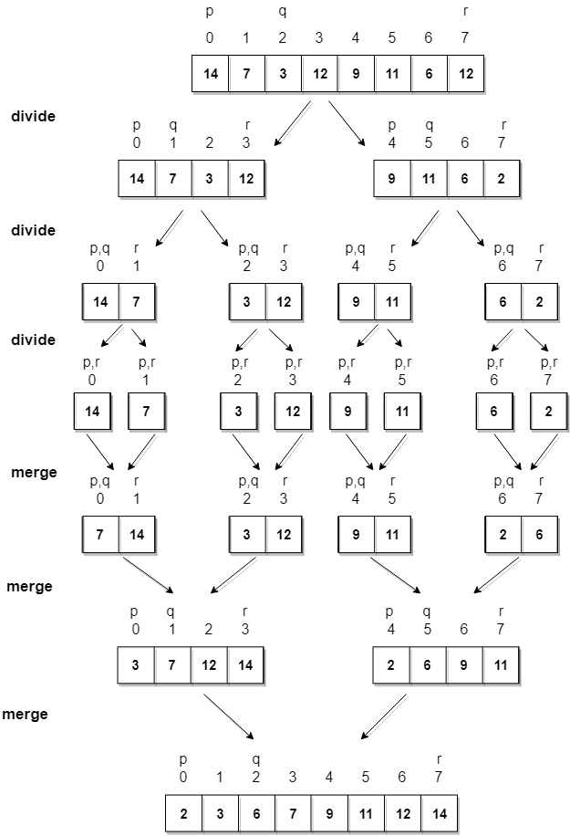

<small>Visual: Unsplash / Lorenzo Herrera</small>
<br/><br/>

<div align="center">

# **Algorithms and data structres 🧱**
 Learn and master Algorithms, Data structres, Asymptotic analysis, Recursion, Dynamic Programming, Algorithms design techniques and strategies Divide and conquer and all kina awesomeness 🧃

<br>


[](https://GitHub.com/Naereen/StrapDown.js/graphs/commit-activity) [](https://github.com/humamaboalraja) [](https://lbesson.mit-license.org/)


</div>

---

<br/>

## - [**Table of content**](#table-of-content)

  - 1 . [Getting started](#getting-started)
  - 2 . [Learning Checklist ✅](#learning-checklist-)
  - ## 3 . [Algorithms Applications & theory](#algorithms-applications-&-theory)
    - 1 . [Characteristics of an Algorithm](#characteristics-of-an-algorithm)
    - 2 . [Asymptotic Analysis](#asymptotic-analysis)
      - 1 . [Time Complexity](#time-complexity)
      - 2 . [Space Complexity](#space-complexity)
      - 3 . [Memory](#memory)
    - 3 . [Asymptotic notations](#asymptotic-notations)
      - 1 . [Big-O notation (O)](#big-O-notation-O)
      - 2 . [Omega notation (Ω)](#omega-notation-ω)
      - 3 . [Theta notation (Θ)](#theta-notation-θ)
      - 4 . [Differences between Big-O, Big-Ω and Big-Θ](#differences-between-big-O,-big-Ω-and-big-Θ)
      - 5 . [Best, Worst, Average Case](#best,-worst,-average-case)
        - [Adding Functions](#adding-functions)
        - [Multiplying Functions](#multiplying-functions)
        - [Properties of Logarithm](#properties-of-logarithm)
        - [Dominance Pecking Order](#dominance-pecking-order)
        - [Same Time Complexity](#same-time-complexity)
    - 4 . [Math](#math) (But not that scary 💆🏽)
      - 1 . [Master Theorem](#master-theorem)
      - 2 . [Exponents](#exeponents)
      - 3 . [Lograithms](#lograithms)
        - 1 . [Lograithm bases](#lograithm-bases)
      - 4 . [Arithmetic series](#lograithms)
    - 5 . [Algorithm Design Techniques & Strategies](#algorithm-design-strategies--techniques)
      - 1 . [Brute Force Algorithms](#brute-force-algorithms)
      - 2 . [Backtracking Algorithms](#backtracking-algorithms)
      - 4 . [Dynamic Programming](#dynamic-programming)
      - 3 . [Greedy Algorithms](#greedy-algorithms)
      - 4 . [Parallel Algorithms](#parallel-algorithms)
      - 5 . [Divide and Conquer](#divide-and-conquer)
    - 6 . [Searching Algorithms](#searching-algorithms)
      - 1 . [Linear Search](#linear-search)
      - 2 . [Binary Search](#binary-search)
      - 3 . [Jump Search](#jump-search)
      - 4 . [Ternary search](#ternary-search)
      - 5 . [Exponential search](#exponential-search)
    - 7 . [Recursion (Recursive Algorithms)](#recursion-recursive-algorithms)
      - 1 . [Differences between Recursion and Iteration](#differences-between-recursion-and-iteration)
      - 2 . [Base case](#base-case) exit condition (when do you stop recursing)
      - 3 . [General (recursive) case](#general-recursive-case) (Recurse)
    - 8 . [Sorting Algorithms](#sorting-algorithms)
      - 1 . [In-place Sorting and Not-in-place Sorting](#in-place-sorting-and-not-in-place-sorting)
      - 2 . [Stable and Not Stable Sorting](#in-place-sorting-and-not-in-place-sorting)
      - 3 . [Adaptive and Non-Adaptive Sorting Algorithm](#adaptive-and-non-adaptive-sorting-algorithm)
      - 3 . [Bubble Sort](#bubble-sort)  
      - 4 . [Selection Sort](#selection-sort)  
      - 5 . [Insertion Sort](#insertion-sort)  
      - 6 . [Merge Sort](#merge-sort)  
      - 7 . [Quick Sort](#quick-sort)  
      - 8 . [Counting Sort](#counting-sort)  
      - 9 . [Radix Sort](#radix-sort)  
      - 10 . [Bucket Sort](#bucket-sort)  
    - 9 . [Graph Algorithms](#graph-algorithms)
      - 1 . [Breadth-first search](#breadth-first-search)
      - 2 . [Depth-first search](#depth-first-search)
      - 3 . [Dijkstra’s shortest path algorithm]()
      - 4 . [A* Algorithm](#a*-aglgorithm)
      - 4 . [Bellman–Ford algorithm](#bellman–ford-algorithm)
  - ## 4 . [Data structres](#data-structres)
    - 1  . [What are Data structres?](#what-are-data-structres?)
    - 2  . [Difference between Linear and Non-linear Data Structures](#difference-between-linear-and-non-linear-data-structures)
    - 3  . [Arrays](#arrays)
    - 4  . [Linked lists](#linked-lists)
      - 4.1  . [Singly Linked lists](#singly-linked-lists)
      - 4.2  . [Doubly Linked lists](#doubly-linked-lists)
      - 4.2  . [Circular Linked lists](#circular-linked-lists)
    - 5  . [Stacks](#stacks)
    - 6  . [Queues](#queues)
    - 7  . [Hash tables](#hash-tables)
    - 8  . [Trees](#trees)
      - 8.1 . [Binary trees](#binary-search-trees)
        - 8.1.1 . [Binary Search Trees](#binary-search-trees)
        - 8.1.2 . [Red-Black Trees](#red-black-trees)
        - 8.1.3 . [Ropes](#ropes)
      - 8.2 . [AVL Trees](#avl-trees)
      - 8.3 . [Heaps](#heaps)
    - 9 . [Tries](#tries)
    - 10 . [Graphs](#graphs)
    - 11 . [Strings](#strings)
    - 12 . [Priority Queue](#priority-queue)
    - 13 . [Dictionaries](#dictionaries)
    - 14 . [Matrix](#Matrix)
    

  ## 5 . [Galaxies connection algorithm](#galaxies-connection-algorithm)

<br>

  #### **Further Learning Resource**

  - 6 . [Articles 📰](#-articles-)
  - 7 . [Books 📚](#-books-)
  - 8 . [Courses 💻](#-courses-)
  - 9 . [Resources](#resources)

---

<br/>

# 1

## **Getting started**

<details open>
  <summary>Let's first get to know why do we need this thing 🥸 | <b>Click to expand</b></summary>
</br>

  <div align="center">

  
  
  <br>

  ## **What are Data structres and Algorithms?**
  
  </div>

  A computer program is a collection of instructions to perform a specific task. For this, a computer program may need to store data, retrieve data, and perform computations on the data.

  A data structure is a named location that can be used to store and organize data. And, an algorithm is a collection of steps to solve a particular problem. Learning data structures and algorithms allow us to write efficient and optimized computer programs. [Source](https://www.programiz.com/dsa)

  and the differences between them are that a Data Structure is about organising and managing data effectively such that we can perform specific operation efficiently, while an Algorithm is a step-by-step procedure to be followed to reach the desired output. ... Steps in an algorithm can use one or many data structure(s) to solve a problem.


  ---

  Algorithms and Data structures go through solutions to standard problems in detail and give you an insight into how efficient it is to use each one of them, and help in understanding the nature of the problem at a deeper level and that's why it's very crucial to master them as a Software Engineer.

  and eventually:
  > it's all about data, and the most efficent way to play with this data 😉

  <div align="center">
  Pumped enough! let's get started!
  </div>


---


</details>
<br/>
<br/>
<br/>


# 2
## **Learning Checklist ✅**

<details>
  <summary>A handy checklist to keep track of your progress, and know when you master your Algorithms and data strucres path 💈. <b>Click to expand</b></summary>
</br>

### **Algorithms**:
Show that you know:

- [ ]  Know how to analyze algorithms
- [ ] A detailed description of the algorithm
    - [ ] Goal of the algorithm
    - [ ] Termination condition
    - [ ] Criteria for determining that the algorithm is correct
    - [ ] Explanation of the steps of the algorithm
- [ ] A specific example illustrating how the algorithm works
- [ ] Detailed calculation of the time complexities, including best, worst and average cases
- [ ] Pseudo-code for complex algorithms (this excludes simple searching and sorting algorithms)
- [ ]  Applied these concepts to searching and sorting algorithms

### **Data structures**:
For each of the data structures listed below, you have to understand their functionality, including common operations and their time complexities; what are their strengths and their limitations and, finally, how they are used in real-world scenarios.

When describing a data structure make sure your analysis includes the following points

- [ ] How does the data structure organize and manipulate data?
- [ ] What operations can you do on it and what are their time complexities and why?
- [ ] What operations can you do on it and what are their time complexities and why?
- [ ] Applications
  
  ---

- [ ]  Arrays
  - [ ] Traversing, Searching, Insertion, Deletion, Size
- [ ]  Stacks
  - [ ]  Push, Pop, is empty, top
- [ ]  Queues
- [ ]  Linked Lists
- [ ]  Hash tables
- [ ]  Graphs
- [ ]  Trees
- [ ]  Tries


</details>

---

<br/>
<br/>


# 3

## **Algorithms Applications & theory**


<br>

<details>

<summary>Algorithms Applications & theory | <b>Click to expand</b></summary>
<br>

<div align="center">


</div>

---

 <h2>Algorithm</h2> 

noun, UK  /ˈæl.ɡə.rɪ.ðəm/ US  /ˈæl.ɡə.rɪ.ðəm/

>a process, step-by-step procedure or set of rules to be followed in calculations or other problem-solving operations to be executed in a certain order to get the desired output, especially by a computer, and those can be simple processes, such as multiplying two numbers, or a complex operation, such as playing  compressed video file. or a Search engine that uses proprietary algorithms to display the most relevant results from its search index for specific queries. Algorithms are generally created independent of underlying languages, i.e. an algorithm can be implemented in more than one programming language.


**<small>Cambridge dictionary/ Oxford Languages</small>**

<br>
<details>
<summary>Algorithms Applications & theory | <b>Click to expand 🔥</b></summary>

<br>

- **What:** Algorithms are a part of daily life actions, and those daily actions and everything we do is the simplest form to represent what an Algorithm is, e.g Finding you car in a parking lot , cleaning your Apartment, reading a book.
  
  ---

- **How to:** There are no well-defined standards for writing algorithms. Rather, it is problem and resource dependent. Algorithms are never written to support a particular programming code. As we know that all programming languages share basic code constructs like loops (do, for, while), flow-control (if-else), etc. These common constructs can be used to write an algorithm. We write algorithms in a step-by-step manner, but it is not always the case. Algorithm writing is a process and is executed after the problem domain is well-defined. That is, we should know the problem domain, for which we are designing a solution.
  
  ---


- **Applications**: The real power of Algorithms come in form of Digital tools, Softwares or small computer programs like, Compression algorithms in a 3D video game or Searching algorithms in Google Search engine, or sorting algorithms to sort Amazon's products based on their ratings and all the other services and digital tools that you use on daily bases.

___

- **Efficiency**: Not all algorithms are created equal, and the tricky part of an Algorithm is that there are plenty of algorithms that solve the same problem at the end, but one of them is the most efficint one to use in that spesific problem case, so to know which solution to choose and to be able to compare them, these Algorithms most be analyzed, and before before analyuzing there an important thing that you need to know what makes a good algorithm is the two most important criteria which are that it solves a problem and it does so efficintly.

    ---
- **Measuring Efficiency**: so the way we measure the effecincy of an algorithm is through using a scientific mathematical technique called **```Asymptotic analysis```**, which allows algorithms to be compared independently of a particular programming language or hardware, which will next tell us that some algorithms are  more efficient than others.

  ---
  
  <br>

  Some important categories of algorithms, from data structures point of view.

  |# | Details|
  |---|------|
  **Search** | Algorithm to search an item in a data structure.
  **Sort** | Algorithm to sort items in a certain order.
  **Insert** | Algorithm to insert item in a data structure.
  **Update** | Algorithm to update an existing item in a data structure.
  **Delete** | Algorithm to delete an existing item from a data structure.


</details>

</details>

---

<br/>
<br/>


# 3.1
## **Characteristics of an Algorithm**:

</br>

<details>
<summary>Characteristics of an Algorithm | <b>Click to expand</b></summary>

<br>

Not all procedures can be called an algorithm. An algorithm should have the following characteristics.


|No.     |  Details|
|------|-------|
**Unambiguous** | Algorithm should be clear and unambiguous.| Each of its steps (or phases), and their inputs/outputs should be clear and must lead to only one meaning.|
**Input** | An algorithm should have 0 or more well-defined inputs.|
**Output** | An algorithm should have 1 or more well-defined outputs, and should match the desired output.|
**Finiteness** | Algorithms must terminate after a finite number of steps.|
**Feasibility** | Should be feasible with the available resources
**Independent** | An algorithm should have step-by-step directions, which should be independent of any programming code.|
**Correctness** | Every step of the algorithm must generate a correct output.|


<br>


<br>


</details>

---

<br/>
<br/>


# 3.2
## **Asymptotic Analysis**:

</br>


**Asymptotic analysis** of an algorithm refers to defining the mathematical boundation/framing of its run-time performance. 

<details>

<summary>Asymptotic Analysis explanation | <b>Click to expand</b></summary>

<br>

- Using asymptotic analysis, we can very well conclude the best case, average case, and worst case scenario of an algorithm. 


- Complexity analysis is effectively used to determine how "good, efficent, scalable, fits the design case best" an algorithm is and whether it's "better" than another one.

- determining how efficient an algorithm is usually involves finding both the **time** complexity and **space** complexity of an Algorithm.

  ---

  <br>
  <div align="center">

  

  ## **But before that what Asymptotic Analysis is about?**
  
  </div>
  <br>

- First what what asymptotic does really mean?! i'm guessing that you have probably heard of the word "asymptote" if not An asymptote is a "line that continually approaches a given curve but does not meet it at any finite distance, in a simpler way it is line that a curve approaches, as it heads towards infinity like that:

  <div align="center">

  
  </div>
  <br>
  <br>

- The idea of Asymptotic complexity and looking at an asymptotic behavior is that we want to see how does the graph behave getting into very large inputs (n) values, and this is simply the idea of asymptotic complexity. 
  
- So why don’t we in this case to save some time measure the **elapsed real time**, like for instance measuring how fast your code ran on your machine which can tell you how strong your algorithm is!? Because it's not the effecint approach to approach Complexity analysis.

- in computer science problems are often applied at a grand scale like for instance if we are writing an algorithm to optimize whatever part of **Google’s** search engine it’s going to be used across billions of users, and there will be large inputs to the algorithms. 
  
- Our most important point is to see how does this algorithm behave on the tail end ( as (input) gets very large), cause we can only see the true measure of performance of an algorithm when we have very large data input, and that why asymptotic complexity analysis intrigues us ❤️ 

- So in order to be able to indicate the correct Asymptotic Analysis of an algorithm there are some rules that you need to follow: 

  1. We measure as a function of $n$, and ignore low order terms, and that's why we drop constants, which is the reason too why:

     - 5n<sup>3</sup> + n  − 6 becomes n<sup>3</sup>

     - 8n log n  − <math>60n</math> becomes n log n
     - 2<sup>n</sup> + 3n<sup>4</sup>  − becomes 2<sup>n</sup>
      - because when we say (O(log n), o(n), O(n2),  O(n3), O(2n), o(n!)) we are not actually describing an individual graph, or a case that is based on a constant value, what we are really describing is a class of functions and behaviors, and that’s why these functions will have the same behaviour when we get a very large input 😉
  2. If the function is a product of several factors, any constants can be omitted.


  <br>

## **An example of Asymptotic Behaviour**
  
---

  ```Insertion Sort:``` 2 * n<sup>2</sup>  | ```Merge Sort:``` 50 * n * log(n)
    
  ---

  We have 2 computers: 🖥

  - **Computer A**: runs 10 Billion instructions / second

  - **Computer B**:  runs 10 Million instructions / second

  - **Computer A** is 1000x faster than **Computer B**

  - **Computer A** runs insertion sort, **Computer B** runs merge sort

  - How long will each computer take to sort 10 million numbers?

  - **Computer A**: 5.5 hours
  - **Computer B**: 20 minutes

  A computer that runs **1000x** faster lost horrendously to a computer that runs **1000x** slower than it.

  But the thing is that insertion sort will be faster for an initial amount, but it will lose as the input gets larger (and that's what we care about and what is a true expression of its efficiency).

  ---


</details>
<br/>

</details>

### **Time complexity**:
<details>
  <summary>What time complexity is? | <b>Click to expand</b></summary>
</br>

Time complexity of an algorithm represents the amount of time required by the algorithm to run to completion. Time requirements can be defined as a numerical function T(n), where T(n) can be measured as the number of steps, provided each step consumes constant time.

  - For example, addition of two n-bit integers takes n steps. Consequently, the total computational time is T(n) = c ∗ n, where c is the time taken for the addition of two bits. Here, we observe that T(n) grows linearly as the input size increases.

- The time complexity of an algorithm relates the length of an algorithm's input to the number of steps it takes.

<br>

---

We do not want to give the running time of an algorithm in a time unit because this would mean that it is only comparable
with the same implementations (programming language, compiler, hardware, etc.). Thus, it is given as a function:


### **The RAM (random access machine) Model of Computation**:

Is a Machine-indepdendent algorithm design  depends upon a hypothetical computer called (Random Access Machine) and under this model of computation we are confronted with a computer where:

- Simple logical or arithmetic operations (+, *, =, if, call) are considered to be simple operations that that take one time step
-  Loops and subroutines are complex operations composed of multiple time steps based on the number of iterations
- All memory access takes exactly one time step.

> This model encapsulates the core functionality of computers but does not mimic them completely. For example, an addition operation and a multiplication operation are both worth a single time step, however, in reality it will take a machine more operations to compute a product versus a sum.

- The reason the RAM model makes these assumptions is because doing so allows a balance between simplicity and completely imitating underlying machine, resulting in a tool that is useful in practice.

- The exact analysis of algorithms is a difficult task. It is the nature of algorithm analysis to be both machine and language independent. For example, if your computer becomes twice as fast after a recent update, the complexity of your algorithm still remains the same.


</details>

</br></br>


### **Space complexity and Auxiliary Space**:
<details >
  <summary>What time complexity is? | <b>Click to expand</b></summary>
</br>

**Space complexity**: of an algorithm represents the total amount of memory space required by the algorithm in its life cycle (including the space of input values) and relates to the length of an algorithm's input to the number of storage locations it uses. The space required by an algorithm is equal to the sum of the following two components:

- A fixed part that is a space required to store certain data and variables, that are independent of the size of the problem. For example, simple variables and constants used, program size, etc.

- A variable part is a space required by variables, whose size depends on the size of the problem. For example, dynamic memory allocation, recursion stack space, etc.


It is also expressed asymptotically. Space complexity is a measure of the amount of working storage an algorithm needs.
This amount is, again, dependent on the input size. 

to find space-complexity, it is enough to calculate the space occupied by the variables used in an algorithm/program.


---

**Auxiliary space**: is not the same as space complexity even though they are sometimes (wrongly) used for the same thing. Space complexity is the sum of the auxiliary space and the input
space, **Auxiliary space** refers to the temporary space required by an algorithm to be used allocated by the algorithm during it's execution to solve the problem, with respect to input size. Think of temporary arrays, pointers etc.

```
Space Complexity = Auxiliary Space + Space use by input values
```

Whenever a solution to a problem is written some memory is required to complete. For any algorithm memory may be used for the following:

  1. Variables (This include the constant values, temporary values)
   1. Program Instruction
   2. Execution

  ---

  Example #1:

  We can use the RAM model to determine the number of steps it will take an algorithm to end with an input we choose, but estimating the worst, average, and best case runtime scenerio with the RAM model can be unconvenint.


  ```python
  def even_numbers_avg(array):
    '''
    This function returns either the average of the 
    sum of even numbers, or None.
    '''
    even_sum = 0           #1 time step
    even_count = 0         #1 time step
                  #n times:
    for n in array:           #1 time step
        if n % 2 == 0:        #1 time step
            even_sum += n         #1 time step
            even_count +=1        #1 time step
            
    if even_count > 0:              #1 time step
        return even_sum/even_count     #1 time step
    else:                           #1 time step
        return None                    #1 time step
  ```
  - In the example above, we can try to generalize the time complexity of this algorithm by counting every step, and we will find that in the worst case its time complexity will be:  
  T(n) = 5n + 6
  - Its space complexity will be the size of the array n, plus the two variables we initialize.
  - The problem with the notation we used above is that is difficult to work precisely with it. In the example above we can see that both return statements have been counted as well as every step in the for loop, which is correct for the worst but not for the average and best case scenarios.
  - Since we can approximate an algorithm to a mathematical function, we can also determine its growth as a function of the input and define an upper bound function (Big O), a lower bound function (Big Ω), or both (Big Θ) in order to understand how it grows.
  - In Asymptotic Notation, we only consider the fastest growing term without any multiplicative constant. E.g.: in the example above 
   
    **T(n) = 5n + 6 is O(n)** and not **O(5n)**
  - Constant terms (e.g. returning or printing some value) are ignored
    - (constant terms can make a difference if the compared algorithms have the same running time) an that's why In Asymptotic Notation, we only consider the fastest growing term without any multiplicative constant. E.g.: in the example above **T(n) = 5n + 6** is **O(n)** and not **O(5n)**

  - Space complexity
    - the array takes n units of space, as the length can vary
    - the item variable is constant as the new item will be saved and the old item will be discarded
    - thus, we have a space complexity of Θ(𝑛)
    - if we talk about auxiliary space, the input array would not be counted
      - thus, we have a auxiliary space complexity of Θ(1)

> And this is why the term space complexity cannot be used for auxiliary space complexity.

  ---
<br>

  Example #2: In recursive calls stack space also counts. 
  <br>

   ```python
      def add(number):
          if number <= 0:
              return 0
          return number + add(number-1)
   ```

  Here each call add a level to the stack :
```
  1.  add(4)
  2.    -> add(3)
  3.      -> add(2)
  4.        -> add(1)
  5.          -> add(0)
```

Each of these calls is added to call stack and takes up actual memory.
      
So it takes ```O(n) space```.

However just because you have n calls total doesn’t mean it takes O(n) space.


---

</details>


</br></br>


### **Memory**:
<details>
  <summary>What you need to know about memory? | <b>Click to expand</b></summary>
</br>
</details>

</br>

---

</details>


<br/>
<br/>

</details>


# 3.2

## **Asymptotic Notations**:

**Recap:** as we've mentioned in ther Asymptotic analysis section The **efficiency** of an algorithm depends on the amount of time, storage and other resources required to execute the algorithm, and an algorithm may not have the same performance for different types of inputs. With the increase in the input size, the performance will change, now this efficiency is measured with the help of Asymptotic Notations 🔥

---

<br>

<details open>
<summary>Asymptotic mathematical Notations <b> | Click to expand</b></summary>

<br>

**Asymptotic Notations** are Mathematical notations that are used to describe the running time of an algorithm when the input tends towards a particular value or a limiting value.

### for example: 

1. In Bubble sort algorithm which we will get to it later, when the input array is already sorted, the time taken by the algorithm is linear i.e. the best case.

2. But, when the input array is in reverse condition, the algorithm takes the maximum time (**quadratic**) to sort the elements i.e. the worst case.

3. When the input array is neither sorted nor in reverse order, then it takes average time. These durations are denoted using asymptotic notations.

  ---

  ### **Order of Dominance in the Asymptotic Limit**

  some common asymptotic growths, valid for both space and time complexity:

 - Constant: O(1)
 - Logarithmic: O(log(n))
 - Linear: O(n)
 - Quasilinear: O(n⋅log(n))
 - Quadratic: O(n2)
 - Exponential: O(2n)
 - Factorial: O(n!)

To understand the difference between some of the most common time complexities, take a look at thi graph below, were the x-axys represents the size of the input of the functions and the y-axys represents the result of the functions.


<div align="center">
<b>n! >> 2n >> n2 >> n⋅logn >> n >> log(n) >> 1</b>
</div>

It is also clear that an efficient algorithm can really make the difference in terms of time and space efficiency, especially as the input size grows.


  ---
<br>

### There are mainly three asymptotic notations which are 🧃:
<br>

### **Big-O notation (𝑂)**: 🤕 (Asymptotic Upper bound)

<details>
  <summary>Big-O notation (O) with code examples | <b>Click to expand</b></summary>

 <br>


 **Big-O**: notation is the formal way to represent the upper bound of the running time of an algorithm. Thus, It measures the worst case time complexity or the longest amount of time an algorithm can possibly take to complete.

 -  Big O notation is usually understood to describe the **worst-case**, complexity of an algorithm, even though the worst-case complexity might differ from the **average-case** complexity.
 - Variables used in Big O notation denote the sizes of inputs to algorithms. For example, **O(n)**  might be the time complexity of an algorithm that traverses through an array of length **n**; similarly, O(n + m) might be the time complexity of an algorithm that traverses through an array of length **n**  and through a string of length **m**
 
 -  e.g. some sorting algorithms have different time complexities
depending on the layout of elements in their input array. In rare cases, their
time complexity will be much worse than in more common cases. Similarly, an
algorithm that takes in a string and performs special operations on uppercase
characters might have a different time complexity when run on an input string
of only uppercase characters vs. on an input string with just a few uppercase
characters.
- when describing the time complexity of an algorithm, it's helpful somtimers to specify what the time complexity refers to. the average case or to the worst case (e.g., "this algorithm runs in O(nlog(n)) time on average and in $O(n^2)$ time in the worse case").

> "the running time grows at most this much, but it could grow more slowly"


<br>

  <div align="center">

  

  "the running time grows at most this much, but it could grow more slowly"

  <small>Big O.
  | Image source / <a href="https://www.programiz.com">Programiz</a></small>
  
<br>
<br>

</div>


The Big O notation is useful when we only have upper bound on time complexity of an algorithm. Many times we easily find an upper bound by simply looking at the algorithm.  

(expresses the upper bound)

For a function g(n), O(g(n)) is given by the relation:

``` math
O(f(n)) = { 
  g(n): 
  there exist positive constants c >  0 and n0
  such that 0 ≤ f(n) ≤ c.g(n) for all n ≥ n0 
}

```

Since Big-o gives the worst-case running time of an algorithm, it is widely used to analyze an algorithm as we are always interested in the worst-case scenario.


Summary:
>The Big O of a function is its asymptotic upper bound. This means that the running time of a function T will be always shorter than that of f . To generalize we can say that a funciton **T(n)** is **O(f(n))** if there is a constant k such that **T(n) < k** ⋅ **f(n)** for large enough **n**.

> P.s Many use Big-O notation even if Big-Theta would be more fitting.

  
    
  </br>
    

  1. ### **Big O cheatsheet**


      <details>
      <summary>Big-O Complexity table ✨ | <b>Click to expand</b></summary>
      </br>


      The following are examples of common complexities and their Big O notations,ordered from fastest to slowest:

      Big O Notation	| Name | Example(s) | Efficiency | Code example|
      |----------------|------|-----------| -------| ----|
      O(1) | Constant | 	Odd or Even number, <br> Look-up table (on average) | 🟩 | Python, Javascript
      O(log(n)) | Logarithmic | Finding element on sorted array with binary search | 🟩 | Python, Javascript
      O(n) | Linear | Find max element in unsorted array. <br> Duplicate elements in array with Hash Map | 🟩 | Python, Javascript
      O(nlog(n)) | Linearithmic | Python, Javascriptorting elements in array with merge sort | 🟩 | Python, Javascript
      O(n<sup>2</sup>) | Quadratic | # Duplicate elements in array **(naïve)**, <br> Sorting array with bubble sort | 🟨 | Python, Javascript
      O(n<sup>3</sup>) | Cubic | 3 variables equation solver | 🟨 | Python, Javascript
      O(2<sup>n</sup>) | Exponential | Find all subsets | 🟥 | Python, Javascript
      O(n!) | Factorial | Find all permutations of a given set/string | 🟥 | Python, Javascript
      </details>

      ---
  <br>

</details>

  ---
  <br>

  ### **Omega notation (Ω)**: 😌 (Asymptotic Lower bound)

  <details>
    <summary>What is Omega notation (Ω) | <b>Click to expand</b></summary>
    </br>

  **Big Omega** notation is used to define the lower bound of any algorithm or we can say the best case of any algorithm.

This always indicates the minimum time required for any algorithm for all input values, therefore the best case of any algorithm.

In simple words, when we represent a time complexity for any algorithm in the form of big-Ω, we mean that the algorithm will take atleast this much time to cmplete it's execution. It can definitely take more time than this too.


<div align="center">

  

"the running time grows at least this much"

<small>Source <a href="://www.programiz.com">Programiz</a></small>

</div>

```
Ω(g(n)) = { f(n): there exist positive constants c and n0 
            such that 0 ≤ cg(n) ≤ f(n) for all n ≥ n0 }
```


The above expression can be described as a function f(n) belongs to the set Ω(g(n)) if there exists a positive constant c such that it lies above cg(n), for sufficiently large n.

For any value of n, the minimum time required by the algorithm is given by Omega Ω(g(n)).


  </details>

  ---

  <br>

  ### **Theta notation (Θ)**: 💈 (Asymptotic Tight (exact) bound))
  <details>
    <summary>What Asymptotic Analysis is? | <b>Click to expand</b></summary>
    </br>


  **Theta notation** encloses the function from above and below. Since it represents the upper and the lower bound of the running time of an algorithm, it is used for analyzing the average-case complexity of an algorithm. (expresses the lower bound)

<div align="center">

  


  the function grows asymptotically as fast as ,e.g., n<sup>2</sup>

<small>Source <a href="://www.programiz.com">Programiz</a></small>

</div>

---

<br>


For a function g(n), Θ(g(n)) is given by the relation:

```
Θ(g(n)) = { f(n): there exist positive constants c1, c2 and n0 such that 0 ≤ c1g(n) ≤ f(n) ≤ c2g(n) for all n ≥ n0 }
```

The above expression can be described as a function f(n) belongs to the set Θ(g(n)) if there exist positive constants c1 and c2 such that it can be sandwiched between c1g(n) and c2g(n), for sufficiently large n.

If a function f(n) lies anywhere in between c1g(n) and c2g(n) for all n ≥ n0, then f(n) is said to be asymptotically tight bound.


  </details>
  
  ---

  <br>

### **Working with the Asymptotic Notation**: 
<details>
 <summary> | <b>Click to expand</b></summary>
 </br>

> Important to note is that for each time complexity there can be a best, worst and average case. To clarify this, I want to
use this example:

```
Contrive(n)
if n = 0 then do something Theta(n^3)
else if n is even then
  flip a coin
  if heads, do something Theta(n)
  else if tails, do something Theta(n^2)
else if n is odd then
  flip a coin
  if heads, do something Theta(n^4)
  else if tails, do something Theta(n^5)
```
<div align="center">

Source: [Stackexchange](https://cs.stackexchange.com/questions/23068/how-do-o-and-%ce%a9-relate-to-worst-and-best-case)

</div>

If this would be an algorithm, we can find different asymptotic behavior of this function.
In the best case (n is even), the runtime is and but not of anything.
In the worst case (n is odd), the runtime is and but not of anything.
In the case n = 0, the running time is .

This also means that the instances of the size n define each case. In the example above, it is odd, even or 0. For some
sorting algorithms, it can be that n is already sorted, almost sorted or sorted in reverse. For searching algorithms this may
be that the looked for element is at index 0, at index n-1 or not in the input at all. Concrete examples will be given when
algorithms are analyzed.


### **Adding Functions**:
the sum of two functions is governed by the dominant one.

- **```𝑂(𝑓(𝑛)) + 𝑂(𝑔(𝑛)) → 𝑂(𝑚𝑎𝑥(𝑓(𝑛), 𝑔(𝑛)))```**
- **```Ω(𝑓(𝑛)) + Ω(𝑔(𝑛)) → Ω(𝑚𝑎𝑥(𝑓(𝑛), 𝑔(𝑛)))```**
- **```Θ(𝑓(𝑛)) + Θ(𝑔(𝑛)) → Θ(𝑚𝑎𝑥(𝑓(𝑛), 𝑔(𝑛)))```**

---

### **Multiplying Functions**:
as described above, constants do not affect the asymptotic behavior of a function and thus, can be omitted.

- **```𝑂(𝑐 · 𝑓(𝑛)) → 𝑂(𝑓(𝑛))```**
- **```Ω(𝑐 · 𝑓(𝑛)) → Ω(𝑓(𝑛))```**
- **```Θ(𝑐 · 𝑓(𝑛)) → Θ(𝑓(𝑛))```**

two functions in a product are important as both increase
- **```𝑂(𝑓(𝑛)) ∗ 𝑂(𝑔(𝑛)) → 𝑂(𝑓(𝑛) ∗ 𝑔(𝑛))```**
- **```Ω(𝑓(𝑛)) ∗ Ω(𝑔(𝑛)) → Ω(𝑓(𝑛) ∗ 𝑔(𝑛))```**
- **```Θ(𝑓(𝑛)) ∗ Θ(𝑔(𝑛)) → Θ(𝑓(𝑛) ∗ 𝑔(𝑛))```**

The same rules also apply to Big O and Big Ω


</details>

 ---

  <br>
  <br>


  ## **Differences between Big-O, Big-Ω and Big-Θ**

<details>

<summary>a table that explains the diffrerences between most common asymptotic notations</summary>

  <br>

  Big Oh | Big Omega | Big Theta 
  --------|-------------|--------|
  (It is like <=)  rate of growth of an algorithm is less than or equal to a specific value. | It is (like >=) rate of growth is greater than or equal to a specified value | (It is like ==) meaning the rate of growth is equal to a specified value.
  The upper bound of algorithm is represented by Big O notation. Only the above function is bounded by Big O. asymptotic upper bond is it given by Big O notation.| The algorithm’s lower bound is represented by Omega notation. The asymptotic lower bond is given by Omega notation. | The bounding of function from above and below is represented by theta notation. The exact asymptotic behavior is done by this theta notation.
  Big oh (O) – Worst case	| Big Omega (Ω) – Best case | Big Theta (Θ) – Average case
  Big-O is a measure of the longest amount of time it could possibly take for the algorithm to complete. | Big- Ω is take a small amount of time as compare to Big-O it could possibly take for the algorithm to complete. | Big- Θ is take very short amount of time as compare to Big-O and Big-? it could possibly take for the algorithm to complete.
  Mathematically – Big Oh is ```0 <=f(n) <= c g(n) for all n>=n0```	| Mathematically – Big Omega is ```O<= C g(n) <= f(n) for all n>=n 0```	| Mathematically – Big Theta is ```O<=C 2 g(n)<=f(n)<=C 1 g(n) for n>=n 0```

</details>


</details>

<br/>
<br/>


<br/>


# 3.4

## **Algorithm design strategies & Techniques**:

<details open>
  <summary>What Asymptotic Analysis is? | <b>Click to expand</b></summary>
</br>


<br/>


  ### **Brute Force Algorithms**:
  <details>
    <summary> | <b>Click to expand</b></summary>
    </br>
  
  **Definition**: An algorithm that inefficiently solves a problem, often by trying every one of a wide range of possible solutions (Use it as a last resort or as the starting point and to later optimize it)

  - Straightforward methods of solving a problem that rely on computing power and trying every possibility rather then advanced techniques to improve efficiency.
  - Examples of Brute Force Algorithms include the **Selection Sort** and **Bubble Sort**.


    ---

  ### **Main Approach**

  Generate and evaluate possible solutions until

  - Satisfactory solution is found.
    - Best solution is found.
    - All possible solutions found
      - Return best solution
      - Return failure if no satisfactory solution.
  - This approach is one of the most expensive algorithmic techniques, mainly in terms of time complexity. It is also, therefore, one of the most naive ones. The steps to generate solution via this method are pretty simple.
  
  ```python
  solve(parameters):
      generate all possible solutions
      ans = select most feasible solution
      return ans
  ```

  ### **Description**

  A brute force algorithm simply tries all possibilities until a satisfactory solution is found such an algorithm can be:
  
   - **Optimizing**: Find the best solution. This may require finding all solutions, or if a value for the best solution is known, it may stop when any best solution is found
  - **Satisfying**: Stop as soon as a solution is found that is good enough

Brute force algorithm is require exponential time and used in various heuristics and optimizations can be used

- **Heuristic**: A rule of thumb that helps you decide which possibilities to look at first
- **Optimization**: In this case, to eliminate certain possibilities without fully exploring
them.


### **Strengths**:
- Wide applicability
- Simplicity
- Yields reasonable algorithms for some important problems
  - Searching, string matching, matrix multiplication.
- Yields standard algorithms for simple computational tasks
  - Sum or product of n numbers, finding max or min in a list


### **Weaknesses:**
- Rarely yields efficient algorithms
- Some brute force algorithms unacceptably slow
- Not as constructive/creative as some other design techniques

</details>

  ---

  <br>

  ### **Backtracking Algorithms**:
  <details>
    <summary> | <b>Click to expand</b></summary>
    </br>

  **Backtracking** is an algorithmic technique that involves trying possibilities along a "search path" and cutting off paths of search that will no longer yield a solution.

   - These "search paths" can manifest as:
    Actual search paths in a graph or searchable structure
   - Chosen characters placed in a progress string Moves played in a puzzle, etc.


  Backtracking algorithm represents one of the most general techniques. Many problems which deal with searching for a set of solutions or which ask for an optimal solution satisfying some constraints can be solved using the backtracking formulation. Many of the problems being solved using backtracking require that all the solutions satisfy a complex set of constraints. For any problem these constraints can be divided into two categories explicit and implicit.

- Backtracking is a systematic way to search for the solution to a problem, or a way to search for the solution to a problem
- if a part solution seems to not lead to a full solution, steps are taken back to find alternative part solutions
either a solution is found or it can be said that there is none
- usually these algorithms are implemented recursively
- ensure correctness by enumerting all possibilities
- Ensure efficiency by never visiting a state more than once


</details>

  ---

<br>

  ### **Dynamic Programming**:
  <details>
    <summary> | <b>Click to expand</b></summary>
    </br>

  > in order to understand Dynamic programming you have to be familiar with Recursion 😉

  **Dynamic programming** is a bottom-up way to solve complex algorithmic problems with overlapping subproblems. Algorithms that use Dynamic programming find the base case and building a solution from the bottom-up.
  Dynamic programming keep track of previous results to avoid re-computing the same operations. (we solve all possible small problems by breaking them down into a collection of simpler subproblems, solving each of those subproblems just once and then store their solutions combine them to obtain solutions for bigger problems.)

  Very simple example:

  - Write down 1 + 1 + 1 + 1 + 1 + 1
  - What’s that equal to?
  - Six. right?!
  - Add another "+1". What’s the total now?
  - *Simply* Seven!
  - Why you get the result so quickly? Ah, you got it faster by adding one to the memorized
  previous answer. So Dynamic Programming is a fancy way of saying: "remembering past
  solutions to save time later."
 
    ---

  ### **When to use Dynamic programming**

  - When we have recursive functions, doing duplicated work is the perfect place for dynamic programming optimization. We can save (or cache) the results of previous operations and speed up future computations.
    - Dynamic Programming is particularly helpful when the number of copying subproblems is exponentially large. Dynamic Programming is frequently related to Optimization Problems.
    - Like for example Fibonacci Implemenation using Dynamic Programming. 


    - >  Saving previous results for later is a technique called "memoization". This is very common to optimize recursive algorithms with overlapping subproblems. It can make exponential algorithms linear!

    ---

<br>

    

- useful when you’re trying to optimize something given a constraint (maximizing or minimizing a function)
- combines greedy algorithms that make the best local decision at each step and exhaustive search algorithms that try
- all possibilities and select the best always to produce the optimum result
  - systematically search all possibilites while storing results to avoid recomputing
    - efficiency and correctness
 - every dynamic-programming solution involves a grid
 - the values in the cells are usually what you’re trying to optimize
 - each cell is a subproblem: How can you divide your problem into subproblems?
 - recursive subproblems that are the same over and over can look up the once computed value in the table
 - optimal substructure (the optimal solution can be created from optimal solutions of its subproblems)
 - overlapping subproblems (supproblem is solved multiple times)
 - there is no single formula for calculating a dynamic-programming solution

    ---
    <br>

  ### **Optimal Substructure:**
  A problem is said to have optimal substructure if an optimal solution can be constructed from optimal solutions of its subproblems.
  ### **Overlapping subproblems:**

  A problem is said to have **overlapping subproblems** if it can be broken down into subproblems which are reused several times.
  
  </details>

  
  ---

<br/>

  ### **Greedy Algorithms**:
  <details>
    <summary> | <b>Click to expand</b></summary>
    </br>

**Greedy Algorithms** are used in optimization problems. They always make the 'local optimum' choice to optimize a given objective. They do not guarantee the optimal solution to the problem they are given.
  - at each step one picks the locally optimal move
  - result may not be optimal (local optimum which can be a global optimum)
  - "approximate" the optimal solution

---

- **Approximation algorithms are judged by:**
  - How fast they are
  - How close they are to the optimal solution

- An example of greedy algorithm is Dijkstra's Algorithm.

  </details>

  ---

<br/>


  ### **Parallel Algorithms**:
  <details>
    <summary> | <b>Click to expand</b></summary>
    </br>

  </details>

  ---

<br/>


  ### **Divide and Conquer**:
  <details>
    <summary>Divide and Conquer | <b>Click to expand</b></summary>
    </br>
    Algorithms that use the divide and Conquer technique divide the problem they are trying to solve into sub-problems, recursively solve them, and then recombine them to get the final answer.

  ---
  
    
  **Divide And Conquer**:

  >Based on recursion
  >Breaks a problem into subproblems that are similar to the original problem
  
  This technique can be divided into the following three parts:
  1. **Divide** the problem into a number of subproblems that are smaller instances of the same problem.
  2. **Conquer** the subproblems by solving them recursively. If they are small enough, solve the subproblems as base cases.
  3. **Combine** the solutions to the subproblems into the solution for the original problem.


---


We can calculate the time efficiency of Divide And Conquer algorithms, and any other recursive algorithm with the Master Theorem, 
  - The master method is a formula for solving recurrence relations of the form:: 
  
  - `𝑇(𝑛) = 𝑎𝑇(𝑛/𝑏) + 𝑓(𝑛)`
  
where: 
  - n is the size of the input; 
  - a is the number of subproblems in the recursion; 
  - n / b is the size of each subproblem. All subproblems are assumed to have the same size; 
  - f(n) is the cost of the work done outside the recursive call, which includes the cost of dividing the problem and cost of merging the solutions. 
    - One example of algorithm that uses the Divide and Conquer technique is the MergeSort and Quicksort.

  </details>

<br/>


</details>
<br/>

---

<br/>
<br/>
<br/>
<br/>


# 3.5

## **Searching Algorithms**:

<details open>
<summary>Searching Algorithms explanation & examples</summary>

<div align="center">


</div>

<br>

  Not even a single day pass, when we do not have to search for something in our day to day life, car keys, books, pen, mobile charger and what not. Same is the life of a computer, there is so much data stored in it, that whenever a user asks for some data, computer has to search it's memory to look for the data and make it available to the user and that's where come:

  **Searching Algorithms** are designed to check for an element or retrieve an element from any data structure where it is stored. Based on the type of search operation, these algorithms are generally classified into two categories:

  - **Sequential Search**: Lists or arrays are traversed sequentially and every element is checked. For example: Linear Search. (designed to search for an item in unsorted data structures, they check every item in the data structure sequentially.) For example: **Linear Search**.

  - **Interval Search**: These algorithms are specifically designed for searching in sorted data-structures. These type of searching algorithms are much more efficient than Linear Search as they repeatedly target the center of the search structure and divide the search space in half. For Example: Binary Search.

  ---

  The following questions help to decide which algorithm should be used:
  - How much time can you spend programming?
  - Are certain items accessed more often than other ones?
  - Might access frequencies change over time?
  - Is the key close by?
  - Is my data structure sitting on external memory?
  - Can I guess where the key should be?

  <small>Chapter 14.2 in The Algorithm Design Manual</small>


  <br>
  
  ### **Linear Search**: 

  <details >
    <summary>What Linear Search with examples | <b>Click to expand</b></summary>
    </br>

  <div align="center">

  

  <small>Linear Search/ [Programming Simplified](programmingsimplified.com)</small>
  
  </div>

  **Linear search** is a very simple sequential search algorithm search that takes in input an array and a value to search and iterates through the array to search for the value. It usually returns the index of the element (if it is in the array) or −1 (if the element is not in the array).
  


``` 
 🦶🏽 Steps:
```

<details>
<summary>Table of steps</summary>

<br>

  1.  Start from the leftmost element of array[ ], and one by one compare target with each element of array[ ] 

  2. If target matches with an element, return the index.

  3. If target doesn’t match with any of elements,return -1.


</details>
<br>
<br>


``` 
 🐾 Steps extended:
```

<details>
<summary>Table of steps <b>(Pseudocode)</b></summary>

<br>

  Linear Search ( Array A, Value x)


   - 1: Set i to 1
   - 2: if i > n then go to step 7
   - 3: if A[i] = x then go to step 6
   - 4: Set i to i + 1
   - 5: Go to Step 2 |The linear fashion|
   - 6: Print Element x Found at index i and go to step 8
   - 7: Print element not found
   - 8: Exit


</details>


<br>
<br>

``` 
 📟 input/ output:
```

<details>
<summary>Input/ output examples</summary>

<br>

  Sample input/ Output:
    
``` python
array[] = {10, 20, 80, 30, 60, 50, 110, 100, 130, 170}
target = 110;
```

  Output : 6 | Element target is present at index 6

  ---

``` python
array[] = {10, 20, 80, 30, 60, 50, 110, 100, 130, 170}
target = 175;    
```
  Output : -1 | Element target is not present in array[]


</details>
<br>
<br>


```
 💻 Implementation:
```


<details>
<summary>Python 🐍</summary>

<br>

     

  ```python
    def linearSearch(array, target):
        # Linearly search target in array[] 
        for index in range(len(array)): # o(n) linear time
            # If target is present, which is our input for the function
            if array[index] == target:
                # then return its location 
                return index

        return -1

    listOfItemsToSearchIn = [2,9,35,16,2,7,8,22,35,46,57,68,34,213,4,13] # Size N = 15

    matchedIndex = linearSearch(listOfItemsToSearchIn, 13)

    print(matchedIndex)

    # Result: 15

  ```


</details>
<br>
<br>


```
 ⏳ Time & Space Complexity (in terms of asymptotic notations):
```


<details>
<summary>Asymptotic analysis</summary>

<br>


<details>
<summary>Time Complexity Analysis</summary>
<br>


- Looking at the linear search algorithm, we assume that this code would need the sum of one iteration times the length of the array plus the time it takes to set up the for loop and returning a value. 
  
  - (**c1 * n + c2**) Where **c1** is the time for one loop iteration, **n** the array length and **c2** the time of the overhead.  We now can say that the running time grows with **n** 
  
  - which means that this algorithm will search for an element by iterating through the whole array of **n**, so in case if the element is not present or positioned as the last element in the array, then the algorithm will go through the whole array of n elements.

  ---

  ### **<div align="center">Complexity</div>**

- **Average | Worst**: We have seen that In the Average | Worst case, the number of elements through which it needs to iterate also depend on **<i>n</i>** which means that Its time complexity in the average and worst case will therefore be **Θ = O(n)**/ **Θ(𝑛)**:
  - linear complexity =  (will keep on looking until it matches with the given input)


- **Best**: case will be in case the element was found at the first iteration (Was positioned as the first element in the list) thus the time complexity of this algorithm in the best case will be **Ω(1)** / **Θ(1)**. 

  ---

- **Termination**: The algorithm terminates for every input, either when it finds the element it is looking for, ot when it iterates through the whole array.


<br>
</details>

<details>
<summary>Space Complexity Analysis</summary>
<br>
No auxiliary data structures are required by this algorithm


</br>
</details>


</details>
<br>
<br>


```
 🧮 Mathematical Abstraction:
```


<details>
<summary>Algorithm's mathematical explanation</summary>

<br>

   **c1 * n + c2** |  Where **c1** is the time for one loop iteration, **n** the array length and **c2** the time of the overhead. We now can say that the running time grows with **n**


</details>
<br>
<br>


    
  </details>

  <br>
  
  ---

  

  ### **Binary search**:

 <details >
   <summary>What is Binary search with examples | <b>Click to expand</b></summary>
   </br>

<div align="center">


<small>Image source/ <a href="https://brilliant.org/wiki/binary-search/">Brilliant</a></small>
</div>


<br>

**Binary search** is an efficient Interval Searching algorithm that searches a sorted list for a desired, or target, element. 

It does this efficiently by halving the search space during each iteration of the program. it finds the middle of the list, asks “is the element I’m looking for larger or smaller than this?” Then it cuts the search space in the list in half and searches only in the left list if the element is smaller, and searches only in the right list if the element is bigger. It repeats this process iteratively or recursively until it finds the element it is looking for (or reports back that the element isn’t in the list at all). The algorithm uses a divide and conquer (or divide and reduce) approach to search.


- It takes a sorted array and the value to search for as an input.
- It works by comparing the target value to the middle element of the array.
-  If the target value is greater than the middle element, the left half of the list is eliminated from the search space, and the search continues in the right half.
- If the target value is less than the middle value, the right half is eliminated from the search space, and the search continues in the left half.
- This process is repeated until the middle element is equal to the target value, or if the algorithm returns that the element is not in the list at all.


> The only limitation is that the array or list of elements must be sorted for the binary search algorithm to work on it.

- it only works on sorted lists
- Faster than linear search

<br>

``` 
 🦶🏽 Steps:
```

<details >
<summary>Table of steps</summary>

<br>

1. Determine the middle element of a sorted list by taking the value of the floor of (low + hight) / 2, where low is the lowest index of the list, and high is the highest index in the list. So in the list [1,2,3,4],2 (since 2 occurs at index 1) would be the middle. In the list [1,2,3,4,5],3 (since 3 occurs at index 2) is the middle.

2. Compare the value of that middle element with the target value.
3. If the target value is equal to the middle element, return that it is true the element is in the list (if the position of the element in the list is desired, return the index as well).
4. If the target value is less than the middle element, eliminate all elements to the right of (and including) the middle element from the search, and return to step one with this smaller search space.
5. If the target value is greater than the middle element, eliminate all the elements to the left of (and including) the middle element from the search, and return to step one with this smaller search space.


</details>
<br>
<br>


``` 
 🐾 Steps extended:
```

<details>
<summary>Table of steps <b>(Pseudocode)</b></summary>

<br>

1. Let left = 0 and right = n-1.

2. If left > right, then stop: target is not present in array. Return -1.
3. Compute middle as the average of right and left, rounded down (so that it is an integer).
4. If array[middle] equals target, then stop. You found it! Return middle.
5. If the middle was too low, that is, array[middle] < target, then set left = middle + 1.
6. Otherwise, the middle was too high. Set max = middle - 1.
7. Go back to step 2.

</details>


<br>
<br>

``` 
 📟 input/ output:
```

<details>
<summary>Input/ output examples</summary>

<br>


  Sample input/ Output:
    
``` python
array = [1,2,3,4,5,6,7,8,9,10,11,12,13,14,15]
target = 15

```

  Output : 6 | Element target is present at index 6

  ---

``` python
array[] = {10, 20, 80, 30, 60, 50, 110, 100, 130, 170}
target = 130;    


 # Result: 8

```

</details>
<br>
<br>


```
 💻 Implementation:
```


<details>
<summary>Python 🐍</summary>

<br>


  <details>
  <summary>Recursive implementation</summary>

  ```python
def binarySearchHelper(array, target, left, right):

    # Element is not present in the list
    if left > right:
      return - 1
    

    middle = (left + right) // 2
    potentialMatch = array[middle]

    # If element is present at the middle itself
    if target == potentialMatch:
        return middle
    
    # If element is smaller than middle, then it can only
    # be present in left subarray
    elif target < potentialMatch:
        return binarySearchHelper(array, target, left, middle - 1)
        
    # Else the element can only be present in right subarray
    else:
        return binarySearchHelper(array, target, middle + 1, right)

def binarySearch(array, target):
  return binarySearchHelper(array, target, 0, len(array) - 1)


# Test list
array = [1,2,3,4,5,6,7,8,9,10,11,12,13,14,15]
target = 15

# Function call
result = binarySearch(array, target)

if result != -1:
  print("Element is present at index", str(result))
else:
  print("Element is not present in array")


 # Result: 14

  ```
  </details>

  <details>
  <summary>Iterative implementation</summary>
  
  ```python
def binarySearchHelper(array, target, left, right):
    # check that the subarray is not empty
    while left <= right:
      
      # find the index of the median value
      middle = (left + right) // 2
      potentialMatch = array[middle]

       # return the middle value if it is the one we we're searching for
      if target == potentialMatch:
          return middle
      
      # If element is smaller than middle, then it can only
      # be present in left subarray
      elif target < potentialMatch:
          right = middle - 1
          
      # Else the element can only be present in right subarray
      else:
          left = middle + 1
    
    # if the subarray is empty return -1
    return -1

def binarySearch(array, target):
  return binarySearchHelper(array, target, 0, len(array) - 1)

# Test list
array = [1,2,3,4,5,6,7,8,9,10,11,12,13,14,15]
target = 15

# Function call
result = binarySearch(array, target)

if result != -1:
  print("Element is present at index", str(result))
else:
  print("Element is not present in array")


 # Result: 14

  ```
</details>


</details>
<br>
<br>


```
 ⏳ Time & Space Complexity (in terms of asymptotic notations):
```


<details >
<summary>Asymptotic analysis</summary>

<br>

<details>
<summary>Time Complexity Analysis</summary>
<br>


<details>
<summary><b>O(log n)</b> explanation</summary>

<br>

When we say the time complexity is log n, we actually mean log2 n, although the base of the log doesn't matter in asymptotic notations, but still to understand this better, we generally consider a base of 2.

Let's first understand what log2(n) means.

```python

Output:
__


Expression: log2(n)
____________

For n = 2:
log2(21) = 1
Output = 1
____________

For n = 4
log2(22) = 2
Output = 2
____________

For n = 8
log2(23) = 3
Output = 3
____________

For n = 256
log2(28) = 8
Output = 8
____________

For n = 2048
log2(211) = 11
Output = 11

```

Now that we know how log2(n) works with different values of n, it will be easier for us to relate it with the time complexity of the binary search algorithm and also to understand how we can find out the number of steps required to search any number using binary search for any value of n.


### **Counting the Number of Steps**


- As we have already seen, that with every incorrect middle, binary search cuts down the list of elements into half. So if we start with 32 elements, after first unsuccessful middle, we will be left with 16 elements.

- So consider an array with 8 elements, after the first unsuccessful, binary search will cut down the list to half, leaving behind 4 elements, then 2 elements after the second unsuccessful guess, and finally only 1 element will be left, which will either be the target or not, checking that will involve one more step. So all in all binary search needed at most 4 guesses to search the target in an array with 8 elements.

- If the size of the list would have been 16, then after the first unsuccessful guess, we would have been left with 8 elements. And after that, as we know, we need atmost 4 guesses, add 1 guess to cut down the list from 16 to 8, that brings us to 5 guesses.

- So we can say, as the number of elements are getting doubled, the number of guesses required to find the target increments by 1.
 
 Seeing the pattern, right? Generalizing this, we can say, for an array with n elements,

- the number of times we can repeatedly halve, starting at n, until we get the value 1, plus one.
And guess what, in mathematics, the function log2 n means exactly same. We have already seen how the log function works above, did you notice something there?

- For n = 8, the output of log2 n comes out to be 3, which means the array can be halved 3 times maximum, hence the number of steps(at most) to find the target value will be (3 + 1) = 4.

</details>

---

</br>

  In each iteration, the search space is getting divided by 2. That means that in the current iteration you have to deal with half of the previous iteration array.
  And the above steps continue till left<right
  Best case could be the case where the first mid-value get matched to the element to be searched.


  ---

  ### **<div align="center">Complexity</div>**

- This shows that the time complexity of binary search is 𝑂(𝑙𝑜𝑔𝑛). This is true for both the worst and average case. Best
case would be 𝑂(1) if the first guess is the searched item.

- **Best case**: in Big-Omega notation would Ω(1) as well. Worst-case would be Ω(𝑙𝑜𝑔𝑛), as it would take at least logn many iterations to say that the item is not present.
- We can see that **Big-O** and **Big-Omega** notation have the same values. This means that we can express the running time in Big-Theta notation. Best case is Θ(1) and worst and average case are Θ(𝑙𝑜𝑔𝑛).

  - Best Time Complexity: O(1)
  - Average Time Complexity: O(logn)
  - Worst Time Complexity: O(logn)

  ---


<br>
</details>

<details>
<summary>Space Complexity Analysis</summary>
<br>

No auxiliary space is required in Binary Search implementation
- Hence space complexity: O(1)


</br>
</details>


</details>
<br>
<br>


```
 🧮 Mathematical Abstraction:
```


<details >
<summary>Algorithm's mathematical explanation</summary>

<br>

We know that at each step of the algorithm, our search space reduces to half. That means if initially, our search space contains n elements, then after one iteration it contains n/2, then n/4 and so on:

```n —> n/2 —> n/4 —> … —> 1```

Suppose our search space is exhausted after <i>k</i> steps. Then,

``` 
T(n) = T(n/2) + c 

n/2k = 1
n = 2k
k = log2n

T(n) = log(n) = O(logn)
```

> Each time we double (N) we increese the time complexity by one step, where is in an linear case algorithm like linear search, we increese one step at each step we give

Therefore, the time complexity of the binary search algorithm is O(log<sup>2</sup>n), which is very efficient. The auxiliary space required by the program is O(1) for iterative implementation and O(log<sup>2</sup>n)  for recursive implementation due to call stack.


The time complexity of Binary Search can be written as


The above recurrence can be solved either using Recurrence T ree method or Master method. It falls in case II of Master Method and solution of the recurrence is Theta(Logn).

Auxiliary Space: O(1) in case of iterative implementation. In case of recursive implementation, O(Logn) recursion call stack space.


</details>
<br>
<br>
 </details>

   <br>
  
  ---

  

  ### **Jump Search**: 
> Soon to be added
 <details>
   <summary>What Jump Search with examples | <b>Click to expand</b></summary>
   </br>

``` 
 🦶🏽 Steps:
```

<details>
<summary>Table of steps</summary>

<br>


</details>
<br>
<br>


``` 
 🐾 Steps extended:
```

<details>
<summary>Table of steps <b>(Pseudocode)</b></summary>

<br>


</details>


<br>
<br>

``` 
 📟 input/ output:
```

<details>
<summary>Input/ output examples</summary>

<br>


</details>
<br>
<br>


```
 💻 Implementation:
```


<details>
<summary>Python 🐍</summary>

<br>


</details>
<br>
<br>


```
 ⏳ Time & Space Complexity (in terms of asymptotic notations):
```


<details>
<summary>Asymptotic analysis</summary>

<br>


</details>
<br>
<br>


```
 🧮 Mathematical Abstraction:
```


<details>
<summary>Algorithm's mathematical explanation</summary>

<br>


</details>
<br>
<br> 
 </details>


   <br>
  
  ---

  
  ### **Ternary search**: 
> Soon to be added
 <details>
   <summary>What is Ternary search with examples | <b>Click to expand</b></summary>
   </br>

``` 
 🦶🏽 Steps:
```

<details>
<summary>Table of steps</summary>

<br>


</details>
<br>
<br>


``` 
 🐾 Steps extended:
```

<details>
<summary>Table of steps <b>(Pseudocode)</b></summary>

<br>


</details>


<br>
<br>

``` 
 📟 input/ output:
```

<details>
<summary>Input/ output examples</summary>

<br>


</details>
<br>
<br>


```
 💻 Implementation:
```


<details>
<summary>Python 🐍</summary>

<br>


</details>
<br>
<br>


```
 ⏳ Time & Space Complexity (in terms of asymptotic notations):
```


<details>
<summary>Asymptotic analysis</summary>

<br>


</details>
<br>
<br>


```
 🧮 Mathematical Abstraction:
```


<details>
<summary>Algorithm's mathematical explanation</summary>

<br>


</details>
<br>
<br>

 </details>


   <br>
  
  ---

  

  ### **Exponential search**: 
  > Soon to be added
 <details>
   <summary>What is Exponential search with examples | <b>Click to expand</b></summary>
   </br>

``` 
 🦶🏽 Steps:
```

<details>
<summary>Table of steps</summary>

<br>


</details>
<br>
<br>


``` 
 🐾 Steps extended:
```

<details>
<summary>Table of steps <b>(Pseudocode)</b></summary>

<br>


</details>


<br>
<br>

``` 
 📟 input/ output:
```

<details>
<summary>Input/ output examples</summary>

<br>


</details>
<br>
<br>


```
 💻 Implementation:
```


<details>
<summary>Python 🐍</summary>

<br>


</details>
<br>
<br>


```
 ⏳ Time & Space Complexity (in terms of asymptotic notations):
```


<details>
<summary>Asymptotic analysis</summary>

<br>


</details>
<br>
<br>


```
 🧮 Mathematical Abstraction:
```


<details>
<summary>Algorithm's mathematical explanation</summary>

<br>


</details>
<br>
<br>

 </details>

  <br>
<br/>


</div>
</details>

---

<br/>
<br/>
<br/>
<br/>


# 3.5

## **Recursion (Recursive Algorithms)**:
  

<details>
<summary>Recursion cases, explanation & examples</summary>

  <br>

  > To solve a problem, solve a subproblem that is a smaller instance of the same problem, and then use the solution to that smaller instance to solve the original problem.


<br>


  **Recursion** is the process in which a a function or method that repeatedly calculates a smaller part of itself to arrive at the final result. It is similar to iteration, but instead of repeating a set of operations, a recursive function accomplishes repetition by calling itself in its own definition.. Using recursive algorithm, certain problems can be solved quite easily. Examples of such problems are Fibonacci, Towers of Hanoi (TOH), Factorial, Tree Traversals, DFS of Graph, etc..

  ```
  We say there's a recursion when a function delegates work to clones of itself
  ```

  - The term  describes  While the concept of recursive programming can be difficult to grasp initially, mastering it can be very useful. Recursion is one of the fundamental tools of computer science.

  - Recursive algorithms have:
    - Base cases that terminate the loop
    - Recursive cases that call themselves they can take a lot of memory due to many function calls
    > In a base case, we compute the result immediately given the inputs to the function call.
    
    > In a recursive step, we compute the result with the help of one or more recursive calls to this same function, but with the inputs somehow reduced in size or complexity, closer to a base case.

    --- 
    <br>

 ### **Recursion instances**
  1. When recursion is used as a technique in which a function makes one or more calls to itself.
  2. When a data structre uses smaller instances of the exact same types of data structre when it represents itself.

  ---

  <br>

   ### **Improving efficiency of recursive functions**
  <br>

  Recursive algorithms can take a lot of memory due to many function calls, and improving efficiency of recursive algorithms can be achieved by:
  1. Memoization (a form of caching)
  2. using tail recursion
  3. Bottom-up (avoiding recursion)

  ---
  
  - **Memoization**
    - **Memoization** or memoisation is an optimization technique used primarily to speed up computer programs by storing the results of expensive function calls and returning the cached result when the same inputs occur again.
 
    - it's used for improving the performance of recursive algorithms. It involves rewriting the recursive algorithm so that as answers to problems are found, they are stored in an data structure. Recursive calls can look up results in the data structure rather than having to recalculate them.
    - We can think about it as a specific type of **Caching**. but While caching can refer in general to any storing technique (like HTTP caching) for future use, **Memoizing** specifically involves caching the return values of a function.

    Recap: 
    1. Memoization is a technique for improving the performance of recursive algorithms
    2. It involves rewriting the recursive algorithm so that as answers to problems are found, they are stored in an array.
    3. Recursive calls can look up results in the array rather than having to recalculate them
    4. Memoization improves performance because partial results are never calculated twice

  ---

  - **Tail recursion**

    A recursive function is tail recursive when recursive call is the last thing executed by the function

    The tail recursive functions considered better than non tail recursive functions as tail-recursion can be optimized by compiler. The idea used by compilers to optimize tail-recursive functions is simple, since the recursive call is the last statement, there is nothing left to do in the current function, so saving the current function’s stack frame is of no use

    - You can turn a non-tail recursive function into tail-recursive to optimize it.
      - if we looked at the factorial of n. It is a non-tail-recursive function. Although it looks like a tail recursive at first look. If we take a closer look, we can see that the value returned by fact(n-1) is used in fact(n), so the call to fact(n-1) is not the last thing done by fact(n) 


    - the recursive call is the last thing executed by the function
    - the compiler optimizes a tail recursive function by not saving the current function's stack frame because the
    - recursive call is the last statement and there is nothing left to do in that function

    ---

  - **Bottom-up**:
      - Going bottom-up is a way to avoid recursion, saving the memory cost that recursion incurs when it builds up the call stack.

      - Put simply, a bottom-up algorithm "starts from the beginning," while a recursive algorithm often "starts from the end and works backwards."

      - The approach of using recursion if we consider the function call stack size has a problem: it builds up a call stack of size O(n)O(n), which makes our total memory cost O(n)O(n). This makes it vulnerable to a stack overflow error, where the call stack gets too big and runs out of space (To avoid this, we can instead go bottom-up)


  ---
  

  <div align="center">

  <h3>Using recursion requires creativity for seeing how a problem can be stated in terms of itself.</h3>
  
  </div>

  ---

<br>

## **<div align="left"> Recursion Examples</div>**

<br>

### **(Factorial)</b> Classic recursion example** 
<details>
<summary>Exaplanataion & Implementastion<b> | Click to expand</b></summary>
<br>
 A classic example is the recursive method for computing the factorial of a number. The factorial of an integer n, which is written as n!, is the result of multiplying n by all the positive integers less than n. For instance, 3! = 3 x 2 x 1, which results in 6, and 4! = 4 x 3 x 2 x 1, which results in 24. An efficient way to calculate a factorial is with a recursive function.

  > In mathematics, the factorial of a non-negative integer n, denoted by n!, is the product of all positive integers less than or equal to n: For example, The value of 0! is 1, according to the convention for an empty product.


  <br>
  
  <div align="center">

  <!-- 
  <small>Source: <a href="https://educative.io"></a></small> -->

  </div>


<div align="center">NON-tail-recursive function</div>


  ```python

  # This function can be written as a tail recursive function. The idea is to use one more argument and accumulate the factorial value in second argument. When n reaches 0, return the accumulated value.


# A NON-tail-recursive function.
# The function is not tail
# recursive because the value
# returned by fact(n-1) is used
# in fact(n) and call to fact(n-1)
# is not the last thing done by
# fact(n)

  def factorial(n):
    # n! = n × (n−1) × (n−2) × … × 2 × 1
    return 1 if n == 0 else n * factorial(n-1)
      
  factorial(120)
  # Result: 120

  ```

<details>
<summary>Tail-recursive function |  <b>Optimized</b></summary>


  ```python

  # A tail recursive function
  # to calculate factorial
  def fact(n, a = 1):
  
      if (n == 0):
          return a
  
      return fact(n - 1, n * a)
  
  # Driver program to test
  #  above function
  print(fact(5))

  # time complexity:
  # the amount of recursive calls is directly proportional to the input number Θ(𝑛)
  
  ```

</details>


<br>

We can trace this computation in precisely the same way that we trace any sequence of function calls.


  ```python
  factorial(5) 
   factorial(4) 
      factorial(3) 
         factorial(2) 
            factorial(1) 
               return 1 
            return 2 * 1 = 2 
         return 3 * 2 = 6 
      return 4 * 6 = 24 
   return 5 * 24 = 120
  ```

  - Our factorial() implementation exhibits the two main components that are required for every recursive function.

    - The base case returns a value without making any subsequent recursive calls. It does this for one or more special input values for which the function can be evaluated without recursion. For factorial(), the base case is n = 1.

    - The reduction step is the central part of a recursive function. It relates the value of the function at one (or more) input values to the value of the function at one (or more) other input values. Furthermore, the sequence of input values values must converge to the base case. For factorial(), the value of n decreases by 1 for each call, so the sequence of input values converges to the base case.

</details>

<br>

### **Palindrome algorithm</b>** 
<details>
<summary>Exaplanataion & Implementastion<b> | Click to expand</b></summary>
<br>

An algorithm to check if a given string is palindrome or not.


  <br>
  
  <div align="center">

  <!-- 
  <small>Source: <a href="https://educative.io"></a></small> -->

  </div>

  ```python

  def palindrome(word):
      if len(word) < 2:
          return print("A Plaindrome")
      elif word[0] == word[-1]:
          return palindrome(word[1:-1])
      else:
          return print("Not a Palindrome")

  palindrome("ada")


  # Result: A Plaindrome

  ```

time complexity:

  ```python
- recursive call will be made n/2 times, as the word is stripped of the first and last letter every call 

- the amount of recursive calls is directly proportional to the input number

- Θ(𝑛)
  ```

 


</details>


<br>

### **Fibonacci algorithm</b>** 
<details>
<summary>Exaplanataion & Implementastion<b> | Click to expand</b></summary>
<br>

<div align="center">


</div>

**Fibonacci sequence** is a very famous sequence of numbers in math. 
The way that it's defined is the first two numbers are zero and one, they're kind of just given to you and then every number thereafter can be found by adding the two previous numbers. 

- The Fibonacci numbers are the numbers in the following integer sequence.
  - 0, 1, 1, 2, 3, 5, 8, 13, 21, 34, 55, 89, 144, ……..
  - In mathematical terms, the sequence Fn of Fibonacci numbers is defined by the recurrence relation ```Fn = F(n-1) + F(n-2)``` with seed values    ```F0 = 0 and F1 = 1.```
  - Example: 0 ,1,1,2,3,5,8,13,21,..... is a Fibonacci sequence.

  ```python
  F0 = 0
  Fn = 1
  Fn = F(n - 1)+ F(n - 2)
  fib (n) 
  __

  1. If (n < 2) 
  2. then return n 
  3. else return fib(n - 1) + fib(n - 2)
  ```
  ---


  ```
                                fib(5)   
                          /                \
                    fib(4)                fib(3)   
                  /        \              /       \ 
              fib(3)      fib(2)         fib(2)   fib(1)
              /    \       /    \        /      \
        fib(2)   fib(1)  fib(1) fib(0) fib(1) fib(0)
        /     \
      fib(1) fib(0)

  ```


  - A single recursive call to fib(n) results in one recursive call to fib (n - 1)
  - two recursive calls to fib (n - 2)
  - three recursive calls to fib (n - 3), 
  - five recursive calls to fib (n - 4) 
  - and, in general, Fk-1 recursive calls to fib (n - k) We can avoid this unneeded repetition by writing down the conclusion of recursive calls and looking them up again if we need them later. This process is called memorization. (Which we will get to in teh examples)


<br>


``` 
 🐾 Steps extended:
```

<details>
<summary>Table of steps <b>(Pseudocode)</b></summary>

<br>

<details>
<summary>Recursive steps (memoization) </summary>

<br>

```python
if (n < 2) 
then return n
if (F[n] is undefined)
then F[n] ← fib (n - 1) + fib (n - 2)
return F[n]

```


</details>

<details>
<summary>Iterative steps </summary>

<br>

```python
F [0] ← 0 
F [1] ← 1 
for i ← 2 to n 
do 
F[i] ← F [i - 1] + F [i - 2] 
return F[n]
```

</details>


</details>


<br>
<br>

``` 
 📟 input/ output:
```

<details>
<summary>Input/ output examples</summary>

<br>

Input:

```
Input  : n = 2
```
Output: 1

---

Input:

```
n = 9
```
Output: 34


</details>
<br>
<br>


```
 💻 Implementation:
```


<details>
<summary>Python 🐍</summary>

<br>


<details>
<summary>Recursive implementation</summary>

<br>

```python

# nth Fibonacci number

def fib(n):
  if n < 2:
    return 1
  elif n == 1:
    return 0
  else:
    # T(n) = T(n-1) + T(n-2)
    # Exponential time complexity
    return fib(n - 1) + fib(n - 2) 

result = fib(5)

print(result)

```


</details>
<br>

<details>
<summary>Recursive optimized/ Memoize Fib</summary>

<br>

```python

# O(n) time | O(n) Space

def getNthFib(n, memoize={1: 0, 2: 1}):
	if n in memoize:
		return memoize[n]
	else:
		memoize[n] = getNthFib(n - 1, memoize) + getNthFib(n - 2, memoize)
		return memoize[n]

```


</details>
<br>

<details>
<summary>Iterative implmenetation</summary>

<br>


</details>
<br>


</details>
<br>
<br>


```
 ⏳ Time & Space Complexity (in terms of asymptotic notations):
```


<details>
<summary>Asymptotic analysis</summary>

<br>

<details>
<summary>Recursive</summary>

<br>


<details>
<summary>Time complexity</summary>

<br>

```
Time Complexity: T(n) = T(n-1) + T(n-2) which is exponential. 
```

We can observe that this implementation does a lot of repeated work (see the following recursion tree). So this is a bad implementation for nth Fibonacci number. 

  ```
                                fib(5)   
                          /                \
                    fib(4)                fib(3)   
                  /        \              /       \ 
              fib(3)      fib(2)         fib(2)   fib(1)
              /    \       /    \        /      \
        fib(2)   fib(1)  fib(1) fib(0) fib(1) fib(0)
        /     \
      fib(1) fib(0)

  ```


</details>
<br>

<details>
<summary>Space Complexity</summary>

<br>

Extra Space: O(n) if we consider the function call stack size

</details>
<br>


</details>


<br>

<details>
<summary>Recursive optimized/ Memoization (Caching) Fib</summary>

<br>


<details>
<summary>Time complexity</summary>

<br>

Time complexity: O(n) linear time


</details>
<br>

<details>
<summary>Space Complexity</summary>

<br>

Extra Space: O(n) if we consider the function call stack size

</details>
<br>


</details>
<br>

<details>
<summary>Iterative</summary>

<br>


<details>
<summary>Time complexity</summary>

<br>

Time complexity: O(n)

So time is gonna be O of N because ultimately, we have to calculate N Fibonacci numbers, so we have to do at least like N constant time operations, because we're literally not using space, we're not doing any recursive calls so we don't have to worry about the call stack and we're not storing anything except for two values which is constant space

</details>
<br>

<details>
<summary>Space Complexity</summary>

<br>

Space Complexity: O(1)

We calculate the next Fibonacci number in constant time by just accessing these two values that we're storing and then we just update the array. 

</details>
<br>


</details>
<br>


</details>
<br>
<br>


```
 🧮 Mathematical Abstraction:
```


<details>
<summary>Algorithm's mathematical explanation</summary>

<br>


<details>
<summary>Fibonacci - Simple Recursive</summary>

<br>

Time Complexity: T(n) = T(n-1) + T(n-2) 

fibb(0) = 0, fibb(1) = 1; fibb(n) = fibb(n-1) + fibb(n-2)
- Performance:
  - Recurrence: T(n)=...
  - T(n) is exponential
  - Actually, T(n)=Θ(fibb(n)
  - fibb(n)≃1.6n

</details>
<br>


</details>
<br>
<br>


</details>


---

  <br>
  <br>

  ### **Differences between Recursion and Iteration**:
  <details>
    <summary> | <b>Click to expand</b></summary>
    </br>

  Property | Recursion | Iteration
  ---------|-----------|------------
  **Definition**|	Function calls itself.|	A set of instructions repeatedly executed.
  **Application**|	For functions.|	For loops.
  **Termination**|	Through base case, where there will be no function call.|	When the termination condition for the iterator ceases to be satisfied.
  **Usage**|	Used when code size needs to be small, and time complexity is not an issue.|	Used when time complexity needs to be balanced against an expanded code size.
  **Code Size** |	Smaller code size|	Larger Code Size.
  **Time Complexity**|	Very high(generally exponential) time complexity.|	Relatively lower time complexity(generally polynomial-logarithmic).|


  </details>

  ---

  <br>

  ### **Base case**:
  <details>
    <summary>What is a base condition in recursion? | <b>Click to expand</b></summary>
    </br>


  The base case, or halting case, of a function is the problem that we know the answer to, that can be solved without any more recursive calls. The base case is what stops the recursion from continuing on forever. Every recursive function must have at least one base case (many functions have more than one). If it doesn't, your function will not work correctly most of the time, and will most likely cause your program to crash in many situations, definitely not a desired effect.

Let's return to our factorial example from above. Remember the problem was that we never stopped the recursion process; we didn't have a base case. Luckily, the factorial function in math defines a base case for us. n! = n*(n - 1)! as long as n > 1. If n = = 1 or n = = 0, then n! = 1. The factorial function is undefined for values less than 0, so in our implementation, we'll return some error value. Using this updated definition, let's rewrite our factorial function.


  In a recursive function, the solution to the base case is provided and the solution of the bigger problem is expressed in terms of smaller problems.

  > The base case is when the recursion stops
  
  The role of the base condition is to stop a recursive function from executing endlessly – once a pre-specified base condition is met, the function knows it’s time to exit.


  </br>

  </details>

  ---

  <br>

  ### **General (recursive) case**:
  <details>
    <summary>Differences between Recursion and Iteration | <b>Click to expand</b></summary>

  <br>

  

  The general case is what happens most of the time, and is where the recursive call takes place. In the case of factorial, the general case occurs when n > 1, meaning we use the equation and recursive definition n! = n*(n - 1)!.


  </details>

  </br>

  ---


 

  <br>

  ### **Diminishing Size of Problem**:
  <details>
    <summary>Diminishing Size of Problem | <b>Click to expand</b></summary>

  <br>

  
  Our third requirement for a recursive function is that the on each recursive call the problem must be approaching the base case. If the problem isn't approaching the base case, we'll never reach it and the recursion will never end. Imagine the following incorrect implementation of factorial:


  </details>

<br>


  ---

  <br>

  ### **The Call Stack**:
  <details>
    <summary>The call stack | <b>Click to expand</b></summary>
    </br>

  When a function is called, a certain amount of memory is set aside for that function to use for purposes such as storing local variables. This memory, called a frame, is also used by the computer to store information about the function such as the function's address in memory; this allows the program to return to the proper place after a function call (for example, if you write a function that calls printf(), you would like control to return to your function after printf() completes; this is made possible by the frame).

  Every function has its own frame that is created when the function is called. Since functions can call other functions, often more than one function is in existence at any given time, and therefore there are multiple frames to keep track of. These frames are stored on the call stack, an area of memory devoted to holding information about currently running functions.


  ---


  </details>

<br/>


</details>

---

<br/>
<br/>
<br/>


# 3.6


## **Sorting Algorithms**:

<details open>
<summary>Sorting Algorithms explanation and examples</summary>
<br>


<details>
<summary>What Sorting algorithms are with some examples | <b>Click to expand</b></summary>

<br>

## **<div align="left">Sorting</div>**

 **Sorting** refers to arranging data in a particular format. Sorting algorithm specifies the way to arrange data in a particular order. Most common orders are in numerical or lexicographical order.
 
 - The importance of sorting lies in the fact that data searching can be optimized to a very high level, if data is stored in a sorted manner. Sorting is also used to represent data in more readable formats. Following are some of the examples of sorting in real-life scenarios −


> You need two essential tools in order to describe most sorting algorithms: comparison and swapping.
  ---
  <br>

### **In-place Sorting and Not-in-place Sorting**:

<br>

Sorting algorithms may require some extra space for comparison and temporary storage of few data elements. These algorithms do not require any extra space and sorting is said to happen in-place, or for example, within the array itself. This is called in-place sorting. Bubble sort is an example of in-place sorting.

However, in some sorting algorithms, the program requires space which is more than or equal to the elements being sorted. Sorting which uses equal or more space is called not-in-place sorting. Merge-sort is an example of not-in-place sorting.


  ---
  <br>

### **Stable and Not Stable Sorting**:

A sorting algorithm is said to be stable if two objects with equal keys appear in the same order in sorted output as they appear in the input array to be sorted. in other words The stability of a sorting algorithm is concerned with how the algorithm treats equal (or repeated) elements. Stable sorting algorithms preserve the relative order of equal elements, while unstable sorting algorithms don’t. In other words, stable sorting maintains the position of two equals elements relative to one another.


- We don’t always need stable sorting. Stability is not a concern if:

  - equal elements are indistinguishable
  - all the elements in the collection are distinct
- When equal elements are distinguishable, stability is imperative.  For instance, if the collection already has some order, then sorting on another key must preserve that order.


- Several common sorting algorithms are stable by nature, such as Merge Sort, Timsort, Counting Sort, Insertion Sort, and Bubble Sort. Others such as Quicksort, Heapsort and Selection Sort are unstable.

- We can modify unstable sorting algorithms to be stable. For instance, we can use extra space to maintain stability in Quicksort.


> Recap: If a sorting algorithm, after sorting the contents, does not change the sequence of similar content in which they appear, it is called stable sorting.
>If a sorting algorithm, after sorting the contents, changes the sequence of similar content in which they appear, it is called unstable sorting.


  ---
  <br>

### **Adaptive and Non-Adaptive Sorting Algorithm**:

A sorting algorithm is said to be adaptive, if it takes advantage of already 'sorted' elements in the list that is to be sorted. That is, while sorting if the source list has some element already sorted, adaptive algorithms will take this into account and will try not to re-order them.

A non-adaptive algorithm is one which does not take into account the elements which are already sorted. They try to force every single element to be re-ordered to confirm their sortedness.


  ---
  <br>

<!-- ### **Important Terms**: -->

### **Sorting Efficiency**:

Since the beginning of the programming age, computer scientists have been working on solving the problem of sorting by coming up with various different algorithms to sort data.

The two main criterias to judge which algorithm is better than the other have been:

Time taken to sort the given data.
Memory Space required to do so.

The following questions help to decide which algorithm should be used:

- How many keys will you be sorting?
- Will there be duplicate keys in the data?
- What do you know about your data?
  -Has the data already been partially sorted?
  - Do you know the distribution of the keys?
  - Are your keys very long or hard to compare?
  - Is the range of possible keys very small?
- Do I have to worry about disk accesses?
- How much time do you have to write and debug your routine?

<small>Chapter 14.1 in The Algorithm Design Manual</small>

<br>
<br>

### Most popular Sorting Algorithms time complexities


Algorithm |	  Best	|Average	|Worst| Space |Stable| In-place|Online | Adaptive|  
-----|-------|---|--|------|-------|--|--|--|
Bubble Sort |	Ω(n)	|θ(n^2)	|O(n^2)	|O(1)|Yes|Yes|Yes|Yes|
Insertion Sort |	Ω(n)	|θ(n^2)	|O(n^2)	|O(1)| Yes|Yes|Yes|Yes|
Selection Sort |	Ω(n^2)	|θ(n^2)	|O(n^2)| O(1) | No | Yes| No | No|
Merge Sort|Ω(n log(n))|θ(n log(n))|O(n log(n))| O(n)| Yes | No|No|No|
Heap Sort |	Ω(n log(n))	|θ(n log(n))	|O(n log(n))| O(1) |
Quick Sort|Ω(n log(n))|θ(n log(n))|O(n^2)	| O(N log N) | No| Yes| No| No|
Radix Sort |Ω(nk)	|θ(nk)|O(nk)| O(N + k)|
Count Sort |Ω(N + k)|Θ(N + k)	|O(N + k)| O(k)|
Bucket Sort|Ω(n+k)|θ(n+k)	|O(n^2)| O(N)|


<br>

Sorting algorithms comparison

Algorithms  | Comments
------------|---------|
Bubble Sort  | Swap pairs bubbling up largest numbers to the right
Insertion Sort |  Look for biggest number to the left and swap it with current
Selection Sort |  Iterate array looking for smallest value to the right
Merge Sort  | Split numbers in pairs, sort pairs and join them in ascending order
Quicksort |  Choose a pivot, set smaller values to the left and bigger to the right.


</details>
---
  
<br>

<br>

  ### **Bubble Sort**: 

  <details>
    <summary>What is Bubble Sort with examples | <b>Click to expand</b></summary>
    </br>


<small>Source/ <a href="https://de.wikipedia.org/wiki/Datei:Bubblesort_Animation.gif">Wikipedia</a></small>

  The Bubble sort algorithm compares each pair of elements in an array and swaps them if they are out of order until the entire array is sorted. For each element in the list, the algorithm compares every pair of elements. 
  
  > it starts by comparing the first element in the array to the next. If the first element is bigger than the next, it swaps them before moving to the next element and repeats the process, until it gets to the end of the array. It then starts a new iteration with one less item to be compared, until the array is sorted.

- Because at each iteration this algorithm moves the item with the largest value at the end, the relative order of elements with the same value remains the same and thus is algorithm is stable.

- This algorithm terminates for every input, as soon as there is an iteration in which no elements of the array need to be sorted.


<details>

<summary>Example:</summary>

<br>

First Pass:
- [ 5 1 4 2 8 ] –> [ 1 5 4 2 8 ], Here, algorithm compares the first two elements, and swaps since 5 > 1.
- [ 1 5 4 2 8 ] –>  [ 1 4 5 2 8 ], Swap since 5 > 4
- [ 1 4 5 2 8 ] –>  [ 1 4 2 5 8 ], Swap since 5 > 2
- [ 1 4 2 5 8 ] –> [ 1 4 2 5 8 ], Now, since these elements are already in order [8 > 5), alg]rithm does not swap them.

Second Pass:
- [ 1 4 2 5 8 ] –> [ 1 4 2 5 8 ]
- [ 1 4 2 5 8 ] –> [ 1 2 4 5 8 ], Swap since 4 > 2
- [ 1 2 4 5 8 ] –> [ 1 2 4 5 8 ]
- [ 1 2 4 5 8 ] –>  [ 1 2 4 5 8 ]
Now, the array is already sorted, but our algorithm does not know if it is completed. The algorithm needs one whole pass without any swap to know it is sorted.

Third Pass:
- [ 1 2 4 5 8 ] –> [ 1 2 4 5 8 ]
- [ 1 2 4 5 8 ] –> [ 1 2 4 5 8 ]
- [ 1 2 4 5 8 ] –> [ 1 2 4 5 8 ]
- [ 1 2 4 5 8 ] –> [ 1 2 4 5 8 ]

</details>

<br><br>


``` 
 🦶🏽 Steps:
```

<details>
<summary>Table of steps</summary>

<br>

- Compare A[0] and A[1]. If A[0] is bigger than A[1], swap the elements.
- Move to the next element, A[1] (which might now contain the result of a swap from the previous step), and compare it with A[2]. If A[1]A[1] is bigger than A[2], swap the elements. Do this for every pair of elements until the end of the list.

- Do steps 1 and 2 <i>n</i> times.

  ---

  - The Bubble sort makes multiple passes through a list
  - It compares adjacent items and exchanges those that are out of order
  - Each pass through the list places the next largest value in its proper place
  - Each item "bubbles" up to the location where it belongs

</details>
<br>
<br>


``` 
 🐾 Steps extended:
```

<details>
<summary>Table of steps <b>(Pseudocode)</b></summary>

<br>

Non-optimized

```python
procedure bubbleSort( list : array of items )

   loop = list.count;
   
   for i = 0 to loop-1 do:
      swapped = false
		
      for j = 0 to loop-1 do:
      
         /* compare the adjacent elements */   
         if list[j] > list[j+1] then
            /* swap them */
            swap( list[j], list[j+1] )		 
            swapped = true
         end if
         
      end for
      
      /*if no number was swapped that means 
      array is sorted now, break the loop.*/
      
      if(not swapped) then
         break
      end if
      
   end for
   
end procedure return list

```


Optimized

```python
procedure bubbleSort(A : list of sortable items)
    n := length(A)
    repeat
        swapped := false
        for i := 1 to n - 1 inclusive do
            if A[i - 1] > A[i] then
                swap(A[i - 1], A[i])
                swapped = true
            end if
        end for
        n := n - 1
    until not swapped
end procedure

```

</details>


<br>
<br>

``` 
 📟 input/ output:
```

<details>
<summary>Input/ output examples</summary>

<br>


  Sample input/ Output:
    
``` python
array = [8, 5, 2, 9, 5, 6, 3]
```

  Output : [2, 3, 5, 5, 6, 8, 9] array is sorted;


</details>
<br>
<br>


```
 💻 Implementation:
```


<details>
<summary>Python 🐍</summary>

<br>


<details>
<summary>Non-optimized</summary>

<br>


```Python

def bubbleSort(array):
  isSorted = False

  while not isSorted:

    # We assume that the list is sorted here
    # then we walk through the array
    isSorted = True
    #The reason why we have array - 1 is because array of i is actually going look at the next element, so if we had this be array just go up to len(array), then We're going to get an out of bounds error on the very last element. So we need to make sure that this is len(array -1)
    for i in range(len(array) - 1):
      if array[i] > array[i + 1]:
        swap(i, i + 1, array)
        # if anything is out of order we indicate that this array is still not sorted and we set the isSorted to False
        isSorted = False
  return array

def swap(i, j, array):
  array[i], array[j] = array[j], array[i]

array = [8, 5, 2, 9, 5, 6, 3]
print(bubbleSort(array))


```

</details>

<details>
<summary>Optimized</summary>

<br>
The above function always runs O(n^2) time even if the array is sorted. It can be optimized by stopping the algorithm if inner loop didn’t cause any swap.


```Python

def bubbleSort(array):

  # check if any items have been swapped
  isSorted = False
  
  # will iterate until the end of the n-1
  counter = 0

  # Run loops two times: one for walking throught the array
  # and the other for comparison
  
  while not isSorted:
    # isSorted keeps track of swapping
    isSorted = True

    # Traverse through all array elements
    #traverse the array from 0 to n-1-counter. Swap if the element found is greater than the next element
    for i in range(len(array) - 1 - counter):
      # To sort in descending order, change > to < in this line.
      if array[i] > array[i + 1]:
        # Swap if greater is at the rear position
        swap(i, i + 1, array)
        isSorted = False
    # will disregard the last valuesorted key in the list cause the counter is 1 now
    counter += 1
  return array

def swap(i, j, array):
  array[i], array[j] = array[j], array[i]

array = [8, 5, 2, 9, 5, 6, 3]
print(bubbleSort(array))


```

</details>


</details>
<br>
<br>


```
 ⏳ Time & Space Complexity (in terms of asymptotic notations):
```


<details>
<summary>Asymptotic analysis</summary>

<br>

<details>
<summary>Time Complexity Analysis</summary>
<br>


- **Worst Case Complexity**: O(n2)
If we want to sort in ascending order and the array is in descending order or the array is completly unsorted then, the worst case occurs.
- **Best Case Complexity**: O(n)
If the array is already sorted, then there is no need for sorting.
- **Average Case Complexity**: The average-case time complexity for the bubble sort algorithm is O(n2), which happens when 2 or more elements are in jumbled, i.e., neither in the ascending order nor in the descending order.
- **Sorting In Place**: Yes

- **Stable**: Yes


To calculate the complexity of the bubble sort algorithm, it is useful to determine how many comparisons each loop performs. For each element in the array, bubble sort does n-1 comparisons. In big O notation, bubble sort performs O(n) comparisons. Because the array contains nn elements, it has an O(n) number of elements. In other words, bubble sort performs O(n) operations on an O(n) number of elements, leading to a total running time of O(n^2)


Note: O(n) is the best-case running time for bubble sort. It is possible to modify bubble sort to keep track of the number of swaps it performs. If an array is already in sorted order, and bubble sort makes no swaps, the algorithm can terminate after one pass. With this modification, if bubble sort encounters a list that is already sorted, it will finish in O(n) time.


</details>


<details>
<summary>Space Complexity Analysis</summary>
<br>

Because this is an in-place algorithm, it does not require any auxiliary space.


</details>


</details>
<br>
<br>


```
 🧮 Mathematical Abstraction:
```


<details>
<summary>Algorithm's mathematical explanation</summary>

<br>

- Input: Given n input elements.

- Output: Number of steps incurred to sort a list.

- Logic: If we are given n elements, then in the first pass, it will do n-1 comparisons; in the second pass, it will do n-2; in the third pass, it will do n-3 and so on. Thus, the total number of comparisons can be found by;

- Therefore, the bubble sort algorithm encompasses a time complexity of O(n2) and a space complexity of O(1) because it necessitates some extra memory space for temp variable for swapping.


Cycle	| Comparisons
-----|------
1st|	(n-1)|
2nd|	(n-2)|
3rd|	(n-3)|
.......| 	......
last |	1

Here, number of comparisons

```
(n - 1) + (n - 2) + (n - 3) +.....+ 1 = n(n - 1) / 2

Sum = n(n - 1) / 2

i.e o(n^2)

```

- nearly equals to n2

- Hence, Complexity: O(n2)

- Also, if we simply observe the number of loops. The algorithm implements two loops. Hence, the complexity is ```n*n = n2```


</details>
<br>

  </details>

  <br>
  
  ---

  

  ### **Selection Sort**:

  

 <details>
   <summary>What is Selection Sort with examples<b> | Click to expand</b></summary>
   </br>

   
   <small>Source <a href="https://ada-students.gitbooks.io/apprentice-handbook/content/year-one/data-structures-and-algorithms/02-sorting-algorithms.html">Selection Sort Animaiton. Blue = current index, Red = current minimum, Yellow = already sorted/ ada-students</a></small>

   <br>

  Selection Sort Algorithm is an in-place, iterative  in-place comparison-based algorithm in which the list is divided into two parts, the sorted part at the left end and the unsorted part at the right end. Initially, the sorted part is empty and the unsorted part is the entire list.

  - It works by comparing the first item in a array to all the other items with a greater index and swaps it with the smallest it founds. It then moves to the next element and repeats the process until it gets to the last item of the array. In this way, after each iteration one more item is sorted.


  - Selection sort enhances the bubble sort by making only a single swap for each pass through the rundown. In order to do this, a selection sort searches for the biggest value as it makes a pass and, after finishing the pass, places it in the best possible area. Similarly, as with a bubble sort, after the first pass, the biggest item is in the right place. After the second pass, the following biggest is set up. This procedure proceeds and requires n-1 goes to sort n item since the last item must be set up after the (n-1) th pass.


sorts an algorithm by repeatedly finding the minimum element from the unsorted part and putting it at the beginning
in place algorithm
does not save the ordered array in another memory location
rearranges the input array

<br>


``` 
 🦶🏽 Steps:
```

<details>
<summary>Table of steps</summary>

<br>

  1. In the selection sort, first of all, we set the initial element as a minimum.
  2. Now we will compare the minimum with the second element. If the second element turns out to be smaller than the minimum, we will swap them, followed by assigning to a minimum to the third element.
  3. Else if the second element is greater than the minimum, which is our first element, then we will do nothing and move on to the third element and then compare it with the minimum.
  We will repeat this process until we reach the last element.
  4. After the completion of each iteration, we will notice that our minimum has reached the start of the unsorted list.
  5. For each iteration, we will start the indexing from the first element of the unsorted list. We will repeat the Steps from 1 to 4 until the list gets sorted or all the elements get correctly positioned.
  Consider the following example of an unsorted array that we will sort with the help of the Selection Sort algorithm.

  Simpler explanation:

  - Store the first element as the smallest value we've seen so far and set it to location 0
  - Compare this item to the next item in the array until we find a smaller number.
  - If a smaller number is found, designate that smaller number to be the new "minimum" and continue until the end of the array.
  - If the "minimum" is not the value (index) we initially began with, swap the two values.
- Repeat this with the next element until the array is sorted.


</details>
<br>
<br>


``` 
 🐾 Steps extended:
```

<details>
<summary>Table of steps <b>(Pseudocode)</b></summary>

<br>

```python
selectionSort(array, size)

  repeat (size - 1) times

  set the first unsorted element as the minimum

  for each of the unsorted elements
    if element < currentMinimum
      set element as new minimum
  swap minimum with first unsorted position

end selectionSort

```

</details>


<br>
<br>

``` 
 📟 input/ output:
```

<details>
<summary>Input/ output examples</summary>

<br>


Input

  ```
  array = [7, 9, 5, 1, 3, 4, 8]
  ```

Output
```
[1, 3, 4, 5, 7, 8, 9]
```

</details>
<br>
<br>


```
 💻 Implementation:
```


<details>
<summary>Python 🐍</summary>

<br>

<details>
<summary>#1 implementation</summary>

<br>

```python
def selectionSort(array):
    for currentIndex in range(len(array) - 1):
        # find the index of the smallest element
        smallestIndex = currentIndex
        for j in range(smallestIndex+1, len(array)):
            if array[smallestIndex] > array[j]:
                smallestIndex = j
        swap(currentIndex, smallestIndex, array)
    return array
        
def swap(i, j, array):
    array[i], array[j] = array[j], array[i]

array = [7, 9, 5, 1, 3, 4, 8]
print(selectionSort(array))
```

</details>


<details>
<summary>#2 implementation</summary>

<br>

```python
def selectionSort(array):

    currentIndex = 0
    #when  current index gets all the way to the final index-1, then everythign is sorted
    while currentIndex < len(array) -1:
      # Assume that smallest index = first index
      smallestIndex = currentIndex
      # iterate starting at the second item to the end of the list 
      for i in range(currentIndex +1, len(array)):
        # we check if the smallest potential number is greater than the current number then update to smallestIndex = current index
        if array[smallestIndex] > array[i]:
          smallestIndex = i
        swap(currentIndex, smallestIndex, array)
        currentIndex += 1
      return array

        
def swap(i, j, array):
    array[i], array[j] = array[j], array[i]

array = [7, 9, 5, 1, 3, 4, 8]
print(selectionSort(array))
```

</details>


</details>
<br>
<br>


```
 ⏳ Time & Space Complexity (in terms of asymptotic notations):
```


<details>
<summary>Asymptotic analysis</summary>

<br>


<details>
<summary>Time Complexity</summary>

<br>


- The outer loop runs n times Θ(𝑛)
- The inner loop runs n times then n-1 times then n-2 times ... (arithmetic series)
  - 𝑛 /2 + 𝑛/2 calculates the sum of this series
- This means that Θ(𝑛^2) applies for the inner loop
- as learned, constant factors and lower-order terms do not matter for the asymptotic analysis
- The most significant term is Θ(𝑛^2)
  - This means that the running time of selection sort is
we also know that selection sort always runs in time in all cases
this is true because the iteration amount of the loops does not depend on the order of data in the array
even a sorted array would lead to the same amount of iterations as an unsorted one


- **Best Case Complexity**: The selection sort algorithm has a best-case time complexity of O(n2) for the already sorted array.

- **Average Case Complexity**: The average-case time complexity for the selection sort algorithm is O(n2), in which the existing elements are in jumbled ordered, i.e., neither in the ascending order nor in the descending order.
- **Worst Case Complexity**: The worst-case time complexity is also O(n2), which occurs when we sort the descending order of an array into the ascending order.

</details>

<details >
<summary>Space Complexity</summary>

<br>

Because this is an in-place algorithm, it does not require any auxiliary space, which means that We did this all in place in the same input array that was given to us. This naturally means that the space complexity is gonna be O of one space.

Space = O(1)


</details>


</details>
<br>
<br>


```
 🧮 Mathematical Abstraction:
```


<details>
<summary>Algorithm's mathematical explanation</summary>

<br>

If we multiply the amount of opeartions carried out by the two loops we will find out that the asymptotic growth of this function is quadratic, therefore, the average, best, and worst case-scenario time complexity will be 
Θ = Ω = O(n2).

But to make sure let's go through the following

Cycle	| Comparisons
-----|------
1st|	(n-1)|
2nd|	(n-2)|
3rd|	(n-3)|
.......| 	......
last |	1


Here, number of comparisons

If we are given n elements, then in the first pass, it will do n-1 comparisons; in the second pass, it will do n-2; in the third pass, it will do n-3 and so on. Thus, the total number of comparisons can be found by;

```
(n - 1) + (n - 2) + (n - 3) + ..... + 1 = n(n - 1) / 2 

nearly equals to n2.

Sum = n(n - 1) / 2

i.e o(n^2)


Also, we can analyze the complexity by simply observing the number of loops. There are 2 loops so the complexity is n*n = n2.

```

The time complexity of the selection sort is the same in all cases. At every step, you have to find the minimum element and put it in the right place. The minimum element is not known until the end of the array is not reached.


</details>
<br>
<br>

 </details>

   <br>
  
  ---

  

  ### **Insertion Sort**: 

 <details >
   <summary>What is Insertion Sort with examples | <b>Click to expand</b></summary>
   </br>

   

   <small>Source: <a href="File:Insertion-sort-example.gif
" >Wikipedia</a></small>

   **Insertion sort** is a stable, in-place sorting algorithm that builds the final sorted array one item at a time. It is not the very best in terms of performance but more efficient traditionally than most other simple O(n2) algorithms such as selection sort or bubble sort. Insertion sort is also used in Hybrid sort, which combines different sorting algorithms to improve performance.

  - The idea is to divide the array into two subsets – sorted subset and unsorted subset. Initially, a sorted subset consists of only one first element at index 0. Then for each iteration, insertion sort removes the next element from the unsorted subset, finds the location it belongs within the sorted subset and inserts it there. It repeats until no input elements remain. The following example explains it all:
    ```
      i = 1    [ 3  8  5  4  1  9  -2 ]
      i = 2    [ 3  8  5  4  1  9  -2 ]           
      i = 3    [ 3  5  8  4  1  9  -2 ]              
      i = 4    [ 3  4  5  8  1  9  -2 ]
      i = 5    [ 1  3  4  5  8  9  -2 ]
      i = 6    [ 1  3  4  5  8  9  -2 ]
              [ -2  1  3  4  5  8  9 ]
    ```

**Characteristics of Insertion Sort:**

- It is efficient for smaller data sets, but very inefficient for larger lists.
- Insertion Sort is adaptive, that means it reduces its total number of steps if a partially sorted array is provided as input, making it efficient.
- It is better than Selection Sort and Bubble Sort algorithms.
- Its space complexity is less. Like bubble Sort, insertion sort also requires a single additional memory space.
- It is a stable sorting technique, as it does not change the relative order of elements which are equal.


``` 
 🦶🏽 Steps:
```

<details>
<summary>Table of steps</summary>

<br>

- We start by making the second element of the given array, i.e. element at index 1, the key. The key element here is the new card that we need to add to our existing sorted set of cards(remember the example with cards above).
- We compare the key element with the element(s) before it, in this case, element at index 0:
If the key element is less than the first element, we insert the key element before the first element.
If the key element is greater than the first element, then we insert it after the first element.
- Then, we make the third element of the array as key and will compare it with elements to it's left and insert it at the right position.
- And we go on repeating this, until the array is sorted.


</details>
<br>
<br>


``` 
 🐾 Steps extended:
```

<details>
<summary>Table of steps <b>(Pseudocode)</b></summary>

<br>

```python
insertionSort(array)
  mark first element as sorted
  for each unsorted element X
    'extract' the element X
    for j <- lastSortedIndex down to 0
      if current element j > X
        move sorted element to the right by 1
    break loop and insert X here
end insertionSort
```

1. Convert to an array or clone the array.
2. Start with the 2nd element. Everything on the left is considered sorted.
3. Compare the current element (2nd) to the previous one. If left - 1 is bigger, it will swap
places. If not, it will continue checking the next one to the left.
4. We check every element on the left side and swap any of them that are out of order

</details>


<br>
<br>

``` 
 📟 input/ output:
```

<details>
<summary>Input/ output examples</summary>

<br>


Input

  ```
  array = [8, 5, 2, 9, 5, 6, 3]
  ```

Output
```
[2, 3, 5, 5, 6, 8, 9]
```


</details>
<br>
<br>


```
 💻 Implementation:
```


<details>
<summary>Python 🐍</summary>

<br>

```python

def insertionSort(array):

    for i in range(1, len(array)):
        key = array[i]
        j = i - 1
        
        # Compare key with each element on the left of it until an element smaller than it is found
        # For descending order, change key<array[j] to key>array[j].        
        while j >= 0 and key < array[j]:
            array[j + 1] = array[j]
            j = j - 1
        
        # Place key at after the element just smaller than it.
        array[j + 1] = key


data = [10, 2, 7, 6, 5, 1, 4, 3]
insertionSort(data)
print('Sorted Array in Ascending Order:')
print(data)

# Sorted Array in Ascending Order:
# [1, 2, 3, 4, 5, 6, 7, 10]

```


</details>
<br>
<br>


```
 ⏳ Time & Space Complexity (in terms of asymptotic notations):
```


<details>
<summary>Asymptotic analysis</summary>

<br>

<details>
<summary>Time complexity</summary>

<br>

- **Best Case Complexity O(n)**: When the array is already sorted, the outer loop runs for n number of times whereas the inner loop does not run at all. So, there are only n number of comparisons. Thus, complexity is linear.


- **Average Case Complexity O(n<sup>2</sup>)**: It occurs when the elements of an array are in jumbled order (neither ascending nor descending).


- **Worst Case Complexity O(n2)**: Suppose, an array is in ascending order, and you want to sort it in descending order. In this case, worst case complexity occurs.

Each element has to be compared with each of the other elements so, for every nth element, (n-1) number of comparisons are made.

Thus, the total number of comparisons = n*(n-1) ~ n<sup>2</sup>


</details>
<br>


<details>
<summary>Space complexity</summary>

<br>

Space complexity is O(1) because an extra variable key is used.


</details>


</details>
<br>
<br>


```
 🧮 Mathematical Abstraction:
```


<details>
<summary>Algorithm's mathematical explanation</summary>

<br>

Analyzing this algorithm:
- The outer loop runs n-1 times Θ(𝑛 − 1)
- the while loop runs k (the length of the subarray) times if the value that is inserted is smaller than all elements in the
subarray
  - the first time: k = 1, second time: k = 2, ..., the last time: k = n-1
  - if c is the constant lines of code which are executed, the following expression calculates the sum:
    - 𝑐𝑛2 /2 − 𝑐𝑛/2
  - this means that Θ(𝑛2 ) applies for the inner loop
- there is still is the possibility that the value that is inserted is bigger than all elements in the subarray
  - this means that the loop would only run once and in total, it would run n-1 times
  - Θ(𝑛)
- Special case "almost sorted"
  - every element starts at most some constant number (a) of positions from where it's supposed to be when sorted
  - at most this many steps would be needed 𝑎 ∗ 𝑐 ∗ (𝑛 − 1)
  - this means that Θ(𝑛) applies
  - this means that insertion sort is fast when given an almost-sorted array


</details>
<br>
<br>

 </details>


   <br>
  
  ---

  

  ### **Merge Sort**: 

 <details>
   <summary>What is Merge Sort with examples | <b>Click to expand</b></summary>
   </br>

   

  **Merge Sort** is an efficient sorting algorithm that uses divide and conquer paradigm to accomplish its task faster. However, It uses auxiliary memory in the process of sorting.
  - Consider an array A of n number of elements. The algorithm processes the elements in 3 steps.
    - If A Contains 0 or 1 elements then it is already sorted, otherwise, Divide A into two sub-array of equal number of elements.
    - Conquer means sort the two sub-arrays recursively using the merge sort.
    - Combine the sub-arrays to form a single final sorted array maintaining the ordering of the array.
      - The main idea behind merge sort is that, the short list takes less time to be sorted.
        - it splits the array typically recursively into halves until two or fewer elements are left. It sorts these two elements and then merges back all halves until the whole collection is sorted.

---

### **Divide and Conquer**:
Using the Divide and Conquer technique, we divide a problem into subproblems. When the solution to each subproblem is ready, we 'combine' the results from the subproblems to solve the main problem.


1. **Divide** the problem into multiple small problems.
2. **Conquer** the subproblems by solving them. The idea is to break down the problem into atomic subproblems, where they are actually solved.
3. **Combine** the solutions of the subproblems to find the solution of the actual problem.


---


**Merge sort**: breaks the given array midway, for example if the original array had 6 elements, then merge sort will break it down into two subarrays with 3 elements each.

- But breaking the orignal array into 2 smaller subarrays is not helping us in sorting the array.

- So we will break these subarrays into even smaller subarrays, until we have multiple subarrays with single element in them. Now, the idea here is that an array with a single element is already sorted, so once we break the original array into subarrays which has only a single element, we have successfully broken down our problem into base problems.
- And then we have to merge all these sorted subarrays, step by step to form one single sorted array.

Let's consider an array with values {14, 7, 3, 12, 9, 11, 6, 12}

pictorial representation of how merge sort will sort the given array

<div align="center">



[Source](https://www.studytonight.com/data-structures/merge-sort)

</div>


---


### **Merge Sort Properties;**
- Stable:  Yes
- In-place: No, it requires auxiliary memory O(n).
- Online: No, new elements will require to sort the whole array.
- Adaptive: No, mostly sorted array takes the same time O(n log n).
- Recursive: Yes
- Time Complexity: Linearithmic O(n log n)
- Space Complexity: ⚠️ Linear O(n), use auxiliary memory


<br>


``` 
 🦶🏽 Steps:
```

<details>
<summary>Table of steps</summary>

<br>

- **Step 1** − if it is only one element in the list it is already sorted, return.
- **Step 2** − divide the list recursively into two halves until it can no more be divided.
- **Step 3** − merge the smaller lists into new list in sorted order.


1. We take a variable p and store the starting index of our array in this. And we take another variable r and store the last index of array in it.
2. Then we find the middle of the array using the formula (p + r)/2 and mark the middle index as q, and break the array into two subarrays, from p to q and from q + 1 to r index.
3. Then we divide these 2 subarrays again, just like we divided our main array and this continues.
4. Once we have divided the main array into subarrays with single elements, then we start merging the subarrays.


</details>
<br>
<br>


``` 
 🐾 Steps extended:
```

<details>
<summary>Table of steps <b>(Pseudocode)</b></summary>

<br>


```python
procedure mergesort( var a as array )
   if ( n == 1 ) return a

   var l1 as array = a[0] ... a[n/2]
   var l2 as array = a[n/2+1] ... a[n]

   l1 = mergesort( l1 )
   l2 = mergesort( l2 )

   return merge( l1, l2 )
end procedure

procedure merge( var a as array, var b as array )

   var c as array
   while ( a and b have elements )
      if ( a[0] > b[0] )
         add b[0] to the end of c
         remove b[0] from b
      else
         add a[0] to the end of c
         remove a[0] from a
      end if
   end while
   
   while ( a has elements )
      add a[0] to the end of c
      remove a[0] from a
   end while
   
   while ( b has elements )
      add b[0] to the end of c
      remove b[0] from b
   end while
   
   return c
	
end procedure

```


</details>


<br>
<br>

``` 
 📟 input/ output:
```

<details>
<summary>Input/ output examples</summary>

<br>


Input:

```
array = [9, 4, 2, 10, 5, 6, 3]
```

Output:

```
[2, 3, 4, 5, 6, 9, 10]
```


</details>
<br>
<br>


```
 💻 Implementation:
```


<details>
<summary>Python 🐍</summary>

<br>

<details>
<summary>Recusrive implementation</summary>

<br>


```python
def mergeSort(array):
	if len(array) == 1:
		return array
	middleIndex = len(array) // 2
	leftHalf = array[:middleIndex]
	rightHalf = array[middleIndex:]
	return mergeSortedArrays(mergeSort(leftHalf), mergeSort(rightHalf))

def mergeSortedArrays(leftHalf, rightHalf):
	sortedArray = [None] * (len(leftHalf) + len(rightHalf))
	k = i = j = 0
	while i < len(leftHalf) and j < len(rightHalf):
		if leftHalf[i] <= rightHalf[j]:
			sortedArray[k] = leftHalf[i]
			i += 1
		else:
			sortedArray[k] = rightHalf[j]
			j += 1
		k += 1
	while i < len(leftHalf):
		sortedArray[k] = leftHalf[i]
		i += 1
		k += 1
	while j < len(rightHalf):
		sortedArray[k] = rightHalf[j]
		j += 1
		k += 1
	return sortedArray

  arr = [12, 11, 13, 5, 6, 7]
  mergeSort(arr)
  print(arr)
  
  #[5, 6, 7, 11, 12, 13]
```


</details>
<br>
<br>

</details>
<br>
<br>


```
 ⏳ Time & Space Complexity (in terms of asymptotic notations):
```


<details>
<summary>Asymptotic analysis</summary>

<br>

<details>
<summary>Time complexity</summary>

<br>


**Merge Sort** is quite fast, and has a time complexity of O(n*log n), in all the 3 cases (worst, average and best) as merge sort always divides the array in two halves and takes linear time to merge two halves. It is also a stable sort, which means the "equal" elements are ordered in the same order in the sorted list.


- This algorithm will terminate for every input when the input is split into subarrays and then merged back together.


- As we have already seen in Binary Search that whenever we divide a number into half in every step, it can be represented using a logarithmic function, which is log n and the number of steps can be represented by log n + 1(at most).

- Also, we perform a single step operation to find out the middle of any subarray, i.e. `O(1)`.

- And to merge the subarrays, made by dividing the original array of n elements, a running time of `O(n)` will be required.

- Hence the total time for mergeSort function will become `n(log n + 1)`, which gives us a time complexity of `O(n*log n)`.

### **Algorithm running process:**

<div align="center">


</div>

1. The divide step takes constant time, regardless of the subarray size. After all, the divide step just computes the
midpoint q of the indices p and r. This means Θ(1).
2. The conquer step, where we recursively sort two subarrays of approximately 𝑛/2 elements each, takes some amount
of time, but we'll account for that time when we consider the subproblems.
3. The combine step merges a total of n elements, taking Θ(𝑛) time.

---

- if an input array that is already sorted, sorted backward, or in which all items are the same will not affect the time complexity of this algorithm and it will stay (n*log n)

- While merging back the subarrays, this algorithm maintains the relative order of elements with the same value, and therefore it is a stable algorithm.

---

**Worst Case Time Complexity [ Big-O ]:** `O(n*log n)`

**Best Case Time Complexity [ Big-omega ]:** `O(n*log n)`

**Average Time Complexity [ Big-theta ]:** `O(n*log n)`


</details>


<br>

<details>
<summary>Space complexity</summary>

<br>

The MergeSort Algorithm is not really space-efficient and requires an auxiliary space equal to the size of the array that it is sorting, so it will have an auxiliary space complexity of  `O(n)` for the call stack

- It requires equal amount of additional space as the unsorted array. Hence its not at all recommended for searching large unsorted arrays.
- It is the best Sorting technique used for sorting Linked Lists.


</details>
<br>
<br>


</details>
<br>
<br>


```
 🧮 Mathematical Abstraction:
```


<details>
<summary>Algorithm's mathematical explanation</summary>

<br>


The running time is the sum of the merging times for all the levels. If there are `𝑙` levels, the total merging time is `𝑙 ∗ 𝑐𝑛 𝑙`.
can be written as `𝑙𝑜𝑔2𝑛 + 1`. This means that  `Θ(𝑛𝑙𝑜𝑔2𝑛)` is the running time for merge sort in Θ notation. This applies for
best, worst and average case.

We can also use the master theorem to calculate the time complexity: `𝑇(𝑛) = 𝑎𝑇(𝑛/𝑏) + 𝑓(𝑛)` ,
where:
  - n = size of input
  - a = number of subproblems in the recursion
  - n/b = size of each subproblem. All subproblems are assumed to have the same size.
  - f(n) = cost of the work done outside the recursive call, which includes the cost of dividing the problem and cost of merging the solutions.

As stated in 2 complexity of Algorithm running process section. 

- we recursively sort two subproblems of the size `𝑛/2`. 
  - This means that we have `a = 2` and `b = 2`. 
  - `n` stays `n`
  - `f(n)` is the cost of dividing and cost of merging. 

- As stated in 1. and 3 in the time complexity of Algorithm running process section. 
    - this is `Θ(1)` and `Θ(𝑛)`. 
    - Putting it all together the formula for merge sort becomes:
      - `𝑇(𝑛) = 2𝑇(𝑛/2) + Θ(𝑛)`

- In this case, we use the second case of the master theorem which states:
- 1. If `f(n) = Θ(𝑛`<sup>`𝑙𝑜𝑔`</sub><sub>`𝑏`</sub> `𝑎`</sup> `)`, then `T(n) = Θ(𝑛`<sup>`𝑙𝑜𝑔`</sub><sub>`𝑏`</sub> `𝑎`</sup> ` ∗ 𝑙𝑜𝑔𝑛)`
  - Let us see if this is true:
    - `f(n) = Θ(𝑛`<sup>`𝑙𝑜𝑔`<sub>`𝑏`</sub> `𝑎`</sup> `)` becomes:
      - `n = Θ(𝑛𝑙𝑜𝑔`<sub>`2`</sub>`2 ) `
      - `n = Θ(𝑛`<sup>`1`</sup>`)`
      - `n = Θ(𝑛)`
    - This is true and thus, the time complexity is:
      - `T(n) = Θ(𝑛`<sup>`𝑙𝑜𝑔`</sub><sub>`2`</sub> `2`</sup>  ` ∗ 𝑙𝑜𝑔𝑛)` 
      - `T(n) = Θ(𝑛`<sup>`1`</sub></sup>  ` ∗ 𝑙𝑜𝑔𝑛)` 
      - `T(n) = Θ(𝑛  ∗ 𝑙𝑜𝑔𝑛)` 
    - Comparing this result with the previous one, we see that both are the same.

- The recurrence basically summarizes the merge sort algorithm – Sort two lists of half the original list’s size and add the `n` steps taken to merge the resulting two lists.


  ---

- Note:
  - During merging, two copies of the entire array are made (L and R)
  - Because it copies more than a constant number of elements at some time, merge sort does not work in place
  - if space is limited, in-place algorithms are preferred


</details>
<br>
<br>

 </details>


   <br>
  
  ---


  ### **Quick Sort**: 

 <details>
   <summary>What is Quick Sort with examples | <b>Click to expand</b></summary>
   </br>

   

  **Quicksort** or **Partition-exchange sort** is an efficient **divide and conquer**, **in-place**, **unstable**, sorting algorithm, which usually performs about two to three times faster than merge sort and heapsort when implemented well. Quicksort is a comparison sort, meaning that it can sort items of any type for which a less-than relation is defined. In efficient implementations, it is usually not a stable sort. 
  - **Quicksort**, on average, makes O(n.log(n)) comparisons to sort n items. In the worst-case, it makes O(n2) comparisons, though this behavior is very rare.
  
    ---

    ### **Divide & Conquer type**:
    - **Divide**: Rearrange the elements and split arrays into two sub-arrays and an element in between search that each element in left sub array is less than or equal to the average element and each element in the right sub- array is larger than the middle element.

    - **Conquer**: Recursively, sort two sub arrays.
    - **Combine**: Combine the already sorted array.


    ---

  - **Quicksort** is based on the divide and conquer approach where
    - An array is divided into subarrays by selecting a pivot element (element selected from the array).
    - While dividing the array, the pivot element should be positioned in such a way that elements less than pivot are kept on the left side and elements greater than pivot are on the right side of the pivot.
    - The left and right subarrays are also divided using the same approach. This process continues until each subarray contains a single element.
    - At this point, elements are already sorted. Finally, elements are combined to form a sorted array.
    
      --- 

  - **Pivot selection**: Pick an element, called a pivot, from the array (usually the leftmost or the rightmost element of the partition).
  - **Partitioning**: Reorder the array such that all elements with values less than the pivot come before the pivot. In contrast, all elements with values greater than the pivot come after it. The equal values can go either way. After this partitioning, the pivot is in its final position.
  - **Recur**: Recursively apply the above steps to the subarray of elements with smaller values than the pivot and separately to the subarray of elements with greater values than the pivot.

    ---

- This algorithm terminates for every input as soon as the subarrays contain 1 or 0 elements.

---

### **Quicksort Applications**:
Quicksort algorithm is used when

- The programming language is good for recursion
- Time complexity matters
- Space complexity matters

---

### **Quick sort imporvments**:
1. Always select middle elemnt as pivot
2. Select random element as pivot

With the listed improvements, Quicksort has an O(n log n) running time.

---

**Quicksort Properties summary**:
- Adaptive: ❌ No, mostly sorted array takes the same time O(n log n).
- Stable: ❌ No
- In-place: ✅ Yes
- Online: ❌ No, the pivot element can be choose at random.
- Recursive: Yes
- Time Complexity: ✅ Linearithmic O(n log n)
- Space Complexity: ✅ Logarithmic O(log n), because of recrusive calls to the stack .

---
<br>

``` 
 🦶🏽 Steps:
```

<details>
<summary>Table of steps</summary>

<br>

1. After selecting an element as pivot, which is the last index of the array in our case, we divide the array for the first time.
2. In quick sort, we call this partitioning. It is not simple breaking down of array into 2 subarrays, but in case of partitioning, the array elements are so positioned that all the elements smaller than the pivot will be on the left side of the pivot and all the elements greater than the pivot will be on the right side of it.
3. And the pivot element will be at its final sorted position.
4. The elements to the left and right, may not be sorted.
5. Then we pick subarrays, elements on the left of pivot and elements on the right of pivot, and we perform partitioning on them by choosing a pivot in the subarrays.

---

Simpler & Compact version:

1. Pick a "pivot" element (at random) or the first in our case.
2. Move everything lower than the pivot to the left, and everything more significant than the pivot
to the right.
3. Recursively repeat step #1 and #2 in the sub-arrays on the left and on the right WITHOUT
including the pivot


</details>
<br>
<br>


``` 
 🐾 Steps extended:
```

<details>
<summary>Table of steps <b>(Pseudocode)</b></summary>

<br>

Quick Sort Pseudocode:

```python
QUICKSORT (array A, int m, int n)   
 if (n > m)   
 then   
 i ← a random index from [m,n]   
 swap A [i] with A[m]   
 o ← PARTITION (A, m, n)   
 QUICKSORT (A, m, o - 1)  
 QUICKSORT (A, o + 1, n)  
```

---

Partition Algorithm:

```python
# Partition algorithm rearranges the sub arrays in a place

PARTITION (array A, int m, int n)   
 x ← A[m]   
 o ← m   
 for p ← m + 1 to n  
 do if (A[p] < x)   
 then o ← o + 1   
 swap A[o] with A[p]  
 swap A[m] with A[o]   
 return o  
```


</details>


<br>
<br>

``` 
 📟 input/ output:
```

<details>
<summary>Input/ output examples</summary>

<br>


Input:

```list = [39,34,32,29,25,21]```

---

Output:

```

Pivot: 39, Left Index: 34, Right index: 21 | [39, 34, 32, 29, 25, 21]
---------------
Left index: 2, Array: [39, 34, 32, 29, 25, 21]
Left index: 3, Array: [39, 34, 32, 29, 25, 21]
Left index: 4, Array: [39, 34, 32, 29, 25, 21]
Left index: 5, Array: [39, 34, 32, 29, 25, 21]
Left index: 6, Array: [39, 34, 32, 29, 25, 21]
--------------------------------------------


Pivot: 21, Left Index: 34, Right index: 25 | [21, 34, 32, 29, 25, 39]
---------------
Right index value: 29, Array: [21, 34, 32, 29, 25, 39] 
Right index value: 32, Array: [21, 34, 32, 29, 25, 39] 
Right index value: 34, Array: [21, 34, 32, 29, 25, 39] 
Right index value: 21, Array: [21, 34, 32, 29, 25, 39] 
--------------------------------------------


Pivot: 34, Left Index: 32, Right index: 25 | [21, 34, 32, 29, 25, 39]
---------------
Left index: 3, Array: [21, 34, 32, 29, 25, 39]
Left index: 4, Array: [21, 34, 32, 29, 25, 39]
Left index: 5, Array: [21, 34, 32, 29, 25, 39]
--------------------------------------------
Pivot: 25, Left Index: 32, Right index: 29 | [21, 25, 32, 29, 34, 39]
---------------
Right index value: 32, Array: [21, 25, 32, 29, 34, 39] 
Right index value: 25, Array: [21, 25, 32, 29, 34, 39] 
--------------------------------------------


Pivot: 32, Left Index: 29, Right index: 29 | [21, 25, 32, 29, 34, 39]
---------------
Left index: 4, Array: [21, 25, 32, 29, 34, 39]
--------------------------------------------


[21, 25, 29, 32, 34, 39]
> 


```


</details>
<br>
<br>


```
 💻 Implementation:
```


<details>
<summary>Python 🐍</summary>

<br>


```python

def swap(array, i, j):
  array[i],array[j] = array[j],array[i]
 
 
# Partition using the Lomuto partition scheme
def partition(array, startIndex, endIndex):
 
    # Pick the rightmost element as a pivot from the list
    pivot = array[endIndex]
 
    # elements less than the pivot will be pushed to the left of `startIndex`
    # elements more than the pivot will be pushed to the right of `startIndex`
    # equal elements can go either way
    print(array[startIndex], array)
 
    # each time we find an element less than or equal to the pivot,
    # `startIndex` is incremented, and that element would be placed
    # before the pivot.
    for i in range(startIndex, endIndex):
        if array[i] <= pivot:
            swap(array, i, startIndex)
            startIndex += 1
 
    # swap `startIndex` with pivot
    swap(array, endIndex, startIndex)
 
    # return `startIndex` (index of the pivot element)
    print(array[startIndex], pivot)
    return startIndex
 
 
# Quicksort routine
def quickSort(array, startIndex, endIndex):
 
    if startIndex >= endIndex:
        return
 
    # rearrange elements across pivot
    pivot = partition(array, startIndex, endIndex)
 
    # recur on sublist containing elements less than the pivot
    quickSort(array, startIndex, pivot - 1)
 
    # recur on sublist containing elements more than the pivot
    quickSort(array, pivot + 1, endIndex)
    
def quickSortHelper(array):
	quickSort(array, 0, len(array) - 1)
	return array

print(quickSortHelper([39,34,32,29,25,21]))

```


Visual implmentation:

```python
def quickSort(array):
	quickSortCore(array, 0, len(array) - 1)
	return array

def swap(i, j, array):
	array[i], array[j] = array[j], array[i]
	
def quickSortCore(array, startIndex, endIndex):
	
	# base condition
	if startIndex >= endIndex:
		return
	
	 
	pivotIndex = startIndex
	
	leftIndex = startIndex + 1
	rightIndex = endIndex


	print(f'Pivot: {array[pivotIndex]}, Left Index: {array[leftIndex]}, Right index: {array[rightIndex]} | {array}')
	print(f'---------------')


	while rightIndex >= leftIndex:
	    if array[leftIndex] > array[pivotIndex] and array[rightIndex] < array[pivotIndex]:
	        swap(leftIndex, rightIndex, array)
	    if array[leftIndex] <= array[pivotIndex]:
	       leftIndex += 1
	       print(f'Left index: {leftIndex}, Array: {array}')
	    if array[rightIndex] >= array[pivotIndex]:
	        rightIndex -= 1
	        print(f'Right index value: {array[rightIndex]}, Array: {array} ')
	print(f'--------------------------------------------')
	print('\n')
	swap(pivotIndex, rightIndex, array)
	leftSubArrayIsSmaller = rightIndex - 1 - startIndex < endIndex - (rightIndex + 1)
	# Verifying that it's going to sort the smaller sublist first
	if leftSubArrayIsSmaller:
		quickSortCore(array, startIndex, rightIndex - 1)
		quickSortCore(array, rightIndex + 1, endIndex)
	else :
		quickSortCore(array, rightIndex + 1, endIndex)
		quickSortCore(array, startIndex, rightIndex - 1)

print(quickSort([39,34,32,29,25,21]))


```


</details>
<br>
<br>


```
 ⏳ Time & Space Complexity (in terms of asymptotic notations):
```


<details>
<summary>Asymptotic analysis</summary>

<br>


<details>
<summary>Time complexity</summary>

<br>


### **worst case running time:**
partitions are the most unbalanced Θ(𝑛2 )


Quick Sort Analysis. Image Source: <a href="https://www.khanacademy.org/computing/computer-science/algorithms/quick-sort/a/analysis-of-quicksort">Khan Academy</a>

This situation can be avoided by picking a random pivot (which does not guarantee that this situation will not happen in other cases, although extremely unlikely especially for large enough inputs) or picking a median input.


---

<br>

### **best case running time:**
partitions are evenly balanced (same or difference of 1) Θ(𝑛𝑙𝑜𝑔𝑛)


Quick Sort Analysis. Image Source: <a href="https://www.khanacademy.org/computing/computer-science/algorithms/quick-sort/a/analysis-of-quicksort">Khan Academy</a>
---


### **average case running time Θ(𝑛𝑙𝑜𝑔𝑛):**
Math explained here [Analysis of quicksort](https://www.khanacademy.org/computing/computer-science/algorithms/quick-sort/a/analysis-ofquicksort)
Θ(𝑛𝑙𝑜𝑔𝑛)


We can also use the master theorem to calculate the time complexity:
**```𝑇(𝑛) = 𝑎𝑇(𝑛/𝑏) + 𝑓(𝑛)```**,

where,
  - n = size of input
  - a = number of subproblems in the recursion
   - n/b = size of each subproblem. All subproblems are assumed to have the same size.
  - f(n) = cost of the work done outside the recursive call, which includes the cost of dividing the problem and cost of merging the solutions

We can see that the number of subproblems in the recursion is of the size 2. Furthermore, we get subproblems with a 𝑛/2 size of since the pivot rearranges the array with respect to bigger and smaller values. The cost of the work that is
done outside of the recursive calls, which is partitioning the array, has a time complexity of Θ(𝑛). This leaves us with the
variables a=2, b=2 and f(n)=n.
**```𝑇(𝑛) = 2𝑇(𝑛/2) + Θ(𝑛)```**,

These are the same values as for the merge sort algorithm. Thus, we can say that we have a time complexity of:
**```T(n) = Θ(𝑛 ∗ 𝑙𝑜𝑔𝑛)```**

Nevertheless, there is a difference. The recurrence above applies for the best case. For the worst case, we have a
different recurrence:
As we can see in the worst case tree graphic above, in this case we choose a pivot that returns the most unbalanced
partitions. This means that we only have one recursive call and the subproblems are of the size n-1. The partitioning
function still has **```Θ(𝑛)```**.
**```𝑇(𝑛) = 𝑇(𝑛 − 1) + Θ(𝑛)```**,


The master theorem is designed for the case where
1. the number of subproblems is a constant, and
2. the sizes of the subproblems decay geometrically

The recurrence for the worst case has the problem size decay linearly and thus, the second requirement does not hold.
This means, that we cannot solve this recurrence by using the master theorem. We can still unroll the recurrence
ourselves to solve it:

**```Θ(𝑛 + (𝑛 − 1) + (𝑛 − 2)+. . . +2 + 1)```**
**```Θ(𝑛(𝑛 + 1)/2)```**
**```Θ(𝑛2 )```**


- Comparing this result with the previous one, we see that both are the same.
Last, for the average case we get the recurrence:

**```𝑇(𝑛) = 1/𝑛 ∗ 𝑠𝑢𝑚[𝑇(𝑖) + 𝑇(𝑛 − 𝑖 − 1), 𝑖 = 0...𝑛 − 1] + Θ(𝑛)```**,

This again cannot be solved by the master theorem but by unrolling again. The term can be summarized by:
**```𝑂(𝑛 ∗ 𝑙𝑜𝑔𝑛)```**

The exact math can be found <a href="http://www.hananayad.com/teaching/syde423/quickSortAvgCase.pdf">Average-Case Analysis of Quicksort</a>


---


<br>

For an array, in which **partitioning** leads to unbalanced subarrays, to an extent where on the left side there are no elements, with all the elements greater than the **pivot**, hence on the right side.

And if keep on getting unbalanced subarrays, then the running time is the worst case, which is O(n2)

Where as if **partitioning** leads to almost equal subarrays, then the running time is the best, with time complexity as **O(n*log n)**.


Case |	Performance| Description
-----|-------------|------------
Worst case performance | Big-O: O(n2) | It occurs when the pivot element picked is either the greatest or the smallest element. This condition leads to the case in which the pivot element lies in an extreme end of the sorted array. One sub-array is always empty and another sub-array contains n - 1 elements. Thus, quicksort is called only on this sub-array.
Best case performance	| Big-omega: O(n*log n)| It occurs when the pivot element is always the middle element or near to the middle element.
Average case performance	| Big-theta: O(n*log n) | It occurs when the above conditions do not occur.


</details>
<br>


<details>
<summary>Space complexity</summary>

<br>

The space complexity for quicksort is **O(log n)**.


</details>
<br>


</details>
<br>
<br>


```
 🧮 Mathematical Abstraction:
```


<details>
<summary>Algorithm's mathematical explanation</summary>

<br>

The worst-case time complexity of Quicksort is O(n2), where n is the size of the input. The worst case happens when the pivot happens to be the smallest or largest element in the list or when all the array elements are equal. This will result in the most unbalanced partition as the pivot divides the array into two subarrays of sizes 0 and n-1. If this repeatedly happens in every partition (say, we have sorted array), then each recursive call processes a list of size one less than the previous list, resulting in O(n2) time.


```T(n) = T(n-1) + cn = O(n²)```


The best-case time complexity of Quicksort is O(n.log(n)). The best case happens when the pivot divides the array into two nearly equal pieces. Now each recursive call processes a list of half the size.

T(n) = 2 T(n/2) + cn = O(n.log(n))


The auxiliary space required by the Quicksort algorithm is O(n) for the call stack.

---

<br>


</details>
<br>
<br>

 </details>

   <br>
  
  ---


  ### **Radix Sort**: 
  > Soon to be added

 <details>
   <summary>What is Radix Sort with examples | <b>Click to expand</b></summary>
   </br>

``` 
 🦶🏽 Steps:
```

<details>
<summary>Table of steps</summary>

<br>


</details>
<br>
<br>


``` 
 🐾 Steps extended:
```

<details>
<summary>Table of steps <b>(Pseudocode)</b></summary>

<br>


</details>


<br>
<br>

``` 
 📟 input/ output:
```

<details>
<summary>Input/ output examples</summary>

<br>


</details>
<br>
<br>


```
 💻 Implementation:
```


<details>
<summary>Python 🐍</summary>

<br>


</details>
<br>
<br>


```
 ⏳ Time & Space Complexity (in terms of asymptotic notations):
```


<details>
<summary>Asymptotic analysis</summary>

<br>


</details>
<br>
<br>


```
 🧮 Mathematical Abstraction:
```


<details>
<summary>Algorithm's mathematical explanation</summary>

<br>


</details>
<br>
<br>

 </details>


   <br>
  
  ---


  ### **Counting Sort**: 
> Soon to be added
 <details>
   <summary>What is Radix Sort with examples | <b>Click to expand</b></summary>
   </br>

``` 
 🦶🏽 Steps:
```

<details>
<summary>Table of steps</summary>

<br>


</details>
<br>
<br>


``` 
 🐾 Steps extended:
```

<details>
<summary>Table of steps <b>(Pseudocode)</b></summary>

<br>


</details>


<br>
<br>

``` 
 📟 input/ output:
```

<details>
<summary>Input/ output examples</summary>

<br>


</details>
<br>
<br>


```
 💻 Implementation:
```


<details>
<summary>Python 🐍</summary>

<br>


</details>
<br>
<br>


```
 ⏳ Time & Space Complexity (in terms of asymptotic notations):
```


<details>
<summary>Asymptotic analysis</summary>

<br>


</details>
<br>
<br>


```
 🧮 Mathematical Abstraction:
```


<details>
<summary>Algorithm's mathematical explanation</summary>

<br>


</details>
<br>
<br>

 </details>

   <br>
  
  ---

  

  ### **Bucket Sort**: 
> Soon to be added
 <details>
   <summary>What is Bucket Sort with examples | <b>Click to expand</b></summary>
   </br>

``` 
 🦶🏽 Steps:
```

<details>
<summary>Table of steps</summary>

<br>


</details>
<br>
<br>


``` 
 🐾 Steps extended:
```

<details>
<summary>Table of steps <b>(Pseudocode)</b></summary>

<br>


</details>


<br>
<br>

``` 
 📟 input/ output:
```

<details>
<summary>Input/ output examples</summary>

<br>


</details>
<br>
<br>


```
 💻 Implementation:
```


<details>
<summary>Python 🐍</summary>

<br>


</details>
<br>
<br>


```
 ⏳ Time & Space Complexity (in terms of asymptotic notations):
```


<details>
<summary>Asymptotic analysis</summary>

<br>


</details>
<br>
<br>


```
 🧮 Mathematical Abstraction:
```


<details>
<summary>Algorithm's mathematical explanation</summary>

<br>


</details>
<br>
<br>

 </details>

   <br>
</details>

  ---
 
 
  <br>
<br/>
<br/>
<br/>


# 3.7

## **Graph Algorithms**:

  <br>

<details open>
<summary>Graph Algorithms explanation and examples</summary>
<br>

---
  


  ### **Breadth-first search**:
  <details>
    <summary>what is Breadth-first search with examples | <b>Click to expand</b></summary>
    </br>


**Breadth first search** is a graph traversal algorithm that starts traversing the graph from root node and explores all the neighbouring nodes. Then, it selects the nearest node and explore all the unexplored nodes. The algorithm follows the same process for each of the nearest node until it finds the goal.
  - It starts at the tree root (or some arbitrary node of a graph, sometimes referred to as a `search key`, or  a given vertex (or the root node in the case of a tree)) and explores the neighbor nodes first before moving to the next-level neighbors.
  - it explores vertices in the order of their distance from the source vertex, where distance is the minimum length of a path from the source vertex to the node as evident from the above example.
  - it can be modified and used for searching or pathfinding on these data structures. As for the DFS, we will see how the algorithm works when used for graph traversal.
  - Terminates when it finds a/the goal node
  - Keeps track of nodes that have already been visited but have not yet been visited from
    - Queue (first in, first out)
  - This algorithm is correct if it can correctly traverse a graph.
  - Like DFS, it can be implemented on both trees and graphs 


---

### **Applications of BFS:**

- Copying garbage collection, Cheney’s algorithm.
- Finding the shortest path between two nodes u and v, with path length measured by the total number of edges (an advantage over depth–first search).
- Testing a graph for bipartiteness.
- Minimum Spanning Tree for an unweighted graph.
- Web crawler.
- Finding nodes in any connected component of a graph.
- Ford–Fulkerson method for computing the maximum flow in a flow network.
- Serialization/Deserialization of a binary tree vs. serialization in sorted order allows the tree to be reconstructed efficiently.

<br>

---

<br>


``` 
 🦶🏽 Steps:
```

<details>
<summary>Table of steps</summary>

<br>

1. Pick any node, visit the adjacent unvisited vertex, mark it as visited, display it, and insert it in a queue.
2. If there are no remaining adjacent vertices left, remove the first vertex from the queue.
3. Repeat step 1 and step 2 until the queue is empty or the desired node is found.


</details>
<br>
<br>


``` 
 🐾 Steps extended:
```

<details>
<summary>Table of steps <b>(Pseudocode)</b></summary>

<br>


</details>


<br>
<br>

``` 
 📟 input/ output:
```

<details>
<summary>Input/ output examples</summary>

<br>

Input:

```python
graph = {'N': ['N', 'C', 'D'],
         'O': ['N', 'E'],
         'D': ['N', 'C', 'F'],
         'E': ['N', 'C', 'E', 'G'],
         'C': ['O', 'D', 'G'],
         'F': ['D', 'G'],
         'G': ['E', 'E', 'F']}

start = 'N'
```

---

Output:

```python
['N', 'C', 'D', 'O', 'G', 'F', 'E']
```


</details>
<br>
<br>


```
 💻 Implementation:
```


<details>
<summary>Python 🐍</summary>

<br>

```python
def bfs(graph, start):
    # Keep track of visited nodes.
    visited = []
    #Initialize a queue
    queue = []
    
    # Appending the starting node to the visited list and the queue
    visited.append(start)
    queue.append(start)
    
    while queue:
        current = queue.pop(0) 
        for vertex in graph[current]:
            if vertex not in visited:
                visited.append(vertex)
                queue.append(vertex)
    return visited

# An illustrated graph is represented using an adjacency list.
graph = {'N': ['N', 'C', 'D'],
         'O': ['N', 'E'],
         'D': ['N', 'C', 'F'],
         'E': ['N', 'C', 'E', 'G'],
         'C': ['O', 'D', 'G'],
         'F': ['D', 'G'],
         'G': ['E', 'E', 'F']}

startingVertix = 'N'

print(bfs(graph, startingVertix))

# Output: ['N', 'C', 'D', 'O', 'G', 'F', 'E']
```

</details>
<br>
<br>


```
 ⏳ Time & Space Complexity (in terms of asymptotic notations):
```


<details>
<summary>Asymptotic analysis</summary>

<br>


<details>
<summary>Time complexity</summary>

<br>

Since all of ​the nodes and vertices are visited, the time complexity for BFS on a graph is `𝑂(𝑉 + 𝐸)`; where VV is the number of vertices and EE is the number of edges.

</details>
<br>

<details>
<summary>Space complexity</summary>

<br>

The auxiliary space required by this algorithm, like in the case of the DFS, depends on the number of vertices, so its space complexity will be `𝑂(𝑉)`


</details>


</details>
<br>
<br>


```
 🧮 Mathematical Abstraction:
```


<details>
<summary>Algorithm's mathematical explanation</summary>

<br>

- Graph with Node set N and Edge set E
- Running time is 𝑂(𝑉 + 𝐸):
  - Since every node and edge will be explored in the worst case
  - 𝑂(𝐸) May very between 𝑂(1) and 𝑂(𝑉 <sup>2</sup>) (adjacency matrix), depending on what the input graph is

  - Meaning of `𝑂(𝑉 + 𝐸)`
    - For `|𝐸| ≥ |𝑉 |`
      - `|𝐸| + |𝑉 | ≤ |𝐸| + |𝐸| = 2 ∗ |𝐸|`
      - Ignoring constant factors in asymptotic notation, we get `𝑂(𝐸)`
    - For `|𝐸| < |𝑉 |`
      - `|𝑉 | + |𝐸| ≤ |𝑉 | + |𝑉 | = 2 ∗ |𝑉 |`
      - Ignoring constant factors in asymptotic notation, we get `𝑂(𝑉)`
    
    - This means that `(𝑂(𝑉 + 𝐸)` really means `𝑂(𝑚𝑎𝑥(𝑉 ,𝐸))`


</details>
<br>
<br>
  </details>

  ---

  <br>

  ### **Depth-first search**:
  <details >
    <summary>what is Depth-first search with examples | <b>Click to expand</b></summary>
    </br>

  <div align="center">
  

  
  
  </div>

**Depth–first search** (DFS) is an algorithm for traversing or searching trees or graphs data structures. One starts at the root (selecting some arbitrary node as the root for a graph) and explore as far as possible along each branch before backtracking.
  - It can be implemented on both trees and graphs
    - and it can also be modified and used for searching or pathfinding on these data structures


**Application of DFS Algorithm**:

- For finding the path
- To test if the graph is bipartite
- For finding the strongly connected components of a graph
- For detecting cycles in a graph

``` 
 🦶🏽 Steps:
```

<details>
<summary>Table of steps</summary>

<br>

1. Adding the vertex that is passed as an argument, `v`, to a data structure (usually a stack) – to keep track of the vertices that have already been visited. 
2. Recursively calls itself on every neighbor of `v`that has not been visited yet, so that all the branches are visited. 
3. Returns the list of visited vertices.

---

- **Step 1:** SET STATUS = 1 (ready state) for each node in G
- **Step 2:** Push the starting node A on the stack and set its STATUS = 2 (waiting state)
- **Step 3:** Repeat Steps 4 and 5 until STACK is empty
- **Step 4:** Pop the top node N. Process it and set its STATUS = 3 (processed state)
- **Step 5:** Push on the stack all the neighbours of N that are in the ready state (whose STATUS = 1) and set their
STATUS = 2 (waiting state)
[END OF LOOP]
- **Step 6:** EXIT


</details>
<br>
<br>


``` 
 🐾 Steps extended:
```

<details>
<summary>Table of steps <b>(Pseudocode)</b></summary>

<br>

In the init() function, we run the DFS function on every node. This is because the graph might have two different disconnected parts so to make sure that we cover every vertex, we can also run the DFS algorithm on every node.


```python
DFS(G, u)
    u.visited = true
    for each v ∈ G.Adj[u]
        if v.visited == false
            DFS(G,v)
     
init() {
    For each u ∈ G
        u.visited = false
     For each u ∈ G
       DFS(G, u)
}

```
</details>


<br>
<br>

``` 
 📟 input/ output:
```

<details>
<summary>Input/ output examples</summary>

<br>


Input:

```

graph = A
     /  |  \
    B   C   D
   / \     / \
  E   F   G   H
     / \   \
    I   J   K

```

Output:

```
["A", "B", "E", "F", "I", "J", "C", "D", "G", "K", "H"]
```


</details>
<br>
<br>


```
 💻 Implementation:
```


<details>
<summary>Python 🐍</summary>

<br>

Implementation of DFS used for graph traversal on a graph represented by an adjacency list, in which each key of the dictionary is a vertex and its value is an array containing all the nodes to which it is connected:

```python
def dfs(graph, start, visited=None):
    if visited is None:
        visited = set()
    visited.add(start)

    print(start)

    for next in graph[start] - visited:
        dfs(graph, next, visited)
    return visited


graph = {'A': ['B', 'D'],
         'B': ['A', 'C', 'D'],
         'C': ['B', 'F'],
         'D': ['A', 'B', 'E', 'F'],
         'E': ['D'],
         'F': ['C', 'D']}

print(dfs(graph, 'C'))

# ['C', 'B', 'A', 'D', 'E', 'F']

```


</details>
<br>
<br>


```
 ⏳ Time & Space Complexity (in terms of asymptotic notations):
```


<details>
<summary>Asymptotic analysis</summary>

<br>

<details>
<summary>Time complexity:</summary>

<br>

Because we need to visit all the vertices, starting at the initial one, checking all of its neighbors (the vertices connected to it by an edge), and recursively call the algorithm on the neighbors that have not been visited yet. Therefore, The average and worst case time complexity of the DFS algorithm is represented in the form of `Θ = O(|V|+|E|)`, where `V` is the number of nodes and `E` is the number of edges. 


- Note that `O(E)` may vary between `O(1)` and `O(V2)`, depending on how dense the graph is.
- if this algorithm is implemented on a tree (which is a graph with `v − 1` edges), its time complexity will be `Ω(V)`

---


- This algorithm will not terminate if implemented for graph traversal on an infinite graph (and could not terminate even if implemented for searching on an infinite graph). Otherwise, it will terminate once it has visited each vertex (or found a given vertex/path, depending on its implementation).

- We know that this algorithm is correct if it can correctly traverse a graph.


</details>
<br>
<br>

<details>
<summary>Space complexity:</summary>

<br>

The auxiliary space required by this algorithm depends on the number of vertices, so its space complexity will be `O(V2)`


</details>


</details>
<br>
<br>


```
 🧮 Mathematical Abstraction:
```


<details>
<summary>Algorithm's mathematical explanation</summary>

<br>


</details>
<br>
<br>
  </details>

  ---

  <br>

  ### **Dijkstra’s shortest path algorithm**:
  <details>
    <summary>what is Dijkstra’s shortest path algorithm with examples | <b>Click to expand</b></summary>
    </br>

  **Dijkstra's algorithm**, published in 1959, is named after its discoverer Edsger Dijkstra, who was a Dutch computer scientist. This algorithm aims to find the shortest-path in a directed or undirected graph with non-negative edge weights (Dijkstra's algorithm allows us to find the shortest path between any two vertices of a graph).

---

Before, we look into the details of this algorithm, let’s have a quick recap about the following:

- **Graph**: A graph is a non-linear data structure defined as G=(V,E) where V is a finite set of vertices and E is a finite set of edges, such that each edge is a line or arc connecting any two vertices.
- **Weighted graph**: It is a special type of graph in which every edge is assigned a numerical value, called weight
- **Connected graph**: A path exists between each pair of vertices in this type of graph
Spanning tree for a graph G is a subgraph G’ including all the vertices of G connected with minimum number of edges. Thus, for a graph G with n vertices, spanning tree G’ will have n vertices and maximum n-1 edges.

---

**Dijkstra's Algorithm Properties:**
- works with weighted graphs
  - Weights are positive
  - For negative weights use Bellman-Ford algorithm
- Finds the path with the smallest total weight
- Only works with directed acyclic graphs
How it works:
1. Finds the "cheapest" node.
2. Update costs of neighboring nodes
3. Repeat for every node
4. Calculate final path

---


**Applications of Dijkstra’s Algorithm:**

- Traffic information systems use Dijkstra’s Algorithm for tracking destinations from a given source location
- Open Source Path First (OSPF), an Internet-based routing protocol, uses Dijkstra’s Algorithm for finding best route from source router to other routers in the network
- It is used by Telephone and Cellular networks for routing management
- It is also used by Geographic Information System (GIS), such as Google Maps, for finding shortest path from point A to point B


``` 
 🦶🏽 Steps:
```

<details>
<summary>Table of steps</summary>

<br>

- **Step 1:** Set dist[s]=0, S=ϕ // s is the source vertex and S is a 1-D array having all the visited vertices

- **Step 2:** For all nodes v except s, set dist[v]= ∞

- **Step 3:** find q not in S such that dist[q] is minimum // vertex q should not be visited

- **Step 4:** add q to S // add vertex q to S since it has now been visited

- **Step 5:** update dist[r] for all r adjacent to q such that r is not in S //vertex r should not be visited dist[r]=min(dist[r], dist[q]+cost[q][r]) //Greedy and Dynamic approach

- **Step 6:** Repeat Steps 3 to 5 until all the nodes are in S // repeat till all the vertices have been visited

- **Step 7:** Print array dist having shortest path from the source vertex u to all other vertices

- **Step 8:** Exit


</details>
<br>
<br>


``` 
 🐾 Steps extended:
```

<details>
<summary>Table of steps <b>(Pseudocode)</b></summary>

<br>


We need to maintain the path distance of every vertex. We can store that in an array of size v, where v is the number of vertices.

We also want to be able to get the shortest path, not only know the length of the shortest path. For this, we map each vertex to the vertex that last updated its path length.

Once the algorithm is over, we can backtrack from the destination vertex to the source vertex to find the path.

>A minimum priority queue can be used to efficiently receive the vertex with least path distance.

```python

function dijkstra(G, S)
    for each vertex V in G
        distance[V] <- infinite
        previous[V] <- NULL
        If V != S, add V to Priority Queue Q
    distance[S] <- 0
	
    while Q IS NOT EMPTY
        U <- Extract MIN from Q
        for each unvisited neighbour V of U
            tempDistance <- distance[U] + edge_weight(U, V)
            if tempDistance < distance[V]
                distance[V] <- tempDistance
                previous[V] <- U
    return distance[], previous[]

```


</details>


<br>
<br>

``` 
 📟 input/ output:
```

<details>
<summary>Input/ output examples</summary>

<br>

Input:

```
start = 0
edges = [[[1, 7]], [[2, 8], [3, 20], [4, 3]], [[3, 14]], [[4, 2]], [], []]

```

Output:

```
[0, 7, 15, 27, 10, -1]
```


</details>
<br>
<br>


```
 💻 Implementation:
```


<details>
<summary>Python 🐍</summary>

<br>


```python

def dijkstrasAlgorithm(start, edges):
	numberOfVertices = len(edges)
	
	minDistance = [float("inf") for _ in range(numberOfVertices)]
	minDistance[start] = 0
	
	visited = set()
	
	while len(visited) != numberOfVertices:
		vertex, currentMinDistance = getVertexWithMinDistance(minDistance, visited)
		
		if currentMinDistance == float("inf"):
			break
		visited.add(vertex)
		
		for edge in edges[vertex]:
			destination, distanceToDestination = edge
			
			if destination in visited:
				continue
			
			newPathDistance = currentMinDistance + distanceToDestination
			currentDestinationDistance = minDistance[destination]
			if newPathDistance < currentDestinationDistance:
				minDistance[destination] = newPathDistance
	return list(map(lambda x: -1 if x == float("inf") else x, minDistance))

def getVertexWithMinDistance(distance, visited):
	currentMinDistance = float("inf")
	vertex = -1
	
	for vertexIndex, distance in enumerate(distance):
		if vertexIndex in visited:
			continue
		if distance <= currentMinDistance:
			vertex = vertexIndex
			currentMinDistance = distance
	return vertex, currentMinDistance


start = 0
edges = [[[1, 7]], [[2, 8], [3, 20], [4, 3]], [[3, 14]], [[4, 2]], [], []]

dijkstrasAlgorithm(start, edges)


# Result [0, 7, 15, 27, 10, -1]

```


</details>
<br>
<br>


```
 ⏳ Time & Space Complexity (in terms of asymptotic notations):
```


<details>
<summary>Asymptotic analysis</summary>

<br>

<details>
<summary>Time complexity</summary>

<br>

Time Complexity: **O(E Log V)**
where, E is the number of edges and V is the number of vertices.


</details>


<details>
<summary>Space complexity</summary>

<br>
Space Complexity: O(V)


</details>


</details>
<br>
<br>


```
 🧮 Mathematical Abstraction:
```


<details>
<summary>Algorithm's mathematical explanation</summary>

<br>


</details>
<br>
<br>


  </details>


  ---

  <br>

  ### **A\* Algorithm**:
  <details>
    <summary>what is A\* algorithm with examples | <b>Click to expand</b></summary>
    </br>

``` 
 🦶🏽 Steps:
```

<details>
<summary>Table of steps</summary>

<br>


</details>
<br>
<br>


``` 
 🐾 Steps extended:
```

<details>
<summary>Table of steps <b>(Pseudocode)</b></summary>

<br>


</details>


<br>
<br>

``` 
 📟 input/ output:
```

<details>
<summary>Input/ output examples</summary>

<br>


</details>
<br>
<br>


```
 💻 Implementation:
```


<details>
<summary>Python 🐍</summary>

<br>


</details>
<br>
<br>


```
 ⏳ Time & Space Complexity (in terms of asymptotic notations):
```


<details>
<summary>Asymptotic analysis</summary>

<br>


</details>
<br>
<br>


```
 🧮 Mathematical Abstraction:
```


<details>
<summary>Algorithm's mathematical explanation</summary>

<br>


</details>
<br>
<br>

  ---

  </details>

 ---

  <br>

  ### **Bellman–Ford algorithm**: <small>Soon</small>
  <details>
    <summary>what is Bellman–Ford algorithm with examples | <b>Click to expand</b></summary>
    </br>

``` 
 🦶🏽 Steps:
```

<details>
<summary>Table of steps</summary>

<br>


</details>
<br>
<br>


``` 
 🐾 Steps extended:
```

<details>
<summary>Table of steps <b>(Pseudocode)</b></summary>

<br>


</details>


<br>
<br>

``` 
 📟 input/ output:
```

<details>
<summary>Input/ output examples</summary>

<br>


</details>
<br>
<br>


```
 💻 Implementation:
```


<details>
<summary>Python 🐍</summary>

<br>


</details>
<br>
<br>


```
 ⏳ Time & Space Complexity (in terms of asymptotic notations):
```


<details>
<summary>Asymptotic analysis</summary>

<br>


</details>
<br>
<br>


```
 🧮 Mathematical Abstraction:
```


<details>
<summary>Algorithm's mathematical explanation</summary>

<br>


</details>
<br>
<br>

  ---

  </details>


<br/>

</details>

</details>

---

  <br>

<br/>
<br/>


<div align="center">

# 4

</div>

## **Data structures** 

<br>

<details open>
<summary>Data structres | <b>Click to expand</b></summary>

<br>

<div align="center">


</div>

---

 <h2><b>Data structres</b></h2> 

Data structures are structures that save and organize data. Different data structures have different attributes and using the right one makes data handling more efficient. Besides the data they hold, each data structure has certain operations
that can be performed. Data structures are essential to every program. It is important to know different data structures and their theory to choose the right one(s) in order to have an efficient application.

Learning data structures and algorithms allow us to write efficient and optimized computer programs. 

> However, in practice, it is more important to avoid using a bad data structure than to identify the single best option available.
> Skiena, Steven S. 1998. The Algorithm Design Manual (page 367)

</br></br>


### **What are Data structres?**:
<details>
  <summary>What are Data structres & Differences | <b>Click to expand</b></summary>

  <br>

- Anything that can store data can be called as a data structure, hence Integer, Float, Boolean, Char etc, all are data structures. They are known as Primitive Data Structures.

- We also have some complex Data Structures, which are used to store large and connected data. Some example of Abstract Data Structure are :

  - Linked List
  - Tree
  - Graph
  - Stack, Queue etc.


All these data structures allow us to perform different operations on data. We select these data structures based on which type of operation is required. We will look into these data structures in more details in our later lessons.


Data structures can also be classified on the basis of the following characteristics:

|Characterstic |	Description|
---------------|--------------|
|Linear	| In Linear data structures,the data items are arranged in a linear sequence. Example: Array
|Non-Linear	| In Non-Linear data structures,the data items are not in sequence. Example: Tree, Graph
|Homogeneous	| In homogeneous data structures,all the elements are of same type. Example: Array
|Non-Homogeneous |	In Non-Homogeneous data structure, the elements may or may not be of the same type. Example: Structures
|Static	| Static data structures are those whose sizes and structures associated memory locations are fixed, at compile time. Example: Array
|Dynamic |	Dynamic structures are those which expands or shrinks depending upon the program need and its execution. Also, their associated memory locations changes. Example: Linked List created using pointers


**<small>Cambridge dictionary/ Oxford Languages</small>**

<br>

</br>
</details>

</br>

---

</br>


### **Arrays**:
<details>
  <summary> | <b>Click to expand</b></summary>
</br>


<div align="center">

  

</div>

**Arrays** are linear collections of items (data values) of same data type stored at contiguous memory locations that can be accessed/identified accessible at numbered indices (by an index), starting at index 0. This makes it easier to calculate the position of each element by simply adding an offset to a base value, i.e., the memory location of the first element of the array (generally denoted by the name of the array), they are used to implement a ton of other data structures -- like queues, stacks, lists, and sometimes strings.

```python
array = [1, 2, 3,4,5,6]
```

> In most languages, indexing starts at 0. The first item in an array can be found at the index 0. Arrays can also have multiple dimensions so matrix operations commonly use them in computer science.

- Arrays are stored in memory contiguously, or in one chunk of space, so the memory address of each element in the array can be computed using this formula ```address = start + (cellsize * index)```. So an array with three 32-bit integer variables could be stored at addresses 2000, 2004, 2008 so then the address of an item would be 2000 + 4 * index. In many implementations of arrays, the array block of memory only stores a pointer to the item in the array rather than the item itself in order to support dynamic typing.

- Arrays have a fixed size when they are created, so insertion and deletion is not natively supported. If you were able to change the size of an array during runtime, there would be no guarantee that there would be more memory in its reserved block to use.

- Many high level languages take care of resizing behind the scenes by using dynamic arrays, so the user doesn't need to initialize the array with a certain size. For example, in Python, lists are initialized automatically with overfill (or additional unused slots). They resize at 4, 8, 16, 25 etc. items ([source](https://www.laurentluce.com/posts/python-list-implementation/)). From a computational perspective, this makes them less efficient but a lot more programmer friendly!


---

<br>

### **Arrays Properties:**
---
- Linear data structure
- Collection of items stored at contiguous memory locations (fixed size)
- Homogeneous data
- Indexing is possible
- Reading time: 𝑂(1)
- Insertion/deletion time: 𝑂(𝑛)
  - Shifting all other elements in memory
- They are space efficient
  - Consist purely of data (no links or other formatting information)
- The size of an array cannot be adjusted in the middle of a program's execution
  - The solution is a dynamic array
    - Doubling the size of the array from 𝑚 to 2𝑚 each time it runs out of space
    - Copying the contents from the old array to the new one
- Sequential and random access possible

  ---

<br>
<br>

The following are an array's standard operations and their corresponding time complexities:

Operation | Complextiy | Description
----------|----------- |------------
Accessing a value at a given index | <h3>𝑂(1)</h3>| Since the values are indexed and this is a data structure contiguos in memory it is possible to access data in the array with a worst-case time complexity of O(1) **constant time complexity**
Search | <h3>𝑂(𝑛)</h3> | The data stored in an array is not always sorted, so we need to assume that every memory slot could be searched before finding the element we are looking for, therefore the time complexity of this operation is 𝑂(𝑛) (linear time complexity);
Updating a value at a given index | <h3>𝑂(1)</h3> |
Inserting a value at the beginning | <h3>𝑂(𝑛)</h3>
Inserting a value at a specific index | <h3>𝑂(𝑛)</h3> | To insert an element at a specific index we might, in the worst case scenerio, need to shift all the other elements in the array, so the time complexity for this operation will be 𝑂(𝑛)
Inserting a value at the end | <h3>𝑂(1)</h3>, <h3>𝑂(𝑛)</h3>  | **O(1)** when dealing with a dynamic array, **O(n)** when dealing with a static array
Removing a value at the beginning | <h3>𝑂(𝑛)</h3>
Removing a value at a specific index | <h3>𝑂(𝑛)</h3> | To delete an element in an array we may run into the same issue of insertion, hence the time complexity will be, again 𝑂(𝑛)
Removing a value at the end | <h3>𝑂(1)</h3>
Copying the array | <h3>𝑂(𝑛)</h3>

---
<br>

**Static array**: an implementation of an array that allocates a fixed amount of memory to be used for storing the array's values. Appending values to the array therefore involves copying the entire array and allocating new memory for it, accounting for the extra space needed for the newly appended value. This is a linear-time operation.

<br>

**Dynamic array:** is an implementation of an array that preemptively allocates double the amount of memory needed to store the array's values. Appending values to the array is a constant-time operation until the allocated memory is filled up, at which point the array is copied and double the memory is once again allocated for it. This implementation leads to an amortized constant-time insertion-at-end operation.

---

<br>

**Advantages of using arrays:**
- Arrays allow random access to elements. This makes accessing elements by position faster.
- Arrays have better cache locality which takes full advantage of the speed of cahce memory and that can make a pretty big difference in performance.
- Arrays represent multiple data items of the same type using a single name.
- The space efficiency of arrays is also one of its major strengths, since arrays are only made up of pure data, no space is wasted.
- Arrays are very common data structures, and they can be used to store basically every kind of data. Other data structures, like Hash Tables, Graphs, and Heaps, are also based on them.

---

<br>


**Disadvantages of using arrays:**
- Their main disadvantage is the impossibility of changing their size while the program is running. 
  - It is however possible to avoid this limitation using dynamic arrays, arrays whose size doubles every time they are full.


---

<br>

**Applications on Array:**

1. Array stores data elements of the same data type.
2. Arrays can be used for CPU scheduling.
3. Used to Implement other data structures like Stacks, Queues, Heaps, Hash tables, etc.
4. Arrangement of leader-board of a game can be done simply through arrays to store the score and arrange them in descending order to clearly make out the rank of each player in the game.
- A simple question Paper is an array of numbered questions with each of them assigned to some marks.
- 2D arrays, commonly known as, matrix, are used in image processing.
- It is also used in speech processing, in which each speech signal is an array. 


> Arrays are very common data structures, and they can be used to store basically every kind of data. Other data structures, like Hash Tables, Graphs, and Heaps, are also based on them.


</details>

</br>


---

</br>


### **Linked Lists**:
<details>
  <summary> | <b>Click to expand</b></summary>
</br>


<div align="center">

  

</div>

**Linked lists** are sequence/linked data structures, which connects elements, through links that are called nodes. 
- Unlike an array data structure, a node in a linked list isn’t necessarily positioned close to the previous element or the next element (Because they are collections of data not allocated in contiguous memory locations but in which the elements are linked using a pointer to the next value in the case of a Singly Linked List)

- **Linked lists** are made up of "Nodes", Nodes in a linked list are connected by pointers, the first one of which is called Head, where any searches or iterations of the linked list will start. - 
  - Every node has a pointer that points to the next node (or to a null value in case it is the last element) 
    - While in case of **doubly linked list** they also have a pointer to the previous value (or to a null value in case of the first element)
  - **Nodes** in a linked list do not need to be stored in consecutive memory addresses, but can be placed anywhere in the computer’s memory and still keep their linear structure. 
  - **Linked lists** are null terminating, which means whenever the pointer to the next node is null, the list has reached the end.

> The last node is called the **tail**

Linked lists are not really space-efficient since they need to store the pointers and the extra space needed will be O(n)

 ---

 <br>

**Why Linked List:**

Arrays can be used to store linear data of similar types, but arrays have the following limitations.
  1. The size of the arrays is fixed: So we must know the upper limit on the number of elements in advance. Also, generally, the allocated memory is equal to the upper limit irrespective of the usage.
  2. Inserting a new element in an array of elements is expensive because the room has to be created for the new elements and to create room existing elements have to be shifted. For example, in a system, if we maintain a sorted list of IDs in an array id[ ]

  ```python
  id[ ] = [1000, 1010, 1050, 2000, 2040]
  ```

  -  And if we want to insert a new ID 1005, then to maintain the sorted order, we have to move all the elements after 1000 (excluding 1000).
  -  Deletion is also expensive with arrays until unless some special techniques are used. For example, to delete 1010 in id[], everything after 1010 has to be moved.


And if we want to insert a new ID 1005, then to maintain the sorted order, we have to move all the elements after 1000 (excluding 1000).
Deletion is also expensive with arrays until unless some special techniques are used. For example, to delete 1010 in id[], everything after 1010 has to be moved.


---

<br>

### **Types of Linked lists:**

---

Linked Lists can be:
- **Singly**: every item has a pointer to the next. (Item navigation is forward only)
- **Doubly**: every item has a reference to the next and the previous. (Items can be navigated forward and backward)
- **Circular**: the last element points to the first one, forming an infinite loop. (Last item contains link of the first element as next and the first element has a link to the last element as previous)
--- 

<br>

### **Linked lists Properties:**

---

- Linear data structure
- Dynamic size
- Collection of items not stored at contiguous memory locations
- Each item stores the address (pointer) of the next item in the list
- Homogeneous or heterogeneous data
- Problem: give me the last item (has to go to all the nodes to find the last one)
- Reading time: 𝑂(𝑛)
- Insertion/deletion time: 𝑂(1)
  - Changing the address of previous and following element
- In contrast to arrays, there is only an overflow if the memory is full

doubly linked lists
contain an extra pointer to the previous element
thus, can be traversed in both directions
insertion before a given node is more efficient
disadvantage
extra space for the pointer
extra modification of a pointer when operations are done

  ---

<br>
<br>

The following are an array's standard operations and their corresponding time complexities:

Type | Operation | Complextiy (Worst) | Complexity (Average) |  Description|
----------|----------- |------------|---|---|
Singly Linked list | Access/ Search | <h3>𝑂(𝑛)</h3>| <h3>Θ(𝑛)</h3> |  Linked Lists (both Singly and Dobly Linked) are not indexed data structures. This means that we cannot access one value directly, but we need to start from the Head (or also from the last element if we are in a Doubly Linked List) and follow the pointers until we find the element we are looking for or we find a null value. For this reason, the time complexity of this operation is  𝑂(𝑛) |
**Singly Linked list** | Insertion | <h3>𝑂(1)</h3>| <h3>𝑂(1)</h3> | To insert a new node "B" in a Singly Linked List, between two nodes "A" and "C", we just need to make sure that the node "A" points to node "B" and that node "B" points to node "C". If the list is a Doubly Linked one, we also need to make sure that the backward pointer of node "C" and "B" is set correctly. We can also add an element at the beginning of a Linked List by simply making it the new head and set its pointer to the previous head, and in case it is a Doubly Linked List we also need to point the backward pointer of the previous Head to the new Head. The time complexity of this operation, after you know the position where you want to insert a new element is 𝑂(1), since you only need to change the value of the pointer(s);
**Singly Linked list** | Deletion | <h3>𝑂(1)</h3>| Θ(1)</h3> | The same concept from the insertion operation applies here, except that instead of changing the pointer(s) to include a new element we change them to exclude one. For this reason, the time complexity of this operation is also 𝑂(1)
---
<br>


**Advantages of using Linekd lists:**
- The biggest advantage of using a linked list comes from the ease of inserting and deleting elements from it. 
  - The use of pointers to connect the nodes also allows you to add elements without having to allocate large blocks of consecutive memory like you would for a an array.
- Dynamic size

---

<br>


**Disadvantages of using arrays:**
- The biggest disadvantage of using a linked list is the inability to directly access individual nodes, instead you must iterate through the entire list until you find the specific node you are looking for as known as (Sequential access)
- Require extra space for storing pointer fields with each element of the list which make them not that pace-efficient since they need to store the pointers and the extra space needed will be O(n)
- Not cache friendly, they don't benefit from the speed of cache memory since they are not stored contiguously. Since array elements are contiguous locations, there is locality of reference which is not there in case of linked lists.


As we have seen, their main disadvantages are that they are slow in searching and occupy more memory than arrays.

> **Linked Lists** are just like arrays, they're also very common data structures. They are mainly used where dynamic memory allocation is required. Trees are an example of data structure implemented using a modified version of linked lists.


---

<br>

**Linked lists Applications:**

  - **Computer science applications**

    1. Linked lists are used to implement stacks, queues, graphs, etc.
    2. Any application which has to deal with an unknown number of objects will need to use a linked list.
    3. Implementation of graphs : Adjacency list representation of graphs is most popular which is uses linked list to store adjacent vertices.
    4. Dynamic memory allocation : We use linked list of free blocks.
    5. Maintaining directory of names
    6. Performing arithmetic operations on long integers
    7. Manipulation of polynomials by storing constants in the node of linked list
    8. Manipulation of polynomials by storing constants in the node of a linked list.
    9. Representing sparse matrices (s (an array representation will waste a lot of memory when most of the cells are empty). The linked list will represent only the non-zero values saving significant space.)


  - **Real life applications**
  
    1. Image viewer – Previous and next images are linked, hence can be accessed by next and previous button.
    2. Previous and next page in web browser – We can access previous and next url searched in web browser by pressing back and next button since, they are linked as linked list.
    3. Music Player – Songs in music player are linked to previous and next song. you can play songs either from starting or ending of the list.

---

<br>

Basis of comparison	| Singly linked list |	Doubly linked list
----|----|---|
Definition |	A single linked list is a list of nodes in which node has two parts, the first part is the data part, and the next part is the pointer pointing to the next node in the sequence of nodes.	| A doubly linked list is also a collection of nodes in which node has three fields, the first field is the pointer containing the address of the previous node, the second is the data field, and the third is the pointer containing the address of the next node.
Access	| The singly linked list can be traversed only in the forward direction. | The doubly linked list can be accessed in both directions.
List pointer |	It requires only one list pointer variable, i.e., the head pointer pointing to the first node. |	It requires two list pointer variables, head and last. The head pointer points to the first node, and the last pointer points to the last node of the list. 
Memory space | 	It utilizes less memory space.	| It utilizes more memory space.
Efficiency |	It is less efficient as compared to a doubly-linked list. |	It is more efficient.
Implementation |	It can be implemented on the stack. |	It can be implemented on stack, heap and binary tree.
Complexity |	In a singly linked list, the time complexity for inserting and deleting an element from the list is O(n).	In a doubly-linked list, the time complexity for inserting and deleting an element is O(1).


<br>

---

### **Singly Linked Lists**:
<details>
  <summary> | <b>Click to expand</b></summary>
</br>


Visual representation of a singly linked list:

```python
  0 -> 1 -> 2 -> 3 -> 4 -> 5 -> null
```

---

<br>


### **Operations time complexity:**

Operation | Complextiy (Worst) | Complexity (Average) |
----------- |------------|---|
Access | O(n) | θ(n)
Search | O(n) | θ(n)
Insertion | O(1) | θ(1)
Deletion | O(1) | θ(1)

---
<br>

### **Expanded operation:**

Operation | Complexity
------|------|
Accessing the head | O(1)
Accessing the tail | O(n)
Accessing a middle node | O(n)
Inserting / Removing the head | O(1)
Inserting / Removing the tail | O(n) to access + O(1)
Inserting / Removing a middle node | O(n) to access + O(1)
Searching for a value | O(n)

</details>

<br>

---

<br>

### **Doubly Linked Lists**:
<details>
  <summary> | <b>Click to expand</b></summary>
</br>


**Doubly linked** list is a type of linked list in which each node apart from storing its data has two links. The first link points to the previous node in the list and the second link points to the next node in the list. The first node of the list has its previous link pointing to NULL similarly the last node of the list has its next node pointing to NULL, so that means that it's so similar to a singly linked list, except that each node in a doubly linked list also has a pointer to the previous node in the linked list.

The previous node is usually stored in a ```prev``` property. Just as the ```next``` property of a doubly linked list's tail points to the ```null``` value, so too does the ```prev``` property of a doubly linked list's head.

> Summary: Doubly Linked List is a variation of Linked list in which navigation is possible in both ways, either forward and backward easily as compared to Single Linked List. Following are the important terms to understand the concept of doubly linked list.


- **Link** − Each link of a linked list can store a data called an element.

- **Next** − Each link of a linked list contains a link to the next link called Next.

- **Prev** − Each link of a linked list contains a link to the previous link called Prev.

- **LinkedList** − A Linked List contains the connection link to the first link called First and to the last link called Last.


---

<br>

### **Visual representation of a doubly linked list:**

```python
null <- 0 <-> 1 <-> 2 <-> 3 -> null
```
As per the above illustration:

1. a doubly linked list typically exposes both its head and tail to its user, as opposed to just its head in the case of a singly linked list, it otherwise behaves very similarly to a singly linked list.
2. Doubly Linked List contains a link element called first and last.

3. Each link carries a data field(s) and two link fields called next and prev.

4. Each link is linked with its next link using its next link.

5. Each link is linked with its previous link using its previous link.

6. The last link carries a link as null to mark the end of the list.


---

<br>


Following are the basic operations supported by a list.


- Insertion: Adds an element at the beginning of the list.
- Insert Last: Adds an element at the end of the list.
- Insertion after specified node: Adds an element after an item of the list.
- Deletion: Deletes an element at the beginning of the list.
- Delete Last: Deletes an element from the end of the list.
- Deletion of the node having given data: Deletes an element from the list using the key.
- Display forward: Displays the complete list in a forward manner.
- Traverse backward: Displays the complete list in a backward manner.
- Searching:	Comparing each node data with the item to be searched and return the location of the item in the list if the item found else return null.
- Traversing: Visiting each node of the list at least once in order to perform some specific operation like searching, sorting, display, etc.

---


<br>

### **Complexity analysis:**


Operation | Complextiy (Worst) | Complexity (Average) |
----------- |------------|---|
Access | O(n) | θ(n)
Search | O(n) | θ(n)
Insertion | O(1) | θ(1)
Deletion | O(1) | θ(1)


---

<br>

### **Operations complexity expanded:**

Operation | Complexity
----------|------------
Accessing the head | O(1)
Accessing the tail | O(1)
Accessing a middle node | O(n)
Inserting / Removing the head | O(1)
Inserting / Removing the tail | O(1)
Inserting / Removing a middle node | O(n) to access + O(1)
Searching for a value: O(n)


<br>


</details>

<br>

---

<br>

### **Circular Linked Lists**:
<details>
  <summary> | <b>Click to expand</b></summary>
</br>

**Circular Linked List:** is a variation of Linked list in which the first element points to the last element and the last element points to the first element. Both Singly Linked List and Doubly Linked List can be made into a circular linked list.

A circular linked list that has no clear head or tail, because its "tail" points to its "head," effectively forming a closed circle.

A circular linked list can be either a singly circular linked list or a doubly circular linked list.

---

<br>


</details>


</details>

</br>

---

</br>


### **Stacks**:
<details>
  <summary>Stacks | <b>Click to expand</b></summary>
</br>

<div align="center">


</div>

**Stack**: is an array-like linear (abstract data type (ADT)) data structure that restricts the way you add and remove data. It only allows you to
insert and retrieve in a **LIFO** (**Last-In-First-Out**) fashion.
  - Stack has one end, whereas the Queue has two ends (front and rear). 
    - It contains only one pointer top pointer pointing to the topmost element of the stack. 
    - Whenever an element is added in the stack, it is added on the top of the stack, and the element can be deleted only from the stack. - In other words, a stack can be defined as a container in which insertion and deletion can be done from the one end known as the top of the stack.
    ---

<br>

**A stack is an object that allows the following operations:**

- **Push**: Add an element to the top of a stack
- **Pop**: Remove an element from the top of a stack
- **IsEmpty**: Check if the stack is empty
- **IsFull**: Check if the stack is full
- **Peek**: Get the value of the top element without removing it


---

<br>

### **Stack Properties:**
---
- Linear data structure
- Insert to the top of the stack (push)
- Stack is a LIFO(Last in First out) structure or we can say FILO(First in Last out).
  - In programming terms, putting an item on top of the stack is called push and removing an item is called pop.
- Read and take it from the top of the stack (pop)
- Last in, first out or first in, last out
Push, pop time: 𝑂(1) (best case implementation)
Example:
  - Recursive function call:
    - First function is called
      - Stack: memoryfunction1
    - First function calls second function
      - Stack: memoryfunction1, memoryfunction2
    - Second function returns
      - Stack: memoryfunction1
  - Redo-Undo features (Photoshop, Editors)
- The stack, used to save the variables for multiple functions, is called the call stack (e.g. recursion)
- Stack is said to be in Overflow state when it is completely full and is said to be in Underflow state if it is completely empty.


  ---

A stack is typically implemented with:
  - Dynamic arrays
  - Linked lists

Stack can be easily implemented using an Array or a Linked List. Arrays are quick, but are limited in size and Linked List requires overhead to allocate, link, unlink, and deallocate, but is not limited in size.


  ---

<br>
<br>

The following are an array's standard operations and their corresponding time complexities:

Operation | Complextiy | Description
----------|----------- |------------
Access / Searching for an element in the stack | <h3>𝑂(n)</h3>| Access an element in a Stack entails that we need to read and remove the top item until we reach the one we're looking for or we are left with an empty Stack. Because of this, the time complexity of this operation will depend on its size and will therefore be 𝑂(n)
Pushing an element onto the stack (Insertion) | <h3>𝑂(1)</h3>| We can only insert an element at the top of the Stack, and for this reason, this operation will have a time complexity of 𝑂(1) (constant time);
Popping an element off the stack | <h3>𝑂(1)</h3>| Just like insertion, we can only delete the top element of a Stack and thus the time complexity of this operation will also be 𝑂(1).
Peeking at the element on the top of the stack (Top Operation) | <h3>𝑂(1)</h3>| -


---

<br>

**Advantages of using Stacks:**
- Depending on how Stacks are implemented they can be more or less space-efficient.

---

<br>


**Disadvantages of using Stacks:**
- Their main advantage is that they are easy to implement and that that the insertion and deletion operations are really time efficient.


---

<br>

**Applications on Stacks:**

1. Converting infix to postfix expressions.
2. Undo operation is also carried out through stacks.
3. Syntaxes in languages are parsed using stacks.
4. It is used in many virtual machines like JVM.
5. Forward – backward surfing in browser
6. History of visited websites
7. Message logs and all messages you get are arranged in stack
8. Call logs, E-mails, Google photos’ any gallery , YouTube downloads, Notifications ( latest appears first )
9. Scratch card’s earned after Google pay transaction
10. Expression Conversion(Infix to Postfix, Postfix to Prefix etc)


> Uses of Stacks include situations in which the order in which the elements are inserted/deleted is not important, or when you specifically need to retrieve the last elements first. An example of implementation could be a social media feed or a chat app, because in both cases you need to retrieve the latest information first.


</details>

</br>

---

</br>


### **Queues**:
<details>
  <summary>Queues | <b>Click to expand</b></summary>
</br>


<div align="center">


</div>

**Queue** is an abstract linear data structure, which follows a particular order in which the operations are performed, somewhat similar to Stacks, in which the first element is inserted from one end called the REAR(also called tail), and the removal of existing element takes place from the other end called as FRONT(also called head). But unlike stacks, a queue is open at both its ends. One end is always used to insert data (**enqueue**) and the other is used to remove data (**dequeue**). Queue follows **First-In-First-Out** methodology, i.e., the data item stored first will be accessed first.
  - Queues are often compared to people standing in line to purchase cinema tickets where the first person to get in line is the first one to purchase items and to get out of the queue. 
  - The difference between stacks and queues is in removing. In a stack we remove the item the most recently added; in a queue, we remove the item the least recently added.

  ---

<br>

**A Queue is an object (an abstract data structure - ADT) that allows the following operations:**

- **Enqueue():** Add an element to the end of the queue. if the queue is full, then it is said to be an Overflow condition.
- **Dequeue():** Remove an element from the front of the queue. The items are popped in the same order in which they are pushed. If the queue is empty, then it is said to be an Underflow condition. 

- **IsEmpty():** Check if the queue is empty
- **IsFull():** Check if the queue is full
- **Peek():** Get the value of the front of the queue without removing it
- **Rear:** Get the last item from queue.
- **Front:** Get the front item from queue.


---

<br>

### **Queue Properties:**
---
- Linear data structure
- Like stack, queue is also an ordered list of elements of similar data types.
- Enqueue (inserting an item at the rear of the queue) at the rear and dequeue (reading and deleting an item from the front of the queue) at the front
- Queue is a FIFO( First in First Out )  structure which means that element inserted first will be removed first.
- The process to add an element into queue is called Enqueue and the process of removal of an element from queue is called Dequeue.
- Enqueueing, dequeueing time: 𝑂(1) (best case implementation)
- Once a new element is inserted into the Queue, all the elements inserted before the new element in the queue must be removed, to remove the new element.
- peek( ) function is oftenly used to return the value of first element without dequeuing it.

example
BFS queue
asynchronously transferred data


  ---

<br>

### **A Queue is typically implemented with:**
  - Arrays
  - Linked lists

Queue can be implemented using an Array, Stack or Linked List. The easiest way of implementing a queue is by using an Array and it is typically implemented with a doubly linked list.

  - Initially the head(FRONT) and the tail(REAR) of the queue points at the first index of the array (starting the index of array from 0). As we add elements to the queue, the tail keeps on moving ahead, always pointing to the position where the next element will be inserted, while the head remains at the first index.


  ---

<br>
<br>

The following are an array's standard operations and their corresponding time complexities:

Operation | Complextiy | Description
----------|----------- |------------
Access / Search | <h3>𝑂(n)</h3>| Access an element in a Queue is similar to the access operation in a Stack, we need to read and remove (dequeue) the front item until we find the one we are looking for or no elements are left in the Queue. The time complexity of this operation will hence be 𝑂(n)
Insertion (Enqueuing) | <h3>𝑂(1)</h3> | We can only insert an element at the rear of the Queue, and for this reason, this operation will have a time complexity of 𝑂(n) (constant time);
Deletion (Dequeuing) | <h3>𝑂(1)</h3> | We can only delete the front element of a Queue and thus the time complexity of this operation will also be 
Peeking at the element at the front of the queue | <h3>𝑂(1)</h3> | Used to return the value of first element without dequeuing it.
Rear | <h3>𝑂(1)</h3> | Get Rear
Front | <h3>𝑂(1)</h3> | Get Front


---

<br>

**Advantages of using Queues:**
- they are also easy to implement and that the insertion and deletion operations are really time efficient

---

<br>

<br>

**Applications on Qeues:**

1. Serving requests on a single shared resource, like a printer, CPU task scheduling etc.
   - CPU scheduling, Disk Scheduling
   - When data is transferred asynchronously between two processes.The queue is used for synchronization. For example: IO Buffers, pipes, file IO, etc
2. In real life scenario, Call Center phone systems uses Queues to hold people calling them in an order, until a service representative is free.
3. Handling of interrupts in real-time systems. The interrupts are handled in the same order as they arrive i.e First come first served.


> Queues are useful in situations in which the order in which the elements are retrieved matters. An example of implementation is every service that needs to handle the users' requests in the order that they were made (like for online payments).

>The space complexity of stacks also depends on how they are implemented.


>It is worth mentioning that another type of Queues, Priority Queues, are also widely used in computer science. They are different from a normal Queue because they don't follow the FIFO order, but they prioritize elements with a higher (or lower) priority. Priority Queues are usually implemented using the Heap Data Structure, so the time complexity to insert an element in a priority queue is the same of insertin an element in a Heap (O(n∗log(n))). like in an A* Algorithm.


</details>

</br>


---

</br>


### **Hash tables**:
<details>
  <summary>Hash tables | <b>Click to expand</b></summary>
</br>

<div align="center">

  

</div>

**Hash tables** are data structures that are used to store the data in key-value pairs, and provide fast insertion, deletion, and lookup of key/value pairs.
  - Each key in the hash table is mapped to a value that is present in the hash table.
  - **Key:** unique integer that is used for indexing the values
  - **Value:** data that are associated with keys.

---

<br>

### **Hash tables Properties:**
---
- Use a hash function
  - Consistently maps a value with a particular key (hash values)
  - These hash values can be used to index a hash table
    - This process is called hashing
      - a key is converted into a small integer (hash value) using a hash function
        - can be considered to be constant 𝑂(1)
      - Hash code is used to find an index (hashCode % arrSize) and the entire linked list at that index (chaining) is first searched for the presence of the key
        - worst-case time is 𝑂(𝑛) 
      - if found, its value is updated and if not, the key-value pair is stored as a new node in the linked-list
  - if there are n entries and the size of the array is b, the value n/b is called the load factor
    - needs to be kept low, so the number of entries at one index is less and the time complexity almost constant 𝑂(1)
- Hash tables usually are arrays
- Hash tables can also be a different data structure
  - e.g. balanced binary search trees
    - insertion, deletion, searching: 𝑂(𝑙𝑜𝑔𝑛)
search-tree)
- Example phonebook, caching (redis)
- search time: average case 𝑂(1), worst case 𝑂(𝑛)
- insert time: average case 𝑂(1), worst case 𝑂(𝑛)
- delete time: average case 𝑂(1), worst case 𝑂(𝑛)

---

- **Collision**: (assigning a value to an array slot that has already been assigned to another value) solutions
  - **Chaining**
    - Make each cell of hash table point to a linked list of records that have same hash function value
    - Devotes a considerable amount of memory to pointer
    - This can slow operations
  - **Open addressing**
    - All elements are stored in the hash table itself (maintained as an array of elements)
    - Each table entry contains either a record or NIL
    - When searching, table slots are examined one by one until the desired element is found or it is clear that the element is not in the table
    - Linear probing:
      - Linearly probe for the next slot
      - Main problem is clustering of many consecutive elements
    - Quadratic probing
      - Taking the original hash index and adding successive values of an arbitrary quadratic polynomial until an open slot is found
    - Double hashing
      - applying a second hash function to key when a collision occurs
  - **Avoiding collisions is taken care of by (good) hash functions**

---

- **Rehasing**
  - When the load factor increases to more than its pre-defined value (default is 0.75), the size of the array is increased (doubled)
  - All values are hashed again and stored in the new double sized array

---

- **Time complexity** (n are items, m number of slots in the hash table)
  - chaining and open adressing require O(m) to initialize an m-element hash table to null elements prior to the first insertion
  - Traversing chaining: O(n+m)
  - Traversing open adressing: O(m)
  - Chaining with doubly-linked lists:

  ---

<br>
<br>

The following are an array's standard operations and their corresponding time complexities:

Operation | Complextiy | Description
----------|----------- |------------
Accessing a value at a given index | <h3>𝑂(1)</h3>| Since the values are indexed and this is a data structure contiguos in memory it is possible to access data in the array with a worst-case time complexity of O(1) **constant time complexity**
---
<br>


---

<br>

**Advantages of using Hash tables:**
- While the advantages of hash table is same when we talk about insertion, deletion or searching of an element, there's a huge advantage that hash table has over address table, which is that it maintains the size constraint. Let us consider a key = 7898789, which in turn is a large number, if we insert this in a direct address table, then we are wasting too much space as we will have to find this location(key) and then insert the value at that location, but in case of a hash table we can process this key via a hash function, say it yields us = 17, now we are only left with inserting at position(17) of the hash table.


---

<br>


**Disadvantages of using Hash tables:**
- A situation might arise when we get the same bucket location for different keys via our hash function, this situation is known as collision. Though we can improve the hash quality, but we can't guarantee that collisions won't take place.


---

<br>

**Applications on Hash tables:**

1. Pattern Matching:
  - Hash Tables search time complexity makes it a perfect candidate for finding a pattern in a pool of strings.
2. Compilers:
  - Compilers make use of hash tables to store the keywords and other identifiers to store the values of a programming language.
3. File Systems:
  - The mapping between the name of the file in our file system and the path of that file is stored via a map that intern makes use of a hash table.
4. constant time lookup and insertion is required
5. cryptographic applications
6. indexing data is required


> Hash Tables are usually implemented with built-in data structures like python dictionaries and can be used for a variety of things, from the implementation of an actual dictionary to entries of a NoSQL database.


</details>

</br>


---

</br>


### **Trees**:
<details>
  <summary>Trees | <b>Click to expand</b></summary>
</br>


<div align="center">


  <small>Source: <a href="https://www.geeksforgeeks.org/binary-tree-data-structure/">GeeksforGeeks</a></small>

</div>

**Tree** is a non-linear data structure that consists of nodes, each with some value and pointers to child-nodes, which recursively form subtrees in the tree.
  - In a Tree, each node points to some "children" nodes or a null value, creating a hierarchical data structure.
  - Trees have a lot of properties, to understand them we are going to take into consideration the Binary Tree in the image above (a Binary Tree is a Tree in which each node has at most 2 children).

> A tree is effectively a graph that's connected, directed, and acyclic, that has an explicit root node, and whose nodes all have a single parent (except for the root node, which effectively has no parent). Note that in most implementations of trees, tree nodes don't have a pointer to their parent, but they can if desired.


### **Trees Properties:**

- Hierarchical data structure
- Topmost node is the root
- Elements with no children are called leaves
- Trees do not have an upper limit on number of nodes as nodes are linked using pointers
- a tree whose elements have at most 2 children is called a binary tree
- Example:
  - folder structure of hard drives

<br>

---

<br>

<div align="center">


</div>


### **Trees terminology:**

Term | Description
-----|-------------
Path |Path refers to the sequence of nodes along the edges of a tree.
Root |The node at the top of the tree is called root. There is only one root per tree and one path from the root node to any node.
Parent |Any node except the root node has one edge upward to a node called parent.
Child |The node below a given node connected by its edge downward is called its child node.
Leaf |The node which does not have any child node is called the leaf node.
Subtree |Subtree represents the descendants of a node.
Visiting |Visiting refers to checking the value of a node when control is on the node.
Traversing |Traversing means passing through nodes in a specific order.
Levels |Level of a node represents the generation of a node. If the root node is at level 0, then its next child node is at level 1, its grandchild is at level 2, and so on.
keys |Key represents a value of a node based on which a search operation is to be carried out for a node.


---

<br>

> There are many types of trees and tree-like structures, including binary trees, heaps, and tries. 

<br>


**Trees common operations:**

Operation | Description
---------|-------------
Access  | Because a Tree is not an indexed data structure, in the worst case it is possible that we need to look through all the nodes until we find the one we are looking for. For this reason, the time complexity of this operation is O(n)
Search  | Trees are not ordered data structures, or at least not all of them. For this reason, searching in a tree could also mean that we need to search through all the other nodes, either with a Depth-First-Search or a Breadth-First-Search approach (we will look at both of these algorithms in the algorithms section of this portfolio) with a time complexity that in both cases is of O(n)
Insertion  | Inserting a Node in a tree may require changing the positions of the other nodes as well to keep the properties of the tree. For this reason, this operation also has a time complexity of O(n)
Deletion  | Deletion, just like insertion, may require rearranging all the other Nodes and so this operation also happens in O(n) time complexity.


> The space complexity of trees is O (n) , since they need to store a number of pointers that grows linearly with the number of nodes.

<br>

---

<br>


There are a lot of subcategories of trees, and they are used in a lot of different scenarios and ways. 
- And below are some specific types of trees and discuss the real-world implementations of each.


### **Binary trees**:
<details>
  <summary> | <b>Click to expand</b></summary>
</br>


**Binary tree** is a tree data structure where the following properties can be found.
Properties
- Follow properties of a tree.
- A node can have at most two child nodes (children).
- These two child nodes are known as the left child and right child.
---

**Usage**
  - Used by compilers to build syntax trees.
  - Used to implement expression parsers and expression solvers.
  - Used to store router-tables in routers.

---


**Binary Tree Applications**:
- For easy and quick access to data
- In router algorithms
- To implement heap data structure
- Syntax tree

--- 

### **Types of Binary Tree:**
<details>
  <summary>Types of binary trees with graphical representations | <b>Click to expand</b></summary>
</br>

**Perfect Binary Tree**:
A perfect binary tree is a type of binary tree in which every internal node has two child nodes and all the leaf nodes are at the same level (have the same depth).


  ```
            1
        /         \
      2           3
    /   \       /   \
    4     5     6     7
  / \   / \   / \   / \
  8   9 10 11 12 13 14 15

  ```

---

<br>

**Complete Binary Tree**:
A complete binary tree is just like a full binary tree, but with two major differences

1. Every level must be completely filled
2. All the leaf elements must lean towards the left.
3. The last leaf element might not have a right sibling i.e. a complete binary tree doesn't have to be a full binary tree.

```
          1
       /     \
      2       3
    /   \   /   \
   4     5 6     7
 /   \
8     9

```

---

<br>

**Balanced Binary Tree**:
A binary tree whose nodes all have left and right subtrees whose heights differ by no more than 1.

A balanced binary tree is such that the logarithmic time complexity of its operations is maintained.

- For example, inserting a node at the bottom of the following imbalanced binary tree's left subtree would cleary not be a logarithmic-time operation, since it would involve traversing through most of the tree's nodes:

an example of a balanced binary tree:


```
             1
          /     \
         2       3
       /
      4
    /
   8
  /
10

          1
       /     \
      2       3
    /   \   /   \
   4     5 6     7
 /   \         /   
10    9       8

```


---

<br>


**Full Binary Tree**:
A binary tree whose nodes all have either two child-nodes or zero child-nodes. 
- it is a special type of binary tree in which every parent node/internal node has either two or no children.


Example:

```
    1
 /     \
2       3
      /   \
     6     7
   /   \
  8     9
```


</details>


---

<br>

### **Binary Search Trees**:
<details>
  <summary>Binary Search Trees | <b>Click to expand</b></summary>
</br>

</details>


<br>

### **Red-Black Trees**:
<details>
  <summary>Red-Black Trees | <b>Click to expand</b></summary>
</br>

</details>

<br>

### **Ropes**:
<details>
  <summary>Ropes | <b>Click to expand</b></summary>
</br>

<div align="center">

  

  <small>Source: <a href="https://www.geeksforgeeks.org/ropes-data-structure-fast-string-concatenation/">GeeksforGeeks</a></small>

</div>

**Rope** data structure is a Binary Tree used data structure which is used to store or manipulate large strings in a more efficient manner. It allows for operations like insertion, deletion, search and random access to be executed faster and much more efficiently in comparison to a traditional String.
  - In a rope, each leaf holds a substring and each inner node the total length of the substrings that are descendants of its left child.
  - A rope is made up of nodes, arranged into a binary tree (that is, each node can have maximum of 2 children) where each leaf (end node) holds a string and a length (also known as a “weight”), and each node further up the tree holds the sum of the lengths of all the leaves in its left subtree. A node with two children thus divides the whole string into two parts: the left subtree stores the first part of the string, the right subtree stores the second part of the string, and node’s weight is the sum of the weights of the leaf nodes of it’s left child. 
  - As a tree, its starting node is marked as the Root and has a left & right child node which further have their child nodes and those with no children are known as leaf nodes. If we take the number of levels to be h, where `h=0` for the root, the maximum possible nodes in a rope can be `2(h+1)-1`.
  - Since this is a derivation of the binary tree, it’s starting index is marked as Root and if we consider the height of the rope to be h, where root is at h=0, the maximum possible modes in a rope can be `2^(h + 1) — 1`.
  - For rope operations, the strings stored in nodes are assumed to be constant immutable objects in the typical nondestructive case, allowing for some copy-on-write behavior. Leaf nodes are usually implemented as basic fixed-length strings with a reference count attached for de-allocation when no longer needed, although other garbage collection methods can be used as well.


  ---

<br>
<br>

The following are Ropes's standard operations and their corresponding time complexities:

Operation | Complextiy (O, Θ) | Description


**Index Θ(log n)** 
  - In order to find the character at ith position, we search recursively beginning at the root node. The easiest way to put this is, we follow one golden rule — if the weight of the current node is lower than the value of i, we subtract the weight from i & move right. If the weight is less than the value of i we simply move left. We continue till the point we reach a leaf node. At the leaf node, we simply return the character at the ith(updated) position.
    - To understand how that is possible let's consider an example, finding the character with at the position i = 8 in the rope in the image above. We start by comparing i to the value of the root (which in this case holds the value of the total length), and we quickly determine if the index is part of the string. Since it is smaller than the value of A, we move to A's left child (B). we compare i to the value of B and since 8 is smaller than 9 we move to B's left child. We compare i to the value of C (6) and since 8 is bigger, we move to C's right child (F) and since we're moving to the right we update i to be i − C (8-6 = 2), and since F is a leaf we access the child at position i (which is now 2) of the substring (y), which is the 8th character of the whole string.

**Concat Θ(log N)**
  - To concatenate 2 Ropes we just need to assign them to a new common root node with the value equal to the sum of the length of the substrings that descend from its new left child. This operation can be made in O(1) time complexity, but computing the value for the new root node is an operation that has a time complexity of O(h) , where h is the height of the tree and is equal to log(n) in a balanced tree.

**Split Θ(log N)**
  -  In order to split a string at any given point i, there are 2 major cases we might encounter: 
  1. Split point being the last character of a leaf node.
  2. Split point being a middle character of a leaf node.
    - With the second case, we can reduce it to the much simpler first one by splitting the string at the given point into 2 leaf nodes & creating a new parent for these component strings.

Now, for the first case, we first locate the node after which we have to split the rope. After we have found it, we break the link of that node to the rope and all links towards it’s right. We then concatenate the separated nodes and re-balance both the new ropes.

**Insert Θ(log N)**
  - Inserting a Rope in the middle of another Rope is an operation that can be done by splitting the original Rope, concatenate the Rope we need to insert, and then concatenate the right part of the node we originally split. Rebalancing the tree may be also required. The time complexity of this operation will be the sum of the time complexities of 1 split operation and 2 concatenation operations
 

**Report Θ(j+log N)** 
  - In order to report the string between given points, find the node that contains the starting character and the first node whose weight is greater than the ending index j. Then, traverse the tree between these nodes and output all the characters by performing an in-order traversal operation. 
---
<br>


<br>


---

<br>

**Advantages of using Ropes:**
1. Ropes enable much faster insertion and deletion of text in comparison to string arrays, on which the operations have a time complexity of O(n).
2. Ropes do not require O(n) extra memory when being operated upon, unlike arrays which require it for copying operations.
3. Ropes do not need large contiguous memory areas like arrays.
4. If the operations performed are non-destructive(i.e the altered content is preserved) it behaves as a persistent data structure allows for multiple undo levels.
5. Stable performance regardless of size.

---

<br>


**Disadvantages of using Ropes:**
1. The complexity of source code increases.
2. Occupies greater overall storage space in comparison to a simple string, when not being operated upon, in order to store the parent nodes. However, this trade-off reduces as the string grows.
3. Increased complexity of structure creates a greater risk of bugs.
4. Extra memory required to store parent nodes.
5. Time to access i-th character increases.
6. They occupy more space than an array of string and their complexity, which can often lead to bugs.
7. Significantly slower on small strings.

---

<br>

**Applications on Ropes:**

This data structure is widely used by softwares such as text editors like Sublime, email systems like Gmail and text buffers to handle large strings efficiently because of their performances in managing strings, especially compared with a traditional string implementation (an array of characters) and because they do not require contiguos memory allocation

- Text Editors which handle large amounts of strings.
- E-mail messages which might require lot of editing.
- Edit buffers for handling large text.
Cedar programming environment uses ropes since its inception.


</details>

<br>


</details>

<br>

---

<br>

### **AVL Trees**:
<details>
  <summary> | <b>Click to expand</b></summary>
</br>

</details>

<br>

---

<br>

### **Heaps**:


<small>Source: <a href="">GeeksForGeeks</a></small>

<details open>
  <summary> | <b>Click to expand</b></summary>
</br>

</details>


</details>

</br>


---

</br>


### **Tries**:
> To be added soon
<details>
  <summary>Tries | <b>Click to expand</b></summary>
</br>
</details>

</br>


---

</br>


### **Graphs**:
<details>
  <summary>Graphs | <b>Click to expand</b></summary>
</br>

<div align="center">


</div>

</div>

**Graphs** are non-linear data structures, which consist of vertices(or nodes) that store data and, connected by edges(or arcs) edges that can also store data, where edges may be directed or undirected.  


  ---

### **Questions to ask when implementing Graphs:**

- How big will your graph be?
  - Adjacency matrices make sense for small graphs
- How dense will your graph be?
  - Adjacency matrices make sense for very dense graphs
- Which algorithms will you be implementing?
- Will you be modifying the graph over the course of your application?

<br>

### **Graphs terminology:**


Term | Description
-----|------------
**Vertex** | (or Node), an element of the graph that always contains some data;
**Edge** | the relationship between 2 vertices, can also contain information;
**Adjacency** | two nodes connected via an edge;
**Path** | a sequence of edges between 2 vertices;
**Eulerian Path** | a path that visits every edge once (but can visit vertices more than once) and ends up in a vertex which is not the starting one;
**Eulerian Cycle** | a path that visits every edge once (but can visit vertices more than once) and ends up in the starting vertex;
**Hamiltonian Path** | a path that visits every vertex only once (but can visit edges more than once) and ends up in a vertex which is not the starting one;
**Hamiltonian Cycle** | a path that visits every vertex only once (but can visit edges more than once) and ends up in the starting vertex;
**Parallel Edges** | If two vertices are connected with more than one edge than such edges are called parallel edges that is many roots but one destination (two or more edges that connect the same vertices)
**Loop** | An edge of a graph which join a vertex to itself is called loop or a self-loop (an edge that connects a node to itself)
**Graph Cycle** |a cycle occurs in a graph when three or more vertices in the graph are connected so as to form a closed loop.


---

<br>

### **Graphs Properties:**
---
- Non-linear data structure
- Are made up of nodes (vertices) and edges (connecting lines)
- Used to model how different things are connected to one another (network)


---

### **Flavors of graphs:**

A graph G = (V, E) consists of a set of vertices V = { V1, V2, . . . } and set of edges E = { E1, E2, . . . }. The set of unordered pairs of distinct vertices whose elements are called edges of graph G such that each edge is identified with an unordered pair (Vi, Vj) of vertices.
The vertices (Vi, Vj) are said to be adjacent if there is an edge Ek which is associated to Vi and Vj. In such a case Vi and Vj are called end points and the edge Ek is said to be connect/joint of Vi and Vj.

<div align="center">


  <small>Source: Algorithms design manual</small>

</div>


Graph Flavor | Description
------|---------
**Finite Graphs** | A graph is said to be finite if it has finite number of vertices and finite number of edges.
**Infinite Graph** | A graph is said to be infinite if it has infinite number of vertices as well as infinite number of edges.
**Trivial Graph** | A graph is said to be trivial if a finite graph contains only one vertex and no edge.
**Directed** | A graph whose edges are directed, meaning that they can only be traversed in one direction, which is specified.
**Undirected** | A graph whose edges are undirected, meaning that they can be traversed in both directions.
**Unweighted:**  | In an unweighted graph the edges do not store data;
**Weighted** | Graphs have "costs" assigned to every edgeExample: drive-time, length, In a weighted graph the edges store data;
**Simple Graph** | A simple graph is a graph which does not contains more than one edge between the pair of vertices. A simple railway tracks connecting different cities is an example of simple graph. 
**Non-simple** | Contain self-loops, Multiedge (edges occurs more than once in the graph) contains more than one edge between a pair of vertices;
**Acyclic** | Contain no cycles, Trees are connected, acyclic undirected graphs
**Cyclic Graph** | A graph that has at least one cycle.
**Embedded** | Vertices and edges are assigned geometric positions (drawing of a graph), Any drawing of a graph is an embedding May or may not have algorithmic significance
**Topological** | The structure of a graph is completely defined by the geometry of its embedding, the vertices are represented by distinct points in space.
**implicit** | Not constructed and then traversed, Built as we use them, Example: the state tree of the AI task where new states (nodes) were created by applying the state transition function
**Explicit** | Explicitly constructed
**Multi Graph** | Any graph which contain some parallel edges but doesn’t contain any self-loop is called multi graph. For example A Road Map.
**Connected Graph** | A graph is connected if for every pair of vertices in the graph there's a path of one or more edges connecting the given vertices.
**Null Graph** | Contains vertices but no edges;
**Regular Graph** | A simple graph is said to be regular if all vertices of a graph G are of equal degree. All complete graphs are regular but vice versa is not possible.
**Labelled Graph** | If the vertices and edges of a graph are labelled with name, data or weight then it is called labelled graph. It is also called Weighted Graph.
**Pseudo Graph** | a pseudo-graph is a graph with at least a loop and a parallel edge;
**Complete/ Full Graph** | A simple graph with n vertices is called a complete graph if the degree of each vertex is n-1, that is, one vertex is attach with n-1 edges. ( Every vertex is adjacent to all the others; (A complete graph is also called Full Graph) )


  ---

<br>


### **Ways of representing a Graph:**

<br>

<details>
  <summary>Representing Graphs using <b>Adjacency List</b> | <b>Click to expand</b></summary>
</br>


Representing a graph with adjacency lists combines adjacency matrices with edge lists. For each vertex `i`, store an array of the vertices adjacent to it. We typically have an array of `∣V∣` adjacency lists, one adjacency list per vertex.
  - With an Adjacency List, we use an array to store information about the graph. In an Adjacency List, the array element with the same index as the id of a vertex contains information about its adjacent vertices. An Adjacency List for the graph in the image above will look like this: [[1,4],[0,2,3,4],[1,3],[1,2,4],[0,1,3]].

<br>


Operation | Description
----------|------------
**Storage**   | Storing a graph as an Adjacency List can be done with time complexity of `O(V + E)` where V is the number of vertices and also the length of the array, and E is the number of edges;
**Add Vertex** | Adding a vertex to a graph represented as an Adjacency List can be done with time complexity of `O(1)` since we just need to store a new element to the list;
**Add Edge** | Adding an edge to a graph represented as an Adjacency List can be done with time complexity of `O(1)` , since we just need to add to the arrays representing the two nodes 1 value;
**Remove Vertex** | Removing a vertex from a graph represented as an Adjacency List can be done with time complexity of `O(V + E)`, since we need to remove the edges to that vertex from all the other vertices as well;
**Remove Edge** | Removing an edge from a graph represented as an Adjacency List can be done with time complexity of `O(E)` , since we need to search and remove the edge from the list of edges of the two nodes that it connects. The space complexity of an Adjacency List is `O(V + E)`


</details>

<br>

<details>
  <summary>Representing Graphs using <b>Adjacency Matrix</b> | <b>Click to expand</b></summary>
</br>


Representing a graph with adjacency lists combines adjacency matrices with edge lists. For each vertex `i`, store an array of the vertices adjacent to it. We typically have an array of `∣V∣` adjacency lists, one adjacency list per vertex.

- Representation of an Adjacency Matrix

```
  [
  [0,1,0,0,1],
  [1,0,1,1,1],
  [0,1,0,1,0],
  [0,1,1,0,1],
  [1,1,0,1,0]
  ]
```
<br>


Operation | Description
----------|------------
**Storage**   | Storing a graph as an Adjacency matrix can be done with time complexity of `O(V`<sup>`2`</sup>`)` , where V is the number of vertices, the number of arrays in the matrix, and the length of each array; the array, and E is the number of edges;
**Add Vertex** | Adding a vertex to a graph represented as an Adjacency Matrix can be done with time complexity of `O(V`<sup>`2`</sup>`)` since we need to update all the arrays of which the matrix is made up as well as adding a new array
**Add Edge** | Adding an edge to a graph represented as an Adjacency Matrix can be done with time complexity of O (1) , since we just need to add to the update 2 values in the matrix
**Remove Vertex** | Removing a vertex from a graph represented as an Adjacency Matrix can be done with time complexity of `O(V`<sup>`2`</sup>`)` , because we need to update all the other arrays of which the matrix is made up
**Remove Edge** | Removing an edge from a graph represented as an Adjacency Matrix can be done with time complexity of O(1) , since we need to just update 2 values in the matrix. The space complexity of an Adjacency Matrix is `O(V`<sup>`2`</sup>`)` .

> it makes sense to use Adjacency Matrices either for small Graphs or Graphs with a lot of edges Due to their space complexity.


</details>


---

<br>

**Applications on Graphs:**

- In Computer science graphs are used to represent the flow of computation.
- Google maps uses graphs for building transportation systems, where intersection of two(or more) roads are considered to be a vertex and the road connecting two vertices is considered to be an edge, thus their navigation system is based on the algorithm to calculate the shortest path between two vertices.
- In Facebook, users are considered to be the vertices and if they are friends then there is an edge running between them. 
  - Facebook’s Friend suggestion algorithm uses graph theory. Facebook is an example of undirected graph.
- In World Wide Web, web pages are considered to be the vertices. There is an edge from a page u to other page v if there is a link of page v on page u. This is an example of Directed graph. 
  - It was the basic idea behind Google Page Ranking Algorithm.
- In Operating System, we come across the Resource Allocation Graph where each process and resources are considered to be vertices. 
  - Edges are drawn from resources to the allocated process, or from requesting process to the requested resource. If this leads to any formation of a cycle then a deadlock will occur.


> Graphs can be used everywhere we need to store relationships of any kind between elements. Since Trees are a subset of Graphs, all the real-world implementations of Trees are also real-world implementations of graphs.


<br>

> Designing novel graph algorithms is very hard, so don’t do it. Instead, try to design graphs that enable youto use classical algorithms to model your problem. **Skiena, Steven S. 1998. The Algorithm Design Manual (page 225)**


</details>

</br>


---

</br>


### **Strings**:
> Soon to be added
<details>
  <summary>Strings | <b>Click to expand</b></summary>
</br>
</details>

</br>


---

</br>


### **Priority Queue**:
> Soon to be added
<details>
  <summary>Priority Queue | <b>Click to expand</b></summary>
</br>
</details>

</br>


---


</br>

### **Dictionaries**:
> Soon to be added
<details>
  <summary>Dictionaries | <b>Click to expand</b></summary>
</br>
</details>

</br>

---


</br>

### **Matrix**:
> Soon to be added
<details>
  <summary>Matrix | <b>Click to expand</b></summary>
</br>
</details>

</br>

</br>


</details>

---

<br/>
<br/>
<br/>
<br/>


<div align="center">

# 5

</div>

  <br>

  ## **Galaxies connection algorithm**:
  <details>
    <summary>Galaxies connections algorithm implementation and analysis | <b>Click to expand</b></summary>
    </br>


For the purpose of this algorithm, the phrases "**galaxy** route" and "**galaxy** connection" are used interchangeably.

You're given a list of galaxies (three-letter codes like "JFK"), a list of routes (one-way flights from one galaxy to another like ["JFK", "SFO"]), and a starting galaxy.

- Goal is write a function that returns the minimum number of galaxy connections (one-way flights) that need to be added in order for someone to be able to reach any galaxy in the list, starting at the starting galaxy.
  - Routes only allow you to fly in one direction; for instance, the route ["JFK", "SFO"] only allows you to fly from "JFK" to "SFO".
  - the connections don't have to be direct; it's okay if an galaxy can only be reached from the starting galaxy by stopping at other galaxies first.


``` 
 🦶🏽 Steps:
```

<details>
<summary>Table of steps</summary>

<br>

1. Creating a **graph** out of the inputs. Each galaxy should be a vertex in the **graph**, and each route should be an edge. The **graph** should be directed with potential cycles, since it's possible for there to be round-trip flights between galaxyies or for some series of flights to eventually lead back to an arbitrary starting point. But how can this **graph** be useful?
   1. Using the **graph** mentioned above #1, if we tried to get all of the galaxies that are unreachable from the starting galaxy. This can be done using depth-first search. Is the number of unreachable galaxies the answer? If not, there is still one extra information that we need to get ot the answer which is:
      1. **A single unreachable** galaxy could have connections to a bunch of other unreachable galaxies, potentially making it more "valuable", since adding one connection to it would make many other galaxies reachable.
  2. and fianlly we need to Calculate the number of unreachable galaxies that are reachable from each unreachable galaxy (this can be done using depth-first search), sort them in descending order according to this number, and count the minimum number of connections that need to be added by iterating through this sorted list of unreachable galaxies, removing every unreachable galaxy's unreachable connections as you go through the list.


</details>
<br>
<br>

``` 
 📟 input/ output:
```

<details>
<summary>Input/ output examples</summary>

<br>

Input:
Code names can be adjusted based on your interest but they should match in the routes lists

```
galaxies = [
  "BGI", "CDG", "DEL", "DOH", "DSM", "EWR", "EYW", "HND", "ICN",
  "JFK", "LGA", "LHR", "ORD", "SAN", "SFO", "SIN", "TLV", "BUD",
]
routes = [
  ["DSM", "ORD"],
  ["ORD", "BGI"],
  ["BGI", "LGA"],
  ["SIN", "CDG"],
  ["CDG", "SIN"],
  ["CDG", "BUD"],
  ["DEL", "DOH"],
  ["DEL", "CDG"],
  ["TLV", "DEL"],
  ["EWR", "HND"],
  ["HND", "ICN"],
  ["HND", "JFK"],
  ["ICN", "JFK"],
  ["JFK", "LGA"],
  ["EYW", "LHR"],
  ["LHR", "SFO"],
  ["SFO", "SAN"],
  ["SFO", "DSM"],
  ["SAN", "EYW"],
]
startingGalaxy = "LGA"
```

Output:
```
3 

// ["LGA", "TLV"], ["LGA", "SFO"], and ["LGA", "EWR"]

```


</details>
<br>
<br>


```
 💻 Implementation:
```


<details>
<summary>Python 🐍</summary>

<br>

```python
# O(g * (g + r) + g + r + alog(g)) | Time. Where g is the number of galaxies and r is the number of routes
# O(g + r ) | Space

def galaxyConnections(galaxies, routes, startingGalaxy):
	galaxyGraph = createGalaxyGraph(galaxies, routes)
	 
	unreachableGalaxytNodes = getUnreachableGalaxytNodes(galaxyGraph, galaxies, startingGalaxy)

	markUnreachableConnections(galaxyGraph, unreachableGalaxytNodes)
	return getMinNumberOfNewConnections(galaxyGraph, unreachableGalaxytNodes)

# O(g + r ) time where g = number of galaxies and r is the lengh of the lsit of routes
# O(g + r ) Space
def createGalaxyGraph(galaxies, routes):
	# 	Dictionary
	galaxyGraph = {}
	for galaxy in galaxies:
		# galaxyNode() custom data structure
		galaxyGraph[galaxy] = galaxyNode(galaxy)
		# Fill up galaxies connection based on routes
		# We added to our graph all the verticeies and now we want to add the connections
	for route in routes:
		# ['LGA', GFK]
		galaxy, connection = route
		galaxyGraph[galaxy].connections.append(connection)
	return galaxyGraph
		

# O(g + r) | g = Number of verticies, r = number of edges (routes)
# O(g) Space depthFirstTraverseGalaxies
def getUnreachableGalaxytNodes(galaxyGraph, galaxies, startingGalaxy):
	visitedGalaxies = {}
	depthFirstTraverseGalaxies(galaxyGraph, startingGalaxy, visitedGalaxies)
	unreachableGalaxytNodes = []
	
	for galaxy in galaxies:
		if galaxy in visitedGalaxies:
			continue
		galaxyNode = galaxyGraph[galaxy]
		galaxyNode.isReachable = False
		unreachableGalaxytNodes.append(galaxyNode)
	return unreachableGalaxytNodes


def depthFirstTraverseGalaxies(galaxyGraph, galaxy, visitedGalaxies):
	if galaxy in visitedGalaxies:
		return
	visitedGalaxies[galaxy] = True
	
	connections = galaxyGraph[galaxy].connections
	for connection in connections:
		depthFirstTraverseGalaxies(galaxyGraph, connection, visitedGalaxies)
	
# O(g * ( g + r)) time | O(g) cuase we are adding up to unreachableConnections
def markUnreachableConnections(galaxyGraph, unreachableGalaxytNodes):
	for galaxyNode in unreachableGalaxytNodes:
		galaxy = galaxyNode.galaxy
		unreachableConnections = []
		# DFS approach technique
		depthFirstAddUnreachableConnections(galaxyGraph, galaxy, unreachableConnections, {})
		galaxyNode.unreachableConnections = unreachableConnections


def depthFirstAddUnreachableConnections(galaxyGraph, galaxy, unreachableConnections, visitedGalaxies):
	if galaxyGraph[galaxy].isReachable:
		return
	if galaxy in visitedGalaxies:
		return
	visitedGalaxies[galaxy] = True
	unreachableConnections.append(galaxy)
	connections = galaxyGraph[galaxy].connections
	for connection in connections:
		depthFirstAddUnreachableConnections(galaxyGraph, connection, unreachableConnections, visitedGalaxies)

# O(glog(g) + g + r) | Time. becuae we're sorting up to rougly g galaxies
# O(1) Space, Because we're sorting in-place, and we're not storing any extra stuff so it's all constant space
def getMinNumberOfNewConnections(galaxyGraph, unreachableGalaxytNodes):
	'''
		Sort them by how many unreachable connections,
		reverse that so that it's in descending order.
	'''
	unreachableGalaxytNodes.sort(key = lambda galaxy: len(galaxy.unreachableConnections), reverse = True)
	numberOfNewConnections = 0
	'''
		Go through all of them, starting with the ones that are like best ones, 
		that have the most unreachable connections,
	'''
	for galaxyNode in unreachableGalaxytNodes:
		# skip them as they're already reachable,
		if galaxyNode.isReachable:
			continue
		numberOfNewConnections +=1
		# increment numberOfNewConnections, mark all their unreachable connections as reachable
		for connection in galaxyNode.unreachableConnections:
			galaxyGraph[connection].isReachable = True
	return numberOfNewConnections
		
		
class galaxyNode:
	def __init__(self, galaxy):
		# Constant space
		self.galaxy = galaxy
		self.connections = []
		self.isReachable = True
		self.unreachableConnections = []
		

galaxies = [
  "BGI", "CDG", "DEL", "DOH", "DSM", "EWR", "EYW", "HND", "ICN",
  "JFK", "LGA", "LHR", "ORD", "SAN", "SFO", "SIN", "TLV", "BUD",
]

routes =  [
  ["DSM", "ORD"],
  ["ORD", "BGI"],
  ["BGI", "LGA"],
  ["SIN", "CDG"],
  ["CDG", "SIN"],
  ["CDG", "BUD"],
  ["DEL", "DOH"],
  ["DEL", "CDG"],
  ["TLV", "DEL"],
  ["EWR", "HND"],
  ["HND", "ICN"],
  ["HND", "JFK"],
  ["ICN", "JFK"],
  ["JFK", "LGA"],
  ["EYW", "LHR"],
  ["LHR", "SFO"],
  ["SFO", "SAN"],
  ["SFO", "DSM"],
  ["SAN", "EYW"],
]


print(galaxyConnections(galaxies, routes, "LGA"))

# Output: 3

```


</details>
<br>

<br>


```
 ⏳ Time & Space Complexity (in terms of asymptotic notations):
```


<details>
<summary>Algorithm's analysis</summary>

<br>

<details>
<summary>Time complexity</summary>

<br>

As you can see in the implementation of function `galaxyConnections()` 
- i first start by creating the galaxy graph **galaxyNode()** custom data structure 
- and then Gather all the unreachable galaxies Mark all the connections that are unreachable 
- and grab them Then sort them by how many unreachable connections they have, 
- and then we store the Unreachable Galaxy Nodes `getUnreachableGalaxytNodes()` which take `O(g + r)` | `g` = Number of verticies, `r` = number of edges (routes) and `O(g)` Space due to the recursive calls on the stack using a depth first search technique `depthFirstTraverseGalaxies()`
-  and in the `markUnreachableConnections()` method which takes `O(g * ( g + r)`) cuase we are adding up to unreachableConnections, we're using DFS approach technique 

-  with depthFirstAddUnreachableConnections()which roughly takes `Θ = O(|V|+|E|)`, where `V` is the number of nodes and `E` is the number of edges. 

- and finally we're `getMinNumberOfNewConnections()` which Sort galaxies by how many unreachable connections, reverse that so that it's in descending order
- Goes through all of them, starting with the ones that are like best ones, that have the most unreachable connections increment numberOfNewConnections, 
- mark all their unreachable connections as reachable and this method roughly takes `(glog(g) + g + r)` | Time, becuae we're sorting up to rougly `g` galaxies.


Which leads to and after roughly summing up the results of all the implemented methods run time that the total run time is:

**`O(a * (a + r) + a + r + alog(a))`** time

where `g` is the number of `galaxies` and `r` is the number of `routes`

</details>


<details>
<summary>Space complexity</summary>

<br>

**O(g + r)** - where `g` is the number of `galaxies` and `r` is the number of `routes`


</details>


</details>
<br>
<br>

  ---

  </details>


<br/>

</details>

</details>


  <br>


---

<br/>
<br/>


# 6
## **Articles 📰**

___

Article           | Provider (Platform) | Used as reference|
--------------------- | -------------- | -------|
[What does ‘Space Complexity’ mean?](https://www.geeksforgeeks.org/g-fact-86/) | Geeksforgeeks | Yes
[Data Structures - Algorithms Basics](https://www.tutorialspoint.com/data_structures_algorithms/algorithms_basics.htm) | Tutorialspoint | Yes
[Difference between Big Oh, Big Omega and Big Theta](https://www.tutorialspoint.com/data_structures_algorithms/asymptotic_analysis.htm) | Tutorialspoint | Yes
[Difference between Recursion and Iteration](https://www.geeksforgeeks.org/difference-between-recursion-and-iteration/) | Geeksforgeeks | Yes
[Difference between Big Oh, Big Omega and Big Theta](https://www.geeksforgeeks.org/difference-between-big-oh-big-omega-and-big-theta/) | Geeksforgeeks | Yes
[What is recursion?](https://www.educative.io/edpresso/what-is-recursion) | Geeksforgeeks | Yes
[Quick Sort Algorithm](https://www.studytonight.com/data-structures/quick-sort) | Study Tonight | Yes

___
<br/><br/><br/>

# 7
## **Books 📚**
One of the most straight to the point Books 🔥🕹📟
___

Book name           | Provider (Platform) | Author| Skill level |  Cost
--------------------- | -------------- | -------- | ---------- | -----
[The Algorithm Design Manual](https://www.amazon.com/-/en/Steven-S-S-Skiena/dp/1849967202) | Amazon | Steven S S. Skiena | Intermediate | $75.98 |
[Grokking Algorithms: An Illustrated Guide for Programmers and Other Curious People](https://www.amazon.com/-/en/Aditya-Bhargava/dp/1617292230) | Amazon | Aditya Bhargava | Beginner | $39.86 |
___

<br/> 

# 8

## **Courses 💻**
----
The most popular courses that teach Algorithms and data structres. Yes for real 🔥🕹📟

Course name           | Provider (Platform) | Duration| Skill level | Course Cost
--------------------- | -------------- | -------- | ---------- | -----
[Intro to Data Structures and Algorithms](https://www.udacity.com/course/data-structures-and-algorithms-in-python--ud513) | [Udacity]([educative.io](https://www.udacity.com/)) | 4 | Beginner | Free |
[Ace the Python Coding Interview](https://www.educative.io/path/ace-python-coding-interview) | [educative](educative.io) | 21h | Beginner |  |

---

<br/><br/><br/>

# 9

<!-- Tables -->
## **Resources**
**Resources** to learn Algorithms and data structres from 🐱
<br/>

---
<br/>

> Learn by Watching/ Doing/ Reading
>
Title | Description
------------ | -------------
[Data Structures Crash Course (Algoexpert.io)](https://www.algoexpert.io/data-structures) | The foundational knowledge you need to ace the coding interviews.
[Asymptotic Analysis: Big-O Notation and More](https://www.programiz.com/dsa/asymptotic-notations) | In this tutorial, you will learn what asymptotic notations are. Also, you will learn about Big-O notation, Theta notation and Omega notation.
[What Is Asymptotic Analysis? And Why Does It Matter? A Deeper Understanding of Asymptotic Bounding.](https://www.youtube.com/watch?v=myZKhztFhzE) | What Asymptotic Analysis Is!
[YouTube channel: Back To Back SWE](https://www.youtube.com/channel/UCmJz2DV1a3yfgrR7GqRtUUA) | A very helpful youtube channel to learn and understand Asymptotic Bounding, logratihms, sorting algorithms etc..
[Animated Algorithms and Data Structures by Chris Laux.](https://www.chrislaux.com/) | A interactive website explaining some sorting algorithms and some data structures.
[Recursion in software development](https://livevideo.manning.com/module/31_3_1/algorithms-in-motion/recursion/recursion?) | To understand recursion you must first understand recursion
---
