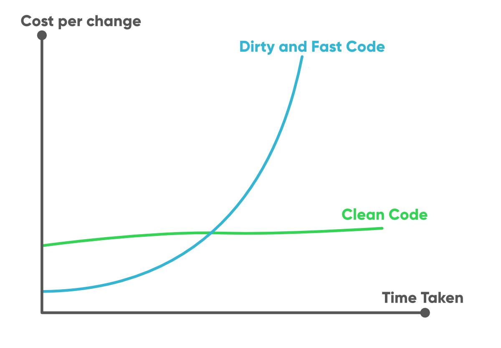

<small>Visual: Unsplash / 
Safar Safarov</small>
  

# **Clean Code 🧼**
#### Learn how to write clean readable, understandable and scalable code that any developer can read, maintain and change easily 🍀

 

  

---

 

## - [**Table of content**](#table-of-content)

- 1 . [Getting started](#getting-started)

- 2 . [Learning Checklist ✅](#learning-checklist-)

- 3 . [Characteristics of a Clean code](#characteristics-of-a-clean-code)
- 4 . [Naming Variables, Constant, Functions Classes & More](#naming-variables,-constant-functions,-classes-&-more)
  - 1 . [Variables | Properties](#variables-|-properties)
  - 2 . [Functions | Methods](#Functions-|-Methods)
  - 3 . [Classes | Modules](#Classes-|-modules)

- 5 . [Code Structure, Comments & Formatting](#code-structure,-comments-&-formatting)
  - 1 . [Formatting](#formatting)
  - 2 . [Good & Bad Comments](#good-&-bad-comments)

- 6 . [Functions & Methods](#functions-and-methods)
  - 1 . [Length](#length)
  - 2 . [Parameters](#parameters)
  - 3 . [Best practices](#best-practices)

- 7 . [Control Structures/ Nested & Error handling](#control-structures-&-errors-handling)
  - 1 . [Conditionals](#conditionals)
  - 1 . [Deep nesting](#deep-nesting)
  - 3 . [Error handling](#error-handling)

- 8 . [Objects, Classes & Data Containers / Structures](#Objects,-classes-&-data-containers-/-structures)
  - 1 . [Cohesion, Coupling and Interfaces](#cohesion-coupling-and-Interfaces)
  - 2 . [Polymorphism; Inheritance and Composition](#polymorphism-inheritance-and-composition)
  - 3 . [Classes, Data Structures, Encapsulation](#polymorphism-inheritance-and-composition)
- 9 . [SOLID principles](#solid-principles)
  - 1 . [Single-Responsibility-Principle (SRP)](#single-responsibility-principle-srp)
  - 2 . [Open-Closed Principle (OCP)](#open-closed-principle-OCP)
  - 3 . [Liskov Substitution Principle](#liskov-substitution-principle)
  - 4 . [Interface Segregation Principle](#interface-segregation-principle)
  - 5 . [Dependency Inversion Principle](#dependency-inversion-principle)
- 10 .  [Code smells](#code-smells)
    - 1 . [Bloaters](#bloaters)
      - 1 . [Long method](#long-method)
      - 2 . [Large class](#large-class)
      - 3 . [Primitive Obsession](#long-method)
      - 4 . [Long Parameter List](#long-parameter-list)
      - 5 . [Data Clumps](#data-clumps)
    - 2 . [Object-Orientation Abusers](#object-orientation-abusers)
      - 1 . [Switch Statements](#switch-statements)
      - 2 . [Temporary Field](#temporary-field)
      - 3 . [Refused Bequest](#refused-bequest)
      - 4 . [Alternative Classes with Different Interfaces](#alternative-classes-with-different-interfaces)
    - 3 . [Change Preventers](#change-preventers)
      - 1 . [Divergent Change](#divergent-change)
      - 2 . [Shotgun Surgery](#shotgun-surgery)
      - 3 . [Parallel Inheritance Hierarchies](#parallel-inheritance-hierarchiesy)
      - 4 . [Parallel Inheritance Hierarchies](#parallel-inheritance-hierarchiesy)
    - 4 . [Dispensables](#dispensables)
      - 1 . [Comments](#comments)
      - 2 . [Duplicate Code](#duplicate-code)
      - 3 . [Lazy Class](#lazy-class)
      - 4 . [Data Class](#data-class)
      - 5 . [Dead Code](#dead-code)
      - 6 . [Speculative Generality](#speculative-generality)
    - 5 . [Couplers](#couplers)
      - 1 . [Feature Envy](#feature-envy)
      - 2 . [Inappropriate Intimacy](#inappropriate-intimacy)
      - 3 . [Message Chains](#message-chains)
      - 4 . [Middle Man](#middle-man)
    - 6 . [Other smells](#incomplete-library-class)
      - 1 . [Incomplete Library Class](#incomplete-library-class)

- 11 . [Refactoring techniques](#refactoring-techniques)
  - 1 . 

- 12 . [Talks about Clean Code](#talks-about-clean-code)
  - [Uncle Bob](#uncle-bob)
    - [Clean Code - Uncle Bob / Lesson 1](#clean-code-uncle-bob-/-lesson-1)
    - [Clean Code - Uncle Bob / Lesson 2](#clean-code-uncle-bob-/-lesson-2)
    - [Clean Code - Uncle Bob / Lesson 3](#clean-code-uncle-bob-/-lesson-3)
    - [Clean Code - Uncle Bob / Lesson 4](#clean-code-uncle-bob-/-lesson-4)
    - [Clean Code - Uncle Bob / Lesson 6](#clean-code-uncle-bob-/-lesson-6)

#### Further Learning Resource

- 13 . [Articles 📰](#-articles-)

- 14 . [Books 📚](#-books-)
- 15 . [Courses 💻](#-courses-)

---

 
 
 

# 1

## **Getting started**

  
Let's first get to know What Clean Code is | <b>Click to expand</b>

 

  

  

  <small>Let’s Clean that Code
 / Source <a href="https://blog.knoldus.com/keep-your-code-clean/">Knoldus</a></small>
  
   

  ## **What's a Clean Code?**
  
  

  Clean Code is a readable, understandable and scalable code that any developer other than the original author can read, maintain and change easily, a code that can be adapted to changing requirements and with understandability comes readability, changeability, extensibility and maintainability.

  ---

  and of the things that a Clean Code is certinaly not is not a code that (**just works**)
  and Martin Fowler & Uncle Bob describes clean code in one of the places:

  > Any fool can write code that a computer can understand. Good programmers write code that humans can understand. (<small>Martin Fowler</small>)

  >What derives us to make the mess in the first place in software development is (The desire to go fast) (<small>Uncle Bob</small>)
   

---

 

## **What's not a Clean code**

a code that grows more and more disorganized as it is changed over time, leading to slower and slower development,
and that's why it's crucial to master how to write Clean Code as a Software engineer.

 

<small>Let’s Clean that Code/ Source<a href="https://blog.knoldus.com/keep-your-code-clean/">Knoldus</a></small>

---

 

 
 
 

# 2
## **Learning Checklist ✅**

  
A handy checklist to keep track of your progress, and know when you master your Clean code path 💈. <b>Click to expand</b>

 

A list of the things we're going to learn 🔥

- [ ]  Modularity
- [ ]  SOLID Principles
- [ ]  Interfaces in general, characteristics of clean interfaces
- [ ]  YAGNI (You Ain't Gonna Need It)
- [ ]  Principle of least astonishment

Characteristics of high-quality code:

- [ ]  Good identifier names
- [ ]  Good functions: size, arguments, return values
- [ ]  Error handling and exceptions
- [ ]  Appropriate use of data types

How to recognize and write high-quality data structures, classes, and interfaces, leveraging the following concepts as appropriate:
  - [ ]  Encapsulation and information hiding
  - [ ]  Internal cohesion and external coupling
  - [ ]  Inheritance and composition
  - [ ]  Dependency inversion

Mastering:
- [ ]  know the characteristics of high-quality code
- [ ]  how to practically write code that has high quality
- [ ]  how to recognize potential quality issues (“bad smells”)
- [ ]  how to improve code quality by refactoring
- [ ]  knowledge and are able to use it in practice.

---

 
 
 

# 3
## **Characteristics of a Clean code**:

 

Characteristics of a Clean code | <b>Click to expand</b>

 

<small>Let’s Clean that Code
 / Source <a href="https://blog.knoldus.com/keep-your-code-clean/">Knoldues</a></small>

 

Aside from all the steps and to summerize (Treat your code like an essay an you are it's author) and that's what is going to lean to building a readable and understable code 😉

  ---
#### 1. It should be elegant readable and meaningful
   -  Clean code should be pleasing to read. Reading it should make you smile the way a well-crafted music box or well-designed car would.

#### 2. Should avoid unintiuitive names, complex nesting, and big code blocks.
  
#### 3. Clean code is focused
   -  Each function, each class, each module exposes a single-minded attitude that remains entirely undistracted, and unpolluted, by the surrounding details.
#### 4. Clean code is taken care of.
   - Someone has taken the time to keep it simple and orderly. They have paid appropriate attention to details. They have cared.

#### 5. Runs all the tests
   - You know your code is dirty when only 95% of your tests passed. You know you’re screwed when you test coverage is 0%.

#### 6. Clean code is easier and cheaper to maintain!

#### 7. Contains no duplication and reduces cognitive load
   - Each time you have to make a change in a duplicate code, you have to remember to make the same change to every instance. This increases the cognitive load and slows down the progress, so Minimize the number of entities such as classes, methods, functions, and the like.

#### 8. Minimize the number of entities such as classes, methods, functions, and the like.
  - Less code is less stuff to keep in your head. Less code is less maintenance. Less code is fewer bugs. Code is liability, keep it short and simple.

#### 9. Should follow common best practices and patterns.

 

 

---

 
 

 

# 4
## **Naming Variables, Constant, Functions Classes & More**:

 

Characteristics of a Clean code | <b>Click to expand</b>

 

 

 

---

 
 
 

# 5
## **Code Structure, Comments & Formatting**:

 

Characteristics of a Clean code | <b>Click to expand</b>

 

 

 

---

 
 
 

# 6
## **Functions & Methods**:

 

Characteristics of a Clean code | <b>Click to expand</b>

 

 

 

---

 
 
 

# 7
## **Control Structures & Errors**:

 

Characteristics of a Clean code | <b>Click to expand</b>

 

 

 

---

 
 
 

# 8
## **Objects, Classes & Data Containers / Structures**:

 

Characteristics of a Clean code | <b>Click to expand</b>

 

### **Cohesion, Coupling and Interfaces**:

Cohesion, Coupling and Interfaces | <b>Click to expand</b>

 

---
### **Polymorphism; Inheritance and Composition**:

Polymorphism; Inheritance and Composition | <b>Click to expand</b>

 

---
### **Classes, Data Structures, Encapsulation**:

Classes, Data Structures, Encapsulation | <b>Click to expand</b>

---

 
 
 

# 9
## **SOLID principles**:

 

Everything you need to know to master SOLID principles | <b>Click to expand</b>

 

### **Single-Responsibility-Principle (SRP)**:

Single-Responsibility-Principle (SRP) | <b>Click to expand</b>

 

---
### **Open-Closed Principle (OCP)**:

Open-Closed Principle (OCP) | <b>Click to expand</b>

 

---
### **Liskov Substitution Principle**:

Liskov Substitution Principle | <b>Click to expand</b>

 

---
### **Interface Segregation Principle**:

Interface Segregation Principle | <b>Click to expand</b>

 

---
### **Dependency Inversion Principle**:

Dependency Inversion Principle | <b>Click to expand</b>

---

 
 
 

# 10
## **Code Smells**:

 

Everything you need to know to master SOLID principles | <b>Click to expand</b>

 

### **Bloaters**:

Bloaters | <b>Click to expand</b>

 

### **Long method**:

Long method | <b>Click to expand</b>

 

---

 

### **Large class**:

Large class | <b>Click to expand</b>

 

---

 

### **Primitive Obsession**:

Bloaters | <b>Primitive Obsessionick to expand</b>

 

---

 

### **Long Parameter List**:

Long Parameter List | <b>Click to expand</b>

 

---

 

### **Data Clumps**:

Data Clumps | <b>Click to expand</b>

 

 

---

 

### **Object-Orientation Abusers**:

Object-Orientation Abusers | <b>Click to expand</b>

 

### **Switch Statements**:

Switch Statements | <b>Click to expand</b>

 

---

 

### **Temporary Field**:

Temporary Field | <b>Click to expand</b>

 

---

 

### **Refused Bequest**:

Refused Bequest | <b>Click to expand</b>

 

---

 

### **Alternative Classes with Different Interfaces**:

Alternative Classes with Different Interfaces | <b>Click to expand</b>

 

---

 

---

 

### **Change Preventers**:

Change Preventers | <b>Click to expand</b>

 

### **Divergent Change**:

Divergent Change | <b>Click to expand</b>

 

---

 

### **Shotgun Surgery**:

Shotgun Surgery | <b>Click to expand</b>

 

---

 

### **Parallel Inheritance Hierarchies**:

Refused Bequest | <b>Parallel Inheritance Hierarchies expand</b>

 

---

 

### **Parallel Inheritance Hierarchies**:

Refused Bequest | <b>Parallel Inheritance Hierarchies expand</b>

 

---

 

 

---

 

### **Dispensables**:

Dispensables | <b>Click to expand</b>

 

### **Comments**:

Comments | <b>Click to expand</b>

 

---

 

### **Duplicate Code**:

Duplicate Code | <b>Click to expand</b>

 

---

 

### **Lazy Class**:

Lazy Class | <b>Click to expand</b>

 

---

 

### **Data Class**:

Data Class | <b>Click to expand</b>

 

---

 

### **Dead Code**:

Dead Code | <b>Click to expand</b>

 

---

 

### **Refused Bequest**:

Refused Bequest | <b>Click to expand</b>

 

---

 

---

 

### **Couplers**:

Couplers | <b>Click to expand</b>

 

### **Feature Envy**:

Feature Envy <b>Click to expand</b>

 

---

 

### **Inappropriate Intimacy**:

Inappropriate Intimacy | <b>Click to expand</b>

 

---

 

### **Message Chains**:

Message Chains | <b>Click to expand</b>

 

---

 

### **Middle Man**:

Middle Man | <b>Click to expand</b>

 

---

 

 

---

 

### **Other smells**:

Other smells | <b>Click to expand</b>

 

---
 
 
 

# 12
## **Talks about Clean Code**:

 

Talks about Clean Code summarized 🎁 | <b>Click to expand</b>

 

## **Uncle Bob**

Uncle Bob's talks

 

  

    
Clean Code - Uncle Bob / Lesson 1

   

  

  

    
Clean Code - Uncle Bob / Lesson 2

   

  

  

    
Clean Code - Uncle Bob / Lesson 3

   

  

  

    
Clean Code - Uncle Bob / Lesson 4

   

  

  

    
Clean Code - Uncle Bob / Lesson 5

   

  

 

---

 
 
 

# 8

## **Articles 📰**

___

Article           | Provider (Platform) | Used as reference|
--------------------- | -------------- | -------|
[Clean code](https://refactoring.guru/refactoring/what-is-refactoring) | refactoring.guru | Yes ❤️
___
   

# 9
## **Books 📚**
One of the most straight to the point Books 🔥🕹📟
___

Book name           | Provider (Platform) | Duration| Skill level |  Cost
--------------------- | -------------- | -------- | ---------- | -----
[Refactoring: Improving the Design of Existing Code](https://www.amazon.com/Refactoring-Improving-Existing-Addison-wesley-Signature/dp/0134757599/) | Amazon | 448 pages | Beginner | Hardcover $44.46 |
[Clean Code: A Handbook of Agile Software Craftsmanship](https://www.amazon.de/-/en/Robert-Martin/dp/0132350882) | oreilly | 464 pages | Beginner | Paperback $32.46 |
___

  

# 10

## **Courses 💻**
----
The most popular courses that teach Clean Code. Yes for real 🔥🕹📟

Course name           | Provider (Platform) | Duration| Skill level | Course Cost | Used as refrence
--------------------- | -------------- | -------- | ---------- | ----- | -----
[Dive Into REFACTORING](https://refactoring.guru/refactoring/course) | refactoring.guru | -- | Beginner | $35.70 discount | Yes ❤️ Using the code smells index structre
[Clean Code](https://www.udemy.com/course/writing-clean-code/) | Udemy | 6.5 hours | Beginner | $14.29 discount | Yes ❤️ Used by summerizing most of its content

---

   

# 11

<!-- Tables -->
## **Resources**
*[Resources to learn Clean Code from]()* 🐱
 

---
 

> Learn by watching/ doing
>
Title | Description
------------ | -------------
[Clean Code - Uncle Bob / Lesson 1](https://www.youtube.com/watch?v=7EmboKQH8lM) | "Coding Better World Together" is a set of master lessons from the famous Uncle Bob (Robert Cecil Martin), where he gives us a broad vision of the importance and future of Software in today's society.

---
