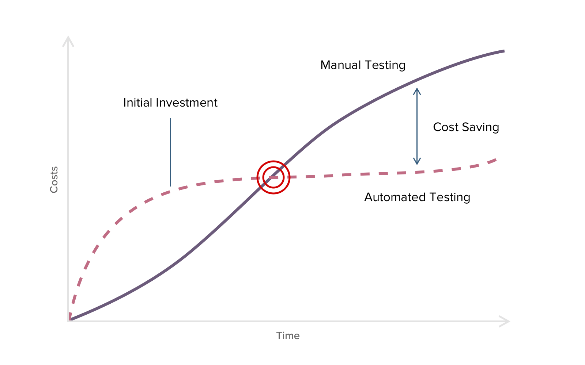

<small>Visual: Unsplash / 
Kevin Ku</small>
  

# **Automated Software Testing 🧪**
Learn the art of automated testing in its different forms, including unit testing, integration testing and system testing, and gain the practical ability to write solid clean tests for your product/software and to judge whether some tests are sufficient or not.

 

  

---

 

## - [**Table of content**](#table-of-content)

  - 1 . [Getting started](#getting-started)
  - 2 . [Learning Checklist ✅](#learning-checklist-)
  - 3 . [Why to transform from Manual to Automated Testing](#why-to-transform-from-manual-to-automated-testing)
    - 1 . [Manual vs. Automated Testing](#manual-vs.-automated-testing)
  - 4 . [How does Automated Software Testing work?](#how-does-automation-testing-work?)
  - 5 . [Essential testing Glossary](#essential-testing-glossary)
    - 1 . [Assertion](#assertion)
    - 2 . [Arrange](#arrange)
    - 3 . [Monkey Patching](#monkey-patching)
    - 4 . [Code Coverage](#code-coverage)
    - 5 . [Spy](#spy)
    - 6 . [Libraries](#Libraries)
    - 7 . [Stub](#Stub)
    - 8 . [Mocking](#mocking)
    - 9 . [Test doubles](#test-doubles)
    - 10 . [Testing frameworks](#testing-frameworks)
    - 11 . [Pure functions](#pure-functions)
  - 6 . [Why do i write tests?](#why-do-i-write-tests)
  - 7 . [Why should i test?](#why-should-i-test)
  - 8 . [Test-Driven Development (TDD)](#test-driven-development-TDD)
    - 1 . [The Three Laws f TDD](@The-three-laws-of-TDD)

  - 9 . [Static testing](#static-testing)
  - 10 . [Unit testing](#unit-testing)
  - 11 . [Integration testing](#integration-testing)
  - 12 . [End to end testing](#end-to-end-testing)
  - 13 . [UI Tests](#ui-tests)
  ---
  Further
  
  - 14 . [Testing third-party services](#testing-third-party-services)
  - 15 . [Black Box Testing](#black-box-testing)

  - 16 . [white Box Testing](#white-box-testing)
  - 17 . [Gray Box Testing](#gray-box-testing)
  - 18 . [Differences between Black Box and White Box Testing](#white-box-testing)
  - 19 . [Regression testing](#regression-testing)
  - 20 . [Load testing](#load-testing)
  - 21 . [Stress testing](#stress-testing)
  - 22 . [Acceptance Testing](#acceptance-testing)
  - 23 . [Performance Testing](#performance-testing)
  - 24 . [Functional Testing](#functional-testing)
  - 25 . [Mutation Testing](#mutation-testing)
  #### Further Learning Resources

  - 20 . [Articles 📰](#-articles-)
  - 21 . [Books 📚](#-books-)
  - 22 . [Courses 💻](#-courses-)

---

 
 
 

# 1

## **Getting started**

  
Let's first get to know why do we need this thing 🥸 | <b>Click to expand</b>

 

  ## **What is Automated Software Testing**

**Automated Software Testing** is  process/ technique where a Tester writes tools, scripts, and software to perform test cases by repeating pre-defined actions that allows to execute repetitive task without intervention of Manual Tester. Test Automation focuses on replacing manual human activity with systems or devices. Because automated testing is done through an automation tool, it consumes less time in exploratory tests and more time in maintaining test scripts while increasing overall test coverage 

- The software testing industry involves two different kinds of testing Manual and Automated. There are distinct differences between the testing types. Manual testing requires physical time and effort to ensure the software code does everything. Also, manual testers have to make a record of their findings.

- The benefit of manual testing is that it allows a human mind to draw insights from a test that might otherwise be missed by an automated testing program. 
- Automated testing is most preferable for large projects that require testing the same areas over and over. Also, projects that have already been through an initial manual testing process and it is an Automated Process of a Manual Process 😉

  ---

- The test automation performs testing at three different levels:

  - Unit Level Automation
  - API Testing
  - User Interface

 

---

 
 
 

# 2
## **Learning Checklist ✅**

  
A handy checklist to keep track of your progress, and know when you master your Automated Software testing learning path 💈. <b>Click to expand</b>

 

---

- [ ] Reasons for automated testing, among them support for refactoring, changing requirements, and continuous deployment.
- [ ] The role of automated testing in fixing and isolating bugs.
- [ ] Criteria for good tests.
- [ ] Role and typical features of test frameworks.
- [ ] Testability.
- [ ] Test-driven development.
- [ ] Robust user interface testing.
- [ ] The role and significance of test coverage tools (including criteria for calculation).
- [ ] Test doubles (mocks/stubs).

  ---

Acquired the following knowledge:

- [ ] The available testing methods and types

- [ ] The reasons for automated testing
- [ ] The principles of test-driven development
- [ ] Assess and choose appropriate testing tools
- [ ] Judge whether a given module’s tests are sufficient or not

---

 
 
 

# 3
## **Why to transform from Manual to Automated Testing**

  
Why Automating your Software Testing Porcess <b>Click to expand</b>

 

---
 

<small>ROI in Software Testing: How QA Automation Helps to Cut Costs | Source <a href="https://www.cleveroad.com/blog/test-automation-roi">Cleveroad</a></small>

 

**Automated Software Testing** has many benefits for app testing cycles. This allows you to build better apps with less effort. Also, it is less time-consuming. Many companies still run only manual tests as they are now aware of how to properly integrate automated testing in their app development process. 

---

 

### **Some of the reasons why Automation Testing is important:**

 

- **Running Tests 24/7**: You can start the test from anywhere in the world and anytime you want to. You can even do that remotely if you don’t have a lot of devices or you don’t have the possibility to buy them.

- **Fewer Human Resources**: You just need a test automation engineer to write your scripts to automate your tests, instead of a lot of people doing boring manual tests over and over again.
- **Reusability**: The scripts are reusable and you don’t need new scripts every time. Also, you can redo the steps that are exactly as the previous ones.
- **Bugs**: Automation helps you find bugs in the early stages of software development, reducing expenses and working hours to fix these problems as well.
- **Reliability**: Automated testing is more reliable and way quicker when running boring repetitive standardized tests which can not be skipped, but may cause errors when manually tested.

 

---

### **Difference between Manual & Automation Testing**

  
Difference between Manual & Automation Testing <b>Click to expand</b>

  
 
|Features |	Manual Testing |	Automation Testing|
|----------|---------------|--------------------|
|**Accuracy & Reliability** | Not accurate at all times due to Human Error, Therefore Less Reliable. | Since it is performed by third party tools and/or Scripts, therefore More Reliable.
**Time required** | Time Consuming. | Faster than Manual Testing as it is executed by Tools.|
**Investment Cost** | Return of Investment(ROI) is low heavy Investment for Human Resources. | Return of Investment(ROI) is high investment for Tools rather than for Human Resources.
|**Usage**|Suitable for Exploratory, Usability and Ad hoc Testing |	Suitable for  Regression Testing, Performance Testing, Load Testing.| 
**Human Element** | It allows for Careful Human observation to find out any glitches |	No human observation involved and a practical option when test cases are run repeatedly.|
**Customer Experience** | Helps in improving the customer experience | No guarantee of positive customer experience

---

 
 
 

# 4
## **How does Automated Software Testing work?**

  
Automated Software Testing workflow |  <b>Click to expand</b>

 

---
 

 
 
 

---
 

# 8

## **Articles 📰**

___

Article           | Provider (Platform) | Used as reference|
--------------------- | -------------- | -------|
[What is Automation Testing and why is it used?](https://www.edureka.co/blog/what-is-automation-testing/) | [Edureka](https://www.edureka.co/) | Yes ❤️

___
   

# 9
## **Books 📚**
One of the most straight to the point Books 🔥🕹📟
___

Book name           | Provider (Platform) | Pages| Skill level |  Cost | Description|
--------------------- | -------------- | -------- | ---------- | -----|----|
[Software Engineering at Google: Lessons Learned from Programming Over Time](https://www.amazon.de/-/en/Titus-Winters/dp/1492082791) | Amazon | 583 pages | Beginner | 48$ | Very good book on several software engineering topics. Among others, includes chapters on communication, on version control, documentation, and code reviews, on CI/CD, and on testing. Chapters 11-14 are relevant for testing. Well-readable, but not a beginner's book.|
___

  

# 10

## **Courses 💻**
----
The most popular courses that teach Automated Software Testing. Yes for real 🔥🕹📟

Course name           | Provider (Platform) | Duration| Skill level | Course Cost
--------------------- | -------------- | -------- | ---------- | -----
-- | -- | -- | -- | -- |

---

   

# 11

<!-- Tables -->
## **Resources**
*[Resources to learn Automated Software Testing from]()* 🐱
 

 

> Learn by watching/ doing
>
Title | Description|
|------------ | -------------|
[Test-driven development tutorial: What is test-driven development (TDD)? lynda.com](https://www.youtube.com/watch?v=QCif_-r8eK4) | Explaining the basics of TDD 
[Agile in Practice: Test Driven Development](https://www.youtube.com/watch?v=uGaNkTahrIw) | Explaining the basics of TDD with an a real-life scenario example
[The Three Laws of TDD (Featuring Kotlin)](https://www.youtube.com/watch?v=qkblc5WRn-U) | Explaining the three laws of TDD by Uncle Bob

---
