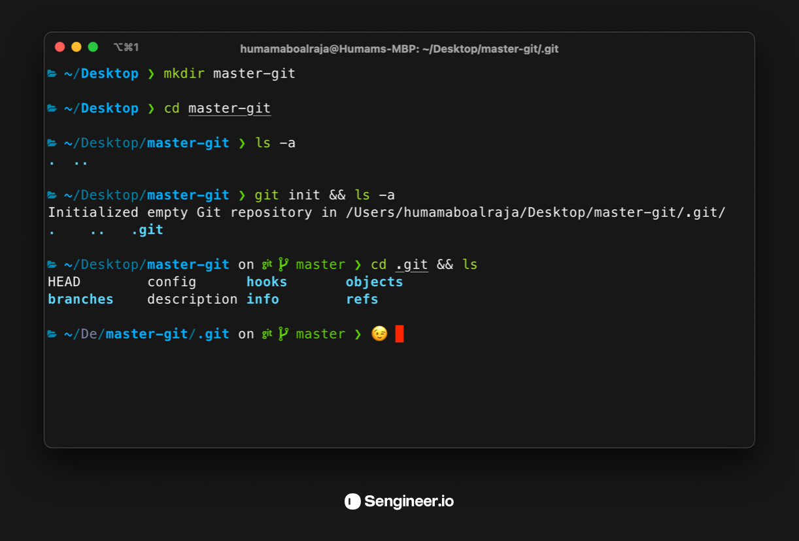

<div align="center">
<small>Image source: <a href="https://unsplash.com/photos/842ofHC6MaI">Yancy Min</a></small>
</div>
<br/><br/>

<div align="center">

# **Version Control with Git & Github 📜** 
Learn and Master Git VCS & Github without any prior knowledge required.


<br>


[](https://GitHub.com/Naereen/StrapDown.js/graphs/commit-activity) [](https://github.com/humamaboalraja) [](https://lbesson.mit-license.org/)


</div>

---

<br/>

## - [**Table of content**](#table-of-content)

  ### 1 . [**What is Git Version Control system & What is Github 😃**](#what-is-git-version-control-system--what-is-github-)
  ---
  ### 2 . [**Git terminology**](#git-terminology)
  ---
  ### 3 . [**Learning Checklist ✅**](#learning-checklist-)
    
  ---

  ### 4 . [**Install and Setup Git**](#install-and-setup-git)
  - 1 . [Windows](#windows)
  - 2 . [Mac](#mac)
  - 3 . [Advanced Configuration](#advanced-configuration)
  - 4 . [Getting Help](#getting-help)
    
    ---
  ### 5 . [**Creating Snapshots 🎸**](#creating-snapshots-)
  - 1 . [Initializing a Repository](#initializing-a-repository)
  - 2 . [Git Workflow Recap](#git-workflow-recap)
  - 3 . [Staging Files](#staging-files)
  - 4 . [Commiting Changes](#commiting-changes)
  - 5 . [Semantic Commits and Commiting best practices](#semantic-commits-and-commiting-best-practices)
  - 6 . [Skipping the staging area](#skipping-the-staging-area)
  - 7 . [Remove, Rename, or Move Files](#remove,-rename,-or-move-files)
  - 8 . [Ignoring Files](#ignoring-files)
  - 9 . [Short Status](#short-status)
  - 10 . [Showing Staged and Unstaged Changes](#showing-staged-and-unstaged-changes)
  - 11 . [Visual Diff Tools](#visual-diff-tools)
  - 12 . [View a Repository's History](#view-a-repository's-history)
  - 13 . [Unstaging Files](#unstaging-files)
  - 14 . [Discarding local changes](#discarding-local-changes)
  - 15 . [Restoring a file from an earlier version](#restoring-a-file-from-an-earlier-version)
    
    ---

  ###  6 . [**Browse a Repo's History 🕑**](#browse-a-repo's-history-)
  - 1 . [Browse, Filter and Format a Repository's History](#browse,-filter-and-format-a-repository's-history)
  - 2 . [Aliases](#aliases)
  - 3 . [Viewing a Commit and The changes across commits](#viewing-a-commit-and-the-changes-across-commits)
  - 4 . [Checking out a Commit](#checking-out-a-commit)
  - 5 . [Finding Bugs Using Bisect](#finding-bugs-using-bisect)
  - 6 . [Finding Contributors Using Shortlog](#finding-contributors-using-shortlog)
  - 7 . [Browsing the history of a Branch](#browsing-the-history-of-a-branch)
  - 8 . [Restoring Files](#restoring-files)
  - 9 . [Use Blame tool to find the author of a Line](#use-blame-tool-to-find-the-author-of-a-line)
  - 10 . [Tagging](#tagging)
    
    ---
  ###  7 . [**Branching 🌳**](#branching)
  - 1 . [What Branches are?](#what-branches-are)
  - 2 . [Working with Branches](#working-with-branches)
  - 3 . [Comparing Branches](#comparing-branches)
  - 4 . [Stashing](#stashing)
  - 5 . [Merging](#merging)
  - 6 . [Fast-Forward Merges](#fast-forward-merges)
  - 7 . [3-Way Merges](#3-way-merges)
  - 8 . [Viewing Merged and Unmerged Branches](#viewing-merged-and-unmerged-branches)
  - 9 . [Merge Conflicts](#merge-conflicts)
  - 10 . [Use GUI merge tools](#use-gui-merge-tools)
  - 11 . [Aborting a Merge](#aborting-a-merge)
  - 12 . [Undoing a Faulty Merge](#undoing-a-faulty-merge)
  - 13 . [Squash Merging](#squash-merging)
  - 14 . [Rebasing](#rebasing)
  - 15 . [Cherry Picking](#cherry-picking)
  - 16 . [Picking a File from another File](#picking-a-file-from-another-file)
    
    ---
  ###   8 . [**Undoing Changes and Rewriting history 🤚🏽**](#undoing-changes-and-rewriting-history-)
  - 1 . [Why would you need to re-write History](#why-would-you-need-to-re-write-history)
  - 2 . [The Golden Rule of Re-writing history & Examples of Bad History](#the-golden-rule-of-re-writing-history-&-examples-of-bad-history)
  - 3 . [Undoing Commits](#undoing-commits)
  - 4 . [Reverting Commits](#reverting-commits)
  - 5 . [Reverting lost Commits](#reverting-lost-commits)
  - 6 . [Amending the Last Commit](#amending-the-last-commit)
  - 7 . [Amending an Earlier Commit](#amending-an-earlier-commit)
  - 8 . [Dropping Commits](#dropping-commits)
  - 9 . [Rewording Commit Messages & Reordering Commits](#rewording-commit-messages-&-reordering-commits)
  - 10 . [Squashing Commits](#squashing-commits)
  - 11 . [Splitting a Commit](#splitting-a-commit)
    
    ---
  ### 9 . [**Collabration**](#collabration)
  - 1 . [Workflows](#workflows)
  - 2 . [Creating a Github Repository](#creating-a-github-repository)
  - 3 . [Adding Collaborators](#adding-collaborators)
  - 4 . [Cloning a Repository](#cloning-a-repository)
  - 5 . [Fetching](#fetching)
  - 6 . [Pulling](#pulling)
  - 7 . [Pushing](#bushing)
  - 8 . [Storing Credentials](#storing-credentials)
  - 9 . [Sharing Tags](#sharing-tags)
  - 10 . [Releases](#releases)
  - 11 . [Sharing Branches](#sharing-branches)
  - 12 . [Collaboration Workflow](#collaboration-workflow)
  - 13 . [Pull Requests](#pull-requests)
  - 14 . [Resolving Conflicts](#resolving-conflicts)
  - 15 . [Issues](#issues)
  - 16 . [Labels](#labels)
  - 17 . [Contributing to Open-source Projects](#contributing-to-open-source-projects)
  - 18 . [Syncying your Forked Repository and keeping it up-to-date](#syncying-your-forked-repository-and-keeping-it-up-to-date)
    
    ---
  #### Further Learning Resource

  ### 10 . [Articles 📰](#articles-)
  ### 11 . [Books 📚](#books-)
  ### 12 . [Courses 💻](#courses-)

---

<br/>
<br/>
<br/>
<br/>
<br/>
<br/>

# 1

## **What is Git Version Control system & What is Github 😃**

<details>
  <summary>Let's first get to know GIT 📇 | <b>Click to expand</b></summary>
</br>
Version control system is an incredibly important part of a professional developer's life. and in this guide, you'll learn about the benefits of version control system and install add Git and Github to your tool belt 😉! 

</br>
</br>

<div align="center">


</div>

<!--  -->
But aside from all of that Git is a free 
[open source](https://github.com/git/git) software written by [Linus Torvalds](https://en.wikipedia.org/wiki/Linus_Torvalds) who also wrote the Linux operating system's kernel. Git is a program for keeping track of changes over time, known in programming as version control. If you've used a track changes feature in a text editing software then you're already familiar with the concept!

___
<br/>

### **Version control models: Centralized vs. Decentralized**

There are a number of Version Control Systems out there. This alone should prove that version control is incredibly important. Three of the most popular version control systems are:

- Git
- Subversion
- Mercurial

and there are many version control systems out there. Often they are divided into two groups: “centralized” and “distributed”.

### **Centralized**:

Centralized version control systems are based on the idea that there is a single “central” copy of your project somewhere (probably on a server), and developers will “commit” their changes to this central copy.
### **Decentralized**:

In the past five years or so a new breed of tools has appeared: so-called “distributed” version control systems (DVCS for short). The three most popular of these are Mercurial, Git and Bazaar.

These systems do not necessarily rely on a central server to store all the versions of a project’s files. Instead, every developer “clones” a copy of a repository and has the full history of the project on their own hard drive. This copy (or “clone”) has all of the metadata of the original.

This method may sound wasteful, but in practice, it’s not a problem. Most programming projects consist mostly of plain text files (and maybe a few images), and disk space is so cheap that storing many copies of a file doesn’t create a noticable dent in a hard drive’s free space. Modern systems also compress the files to use even less space.

<br/>

> **Recap**: 
> Version control systems aim to solve a specific problem that developers face: “storing and sharing multiple versions of code files.” If you’re a developer of any kind and you don’t use any kind of version control, you should start right now. It will make your life easier, so the main point of a version control system is to help you maintain a detailed history of the project as well as the ability to work on different versions of it. Having a detailed history of a project is important because it lets you see the progress of the project over time. If needed, you can also jump back to any point in the project to recover data or files.

---

</details>
<br/>
<br/>
<br/>

# 2
## **Git Terminology**

<details >
<summary>How about we familiarize ourselves with Git's jargons, and break this fragile fear wall 💪🏽 | <b>Click to expand</b></summary>
</br>
Git is a tool that covered vast terminology and jargon, which can often be difficult for new users, or those who know Git basics but want to become Git masters. So, we need a little explanation of the terminology behind the tools. Let's have a look at the commonly used terms.

---
<br/>
<br/>

### 1. **Git**:

an SCM (and therefore a VCS!). The URL for the Git website is https://git-scm.com/ (see how it has "SCM" directly in its domain!).

---
<br/><br/>


### 2. **VCS version Control System / Source Code Manager**:
<br/>


A version control system (abbreviated as VCS) is a tool that manages different versions of source code. A source code manager (abbreviated as SCM) is another name for a version control system.

---

<br/><br/>


### 3. **Commit**:
<br/>


Git thinks of its data like a set of snapshots of a mini filesystem. Every time you commit (save the state of your project in Git), it basically takes a picture of what all your files look like at that moment and stores a reference to that snapshot. You can think of it as a save point in a game - it saves your project's files and any information about them.

Everything you do in Git is to help you make commits, so a commit is the fundamental unit in Git.

---
<br/><br/>

<!-- Image goes here -->

### 4. **Repository / repo**:

A repository is a directory which contains your project work, as well as a few files (hidden by default on Mac OS X) which are used to communicate with Git. Repositories can exist either locally on your computer or as a remote copy on another computer. A repository is made up of commits and in Git, Repository is like a data structure used by VCS to store metadata for a set of files and directories. It contains the collection of the file as well as the history of changes made to those files. Repositories in Git is considered as your project folder. A repository has all the project-related data. Distinct projects have distinct repositories.


---
<br/>


### 5. **Working Directory**:
<br/>

The Working Directory is the files that you see in your computer's file system. When you open your project files up on a code editor, you're working with files in the Working Directory.

This is in contrast to the files that have been saved (in commits!) in the repository.

When working with Git, the Working Directory is also different from the command line's concept of the current working directory which is the directory that your shell is "looking at" right now.

---
<br/>


### 6. **SHA**:

A SHA is basically an ID number for each commit. Here's what a commit's SHA might look like: e2adf8ae3e2e4ed40add75cc44cf9d0a869afeb6.

It is a 40-character string composed of characters (0–9 and a–f) and calculated based on the contents of a file or directory structure in Git. "SHA" is shorthand for "Secure Hash Algorithm". If you're interested in learning about hashes, check out our Intro to Computer Science course.

---

</br></br>


### 7. **Branch**:


A branch is a version of the repository that diverges from the main working project. It is an essential feature available in most modern version control systems.Branches serve as an abstraction for the edit/stage/commit process You can think of them as a way to request a brand new working directory, staging area, and project history. New commits are recorded in the history for the current branch, which results in a fork in the history of the project, and a Git project can have more than one branch. We can perform many operations on Git branch-like rename, list, delete, etc.


---
<br/><br/>


### 8. **Checkout**:


A checkout is when content in the repository has been copied to the Working Directory, and it is used for the act of switching between different versions of a target entity and simly the git checkout command is used to switch between branches in a repository.


---

<br/><br/>

### 9. **Cherry-Picking**:
Cherry-picking in Git is meant to apply some commit from one branch into another branch. In case you made a mistake and committed a change into the wrong branch, but do not want to merge the whole branch. You can revert the commit and cherry-pick it on another branch, git cherry-pick is a useful tool but not always a best practice. Cherry picking can cause duplicate commits and many scenarios where cherry picking would work, traditional merges are preferred instead. With that said git cherry-pick is a handy tool for a few scenarios.

---

<br/><br/>


### 10. **Merge**:

Merging is a process to put a forked history back together. The git merge command facilitates you to take the data created by git branch and integrate them into a single branch.


---

<br/><br/>


### 11. **Staging Area / Staging Index / Index**:
<br/>


<br/>

The Git index is a staging area between the working directory and repository. It is used as the index to build up a set of changes that you want to commit together and in a simler way it's a file in the Git directory that stores information about what will go into your next commit. You can think of the staging area as a prep table where Git will take the next commit. Files on the Staging Index are poised to be added to the repository, which means when we use ``` git add ``` which will get to know what that is later, it adds files to the staging area, form the stage of the working directory, and when we ```git commit``` those added changes it adds them to the repository.


---

<br/>

### 12. **Pull/Pull Request**:
The term Pull is used to receive data from remote git servers e.g Gitlab, GitHub... It fetches and merges changes on the remote server to your working directory. The git pull command is used to make a Git pull.

Pull requests are a process for a developer to notify team members that they have made a feature. Once their feature branch is ready, the developer files a pull request via their remote server account. Pull request announces all the team members that they need to review the code and merge it into the master branch, Pull requests are features that makes it easier for developers to collaborate using Git servers like Github, Bitbucket, Gitlab. They provide a user-friendly web interface for discussing proposed changes before integrating them into the official project.


---

<br/>

### 13. **Push**:
The push term refers to upload local repository content to a remote repository. Pushing is an act of transfer commits from your local repository to a remote repository. Pushing is capable of overwriting changes; caution should be taken when pushing.


---

<br/>

### 14. **Upstream And Downstream**:
The term upstream and downstream refers to the repository. Generally, upstream is from where you clone the repository, and downstream is any project that integrates your work with other works. However, these terms are not restricted to Git repositories.

There are two different contexts in Git for upstream/downstream, which are remotes and time/history. In the reference of remote upstream/downstream, the downstream repo will be pulled from the upstream repository. Data will flow downstream naturally.

In the reference of time/history, it can be unclear, because upstream in time means downstream in history, and vice-versa. So it is better if we use the parent/child terms in place of upstream/downstream in case of time/history.


---

<br/>


### 15. **Fetch**:

It is used to fetch branches and tags from one or more other repositories, along with the objects necessary to complete their histories. It updates the remote-tracking branches.


---

<br/>

### 16. **Git Reset**:

The term reset stands for undoing changes. The git reset command is used to reset the changes. The git reset command has three core forms of invocation. These forms are as follows.

- Soft
- Mixed
- Hard

If we say in terms of Git, then Git is a tool that resets the current state of HEAD to a specified state. It is a sophisticated and versatile tool for undoing changes. It acts as a time machine for Git. You can jump up and forth between the various commits. Each of these reset variations affects specific trees that git uses to handle your file in its content.

Additionally, git reset can operate on whole commits objects or at an individual file level. Each of these reset variations affects specific trees that git uses to handle your file and its contents.


---

<br/>

### 17. **Git Diff**:
Git diff is a command-line utility. It's a multiuse Git command. When it is executed, it runs a diff function on Git data sources. These data sources can be files, branches, commits, and more. It is used to show changes between commits, commit, and working tree, etc.

It compares the different versions of data sources. The version control system stands for working with a modified version of files. So, the diff command is a useful tool for working with Git.

However, we can also track the changes with the help of git log command with option -p. The git log command will also work as a git diff command.


---

<br/>

### 18. **Git Fork**:
A fork is a rough copy of a repository. Forking a repository allows you to freely test and debug with changes without affecting the original project. One of the excessive use of forking is to propose changes for bug fixing. To resolve an issue for a bug that you found, you can:

- Fork the repository.
- Make the fix.
- Forward a pull request to the project owner.

Forking is not a Git function; it is a feature of Git service like GitHub.


---

<br/>


### 19. **Git Clone**:
In Git, cloning is the act of making a copy of any target repository. The target repository can be remote or local. You can clone your repository from the remote repository to create a local copy on your system. Also, you can sync between the two locations.


---

<br/>


### 20. **Git Remote**:
In Git, the term remote is concerned with the remote repository. It is a shared repository that all team members use to exchange their changes. A remote repository is stored on a code hosting service like an internal server, GitHub, Subversion and more.

In case of a local repository, a remote typically does not provide a file tree of the project's current state, as an alternative it only consists of the .git versioning data.


---

<br/>


### 21. **HEAD**:

HEAD is the representation of the last commit in the current checkout branch. We can think of the head like a current branch. When you switch branches with git checkout, the HEAD revision changes, and points the new branch.

---

<br/>

### 22. **Master**:

Master is a naming convention for Git branch. It's a default branch of Git. After cloning a project from a remote server, the resulting local repository contains only a single local branch. This branch is called a "master" branch. It means that "master" is a repository's "default" branch.


---

<br/>

### 23. **Git Revert**:

In Git, the term revert is used to revert some changes. The git revert command is used to apply revert operation. It is an undo type command. However, it is not a traditional undo alternative. It does not delete any data in this process; instead, it will create a new change with the opposite effect and thereby undo the specified commit. Generally, git revert is a commit.

It can be useful for tracking bugs in the project. If you want to remove something from history then git revert is a wrong choice.

Moreover, we can say that git revert records some new changes that are just opposite to previously made commits. 

---

<br/>


### 24. **Git Rm/Remove**:

In Git, the term rm stands for remove. It is used to remove individual files or a collection of files. The key function of git rm is to remove tracked files from the Git index. Additionally, it can be used to remove files from both the working directory and staging index.


---

<br/>


### 25. **Stashing**:

Sometimes you want to switch the branches, but you are working on an incomplete part of your current project. You don't want to make a commit of half-done work. Git stashing allows you to do so. The git stash command enables you to switch branch without committing the current branch.


---

<br/>


### 26. **Tag**:
Tags make a point as a specific point in Git history. It is used to mark a commit stage as important. We can tag a commit for future reference. Primarily, it is used to mark a projects initial point like v1.1. There are two types of tags.

- Light-weighted tag
- Annotated tag


---

<br/>


### 27. **Git Ignore**:
In Git, the term ignore used to specify intentionally untracked files that Git should ignore. It doesn't affect the Files that already tracked by Git.

---

<br/>


### 28. **Git Squash**:
In Git, the term squash is used to squash previous commits into one. Git squash is an excellent technique to group-specific changes before forwarding them to others. You can merge several commits into a single commit with the powerful interactive rebase command.

---

<br/>


### 29. **Origin**:
In Git, "origin" is a reference to the remote repository from a project was initially cloned. More precisely, it is used instead of that original repository URL to make referencing much easier.


---

<br/>

### 30. **Git Rebase**:
Rebasing is a process to reapply commits on top of another base trip. It is used to apply a sequence of commits from distinct branches into a final commit. It is an alternative of git merge command. It is a linear process of merging.

In Git, the term rebase is referred to as the process of moving or combining a sequence of commits to a new base commit. Rebasing is very beneficial and it visualized the process in the environment of a feature branching workflow.

It is good to rebase your branch before merging it.


---
</br>

> ### So now that we have all of these Jargons simplified, let's see how we can use all of that to make our development workflow easier with Git 😉 📟

</details>

---

<br/></br><br/>

# 3
## **Learning Checklist ✅**

<details>
  <summary>A handy checklist to keep track of your progress, and know when you master Git 🧧. <b>Click to expand</b></summary>
</br>

You can use this learning checklist to follow this guide step by step and track your learning progress 💈

---
  ## Now i can:

 - [ ] Install & setup Git and Configure it with my Username and E-mail 
 - [ ] Create a Github, Bitbucket, Gitlab... account and add my username to Git config 
 - [ ] Create repositories on my Computer 
 - [ ] Create a "repository" (project) with a git hosting tool (like Bitbucket)
 - [ ] Copy (or clone) the repository to my local machine
 - [ ] Add a file to my local repo and "commit" (save) the changes
 - [ ] Connect my local repository to a remote one and "Push" my project/changes to my remote repository
 - [ ] Make a change to my file with a git hosting tool and commit
 - [ ] "Pull" the changes to my local machine
 - [ ] Create a "branch" (version), make a change, commit the change
 - [ ] Interact with branches by deleting, modifying, merging etc.. them
 - [ ] Open a "pull request" (propose changes to the master branch)
 - [ ] "Merge" my branch to the master branch
 - [ ] Merge my branch locally, delete the branch and pull from upstream.
 - [ ] Keep my file up to date by pulling in changes from collaborators.
 - [ ] Add a collabrator to my project.
 - [ ] Fork a project from Github, Gitlab, Bitbucket... and clone it locally
 - [ ] Add a branch locally to my forked repository to work on my changes.
 - [ ] reset old changes, commits, branches
 - [ ] Revert commits


</details>

---

<br/><br/><br/>

# 4
## **Install and Setup Git**

<details>
  <summary>Install and Setup Git | <b>Click to expand</b></summary>
</br>

Before you start using Git, you have to make it available on your computer. Even if it’s already installed, it’s probably a good idea to update to the latest version. You can either install it as a package or via another installer, or download the source code and compile it yourself.


<br>

### **Mac** 🍏
___
Git is actually installed on MacOS, but we'll be reinstalling it so that we'll have the newest version.

<details>
<summary>1. Install Git</summary>
<br/>
There are several ways to install Git on a Mac. The easiest is probably to install the Xcode Command Line Tools. On Mavericks (10.9) or above you can do this simply by trying to run git from the Terminal the very first time.

```latex
 git --version
 ```

 If you don’t have it installed already, it will prompt you to install it.

If you want a more up to date version, you can also install it via a binary installer. A macOS Git installer is maintained and available for download at the Git website, at https://git-scm.com/download/mac.

so now install Git choosing all of the default options, Once everything is installed, you should be able to run  ```git``` on the command line. If it displays the usage information, then you're good to go!


or you can install it using **Homebrew**,
Install [homebrew](https://brew.sh/) if you don't already have it, then:

```latex
$ brew install git
```

</details>


<details>
<summary>2. First Time Git Configuration</summary>
</br>
Before you can start using Git, you need to configure it. Run each of the following lines on the command line to make sure everything is set up.

```bash
# sets up Git with your name
git config --global user.name "<Your-Full-Name>"

# sets up Git with your email
git config --global user.email "<your-email-address>"

# makes sure that Git output is colored
git config --global color.ui auto

# displays the original state in a conflict
git config --global merge.conflictstyle diff3

git config --list
```
</details>

<details>
<summary>3. Git & Code Editor setup</summary>
</br>

The last step of configuration is to get Git working with your code editor. Below are three of the most popular code editors. If you use a different editor, then do a quick search on Google for "associate X text editor with Git" (replace the X with the name of your code editor).

Atom Editor Setup

```bash
git config --global core.editor "atom --wait"
```

Sublime Text Setup
```bash
git config --global core.editor "'/Applications/Sublime Text 2.app/Contents/SharedSupport/bin/subl' -n -w"
```

VSCode Setup
```bash
git config --global core.editor "code --wait"
```

</details>


___

<br/>


<br>


### **Windows** 🧊
<details>
<summary>1. Install Git</summary>
</br>
To download Git:

1. go to https://git-scm.com/downloads
2. download the software for Windows
3. install Git choosing all of the default options

Once everything is installed, you should be able to run git on the command line. If it displays the usage information, then you're good to go!


</details>

<details>
<summary>2. First Time Git Configuration
</summary>
</br>
Before you can start using Git, you need to configure it. Run each of the following lines on the command line to make sure everything is set up.


```bash
# sets up Git with your name
git config --global user.name "<Your-Full-Name>"

# sets up Git with your email
git config --global user.email "<your-email-address>"

# makes sure that Git output is colored
git config --global color.ui auto

# displays the original state in a conflict
git config --global merge.conflictstyle diff3

git config --list
```


</details>

<details >
<summary>3. Git & Code Editor setup
</summary>
</br>

The last step of configuration is to get Git working with your code editor. Below are three of the most popular code editors. If you use a different editor, then do a quick search on Google for "associate X text editor with Git" (replace the X with the name of your code editor).

Atom Editor Setup

```bash
git config --global core.editor "atom --wait"
```

Sublime Text Setup
```bash
git config --global core.editor "'/Applications/Sublime Text 2.app/Contents/SharedSupport/bin/subl' -n -w"
```

VSCode Setup
```bash
git config --global core.editor "code --wait"
```

</details>

</details>

___

<br/><br/><br/>


# 5
## **Creating Snapshots 🎸**
<details open>
  <summary>Creating Snapshots 🎸 | <b>Click to expand</b></summary>
</br>

  
<br>

  ### **Initializing a Repository**: 

  <details open>
    <summary>Initializing a Repository with examples | <b>Click to expand</b></summary>
    </br>

  To create a new reposityro in Gitwe use ```git init``` command which creates a new Git repository for us. It can be used to convert an existing, unversioned project to a Git repository or initialize a new, empty repository. Most other Git commands are not available outside of an initialized repository, so this is usually the first command you'll run in a new project.
  Executing git init creates a .git subdirectory in the current working directory, which contains all of the necessary Git metadata for the new repository. This metadata includes subdirectories for objects, refs, and template files. A HEAD file is also created which points to the currently checked out commit.

  

  <br>


   1 . **Create a new Repositroy from Scratch/ An already existed Project.**
  

  </details>
  <br>
  <br>
  
  ---

  <br>

  ### **Git Workflow Recap**: 

  <details>
    <summary>Git Workflow Recap with examples | <b>Click to expand</b></summary>
    </br>
  </details>
  <br>
  <br>


  
  ---
  <br>

  ### **Staging Files**: 

  <details>
    <summary>Staging Files with examples | <b>Click to expand</b></summary>
    </br>
  </details>
  <br>
  <br>


  
  ---
  <br>
  
  ### **Commiting Changes**: 

  <details>
    <summary>Commiting Changes with examples | <b>Click to expand</b></summary>
    </br>
  </details>
  <br>
  <br>


  
  ---
  <br>
  
  ### **Semantic Commits and Commiting best practices**: 

  <details>
    <summary>Semantic Commits and Commiting best practices with examples | <b>Click to expand</b></summary>
    </br>
  </details>
  <br>
  <br>


  
  ---
  <br>

  ### **Skipping the staging area**: 

  <details>
    <summary>Skipping the staging area with examples | <b>Click to expand</b></summary>
    </br>
  </details>
  <br>
  <br>


  
  ---
  <br>

  ### **Remove, Rename, or Move Files**: 

  <details>
    <summary>Remove, Rename, or Move Files with examples | <b>Click to expand</b></summary>
    </br>
  </details>
  <br>
  <br>


  
  ---
  <br>

  ### **Ignoring Files**: 

  <details>
    <summary>Ignoring Files with examples | <b>Click to expand</b></summary>
    </br>
  </details>
  <br>
  <br>


  
  ---
  <br>

  ### **Short Status**: 

  <details>
    <summary>Short Status with examples | <b>Click to expand</b></summary>
    </br>
  </details>
  <br>
  <br>


  
  ---
  <br>

  ### **Showing Staged and Unstaged Changes**: 

  <details>
    <summary>Showing Staged and Unstaged Changes with examples | <b>Click to expand</b></summary>
    </br>
  </details>
  <br>
  <br>


  
  ---
  <br>

  ### **Visual Diff Tools**: 

  <details>
    <summary>Visual Diff Tools with examples | <b>Click to expand</b></summary>
    </br>
  </details>
  <br>
  <br>


  
  ---
  <br>

  ### **View a Repository's History**: 

  <details>
    <summary>View a Repository's History with examples | <b>Click to expand</b></summary>
    </br>
  </details>
  <br>
  <br>


  
  ---
  <br>

  ### **Unstaging Files**: 

  <details>
    <summary>Unstaging Files with examples | <b>Click to expand</b></summary>
    </br>
  </details>
  <br>
  <br>


  
  ---
  <br>

  ### **Discarding local changes**: 

  <details>
    <summary>Discarding local changes with examples | <b>Click to expand</b></summary>
    </br>
  </details>
  <br>
  <br>


  
  ---
  <br>

  ### **Restoring a file from an earlier version**: 

  <details>
    <summary>Restoring a file from an earlier version with examples | <b>Click to expand</b></summary>
    </br>
  </details>
  <br>
  <br>


</details>

---

<br/><br/><br/>

# 6

## **Browse a Repo's History 🕑**

<details>
  <summary>Browse a Repo's History 🕑 | <b>Click to expand</b></summary>
</br>


  <br>

  ### **Browse, Filter and Format a Repository's History**: 

  <details>
    <summary>Browse, Filter and Format a Repository's History with examples | <b>Click to expand</b></summary>
    </br>
  </details>
  <br>
  <br>


  
  ---
  <br>

  ### **Aliases**: 

  <details>
    <summary>Aliases with examples | <b>Click to expand</b></summary>
    </br>
  </details>
  <br>
  <br>


  
  ---
  <br>
  
  ### **Viewing a Commit and The changes across commits**: 

  <details>
    <summary>Viewing a Commit and The changes across commits with examples | <b>Click to expand</b></summary>
    </br>
  </details>
  <br>
  <br>

  ---
  <br>
  
  ### **Checking out a Commit**: 

  <details>
    <summary>Checking out a Commit with examples | <b>Click to expand</b></summary>
    </br>
  </details>
  <br>
  <br>

  ---
  <br>
  
  ### **Finding Bugs Using Bisect**: 

  <details>
    <summary>Finding Bugs Using Bisect with examples | <b>Click to expand</b></summary>
    </br>
  </details>
  <br>
  <br>

  ---
  <br>
  
  ### **Finding Contributors Using Shortlog**: 

  <details>
    <summary>Finding Contributors Using Shortlog with examples | <b>Click to expand</b></summary>
    </br>
  </details>
  <br>
  <br>

  ---
  <br>
  
  ### **Browsing the history of a Branch**: 

  <details>
    <summary>Browsing the history of a Branch with examples | <b>Click to expand</b></summary>
    </br>
  </details>
  <br>
  <br>

  ---
  <br>
  
  ### **Restoring Files**: 

  <details>
    <summary>Restoring Files with examples | <b>Click to expand</b></summary>
    </br>
  </details>
  <br>
  <br>

  ---
  <br>
  
  ### **Use Blame tool to find the author of a Line**: 

  <details>
    <summary>Use Blame tool to find the author of a Line with examples | <b>Click to expand</b></summary>
    </br>
  </details>
  <br>
  <br>

  ---
  <br>
  
  ### **Tagging**: 

  <details>
    <summary>Tagging with examples | <b>Click to expand</b></summary>
    </br>
  </details>

<br>

</details>

___
<br/><br/><br/>


# 7

## **Branching 🌳**

<details>
  <summary>Branching 🌳</b></summary>
</br>

  <br>
  
  ### **What Branches are?**: 

  <details>
    <summary>What Branches are? with examples | <b>Click to expand</b></summary>
    </br>
  </details>
  <br>
  <br>

  ---
  <br>
  
  ### **Working with Branches**: 

  <details>
    <summary>Working with Branches with examples | <b>Click to expand</b></summary>
    </br>
  </details>
  <br>
  <br>

  ---
  <br>
  
  ### **Comparing Branches**: 

  <details>
    <summary>Comparing Branches with examples | <b>Click to expand</b></summary>
    </br>
  </details>
  <br>
  <br>

  ---
  <br>
  
  ### **Stashing**: 

  <details>
    <summary>Stashing with examples | <b>Click to expand</b></summary>
    </br>
  </details>
  <br>
  <br>

  ---
  <br>
  
  ### **Merging**: 

  <details>
    <summary>Merging with examples | <b>Click to expand</b></summary>
    </br>
  </details>
  <br>
  <br>

  ---
  <br>
  
  ### **Fast-Forward Merges**: 

  <details>
    <summary>Fast-Forward Merges with examples | <b>Click to expand</b></summary>
    </br>
  </details>
  <br>
  <br>


  ---
  <br>
  
  ### **3-Way Merges**: 

  <details>
    <summary>3-Way Merges with examples | <b>Click to expand</b></summary>
    </br>
  </details>
  <br>
  <br>


  ---
  <br>
  
  ### **Viewing Merged and Unmerged Branches**: 

  <details>
    <summary>Viewing Merged and Unmerged Branches with examples | <b>Click to expand</b></summary>
    </br>
  </details>
  <br>
  <br>


  ---
  <br>
  
  ### **Merge Conflicts**: 

  <details>
    <summary>Merge Conflicts with examples | <b>Click to expand</b></summary>
    </br>
  </details>
  <br>
  <br>


  ---
  <br>
  
  ### **Use GUI merge tools**: 

  <details>
    <summary>Use GUI merge tools with examples | <b>Click to expand</b></summary>
    </br>
  </details>
  <br>
  <br>


  ---
  <br>
  
  ### **Aborting a Merge**: 

  <details>
    <summary>Aborting a Merge with examples | <b>Click to expand</b></summary>
    </br>
  </details>
  <br>
  <br>


  ---
  <br>
  
  ### **Undoing a Faulty Merge**: 

  <details>
    <summary>Undoing a Faulty Merge with examples | <b>Click to expand</b></summary>
    </br>
  </details>
  <br>
  <br>


  ---
  <br>
  
  ### **Squash Merging**: 

  <details>
    <summary>Squash Merging with examples | <b>Click to expand</b></summary>
    </br>
  </details>
  <br>
  <br>


  ---
  <br>
  
  ### **Rebasing**: 

  <details>
    <summary>Rebasing with examples | <b>Click to expand</b></summary>
    </br>
  </details>
  <br>
  <br>


  ---
  <br>
  
  ### **Cherry Picking**: 

  <details>
    <summary>Cherry Picking with examples | <b>Click to expand</b></summary>
    </br>
  </details>
  <br>
  <br>


  ---
  <br>
  
  ### **Picking a File from another File**: 

  <details>
    <summary>Picking a File from another File with examples | <b>Click to expand</b></summary>
    </br>
  </details>
  <br>
  <br>


 


</details>

___

<br/><br/><br/>

# 8
## **Undoing Changes 🤚🏽**

<details>
  <summary>Undoing Changes and Rewriting history 🤚🏽</b></summary>
</br>


 ---
  <br>
  
  ### **Why would you need to re-write History**: 

  <details>
    <summary>Why would you need to re-write History with examples | <b>Click to expand</b></summary>
    </br>
  </details>
  <br>
  <br>


  ---
  <br>
  
  ### **The Golden Rule of Re-writing history & Examples of Bad History**: 

  <details>
    <summary>The Golden Rule of Re-writing history & Examples of Bad History with examples | <b>Click to expand</b></summary>
    </br>
  </details>
  <br>
  <br>


  ---
  <br>
  
  ### **Undoing Commits**: 

  <details>
    <summary>Undoing Commits with examples | <b>Click to expand</b></summary>
    </br>
  </details>
  <br>
  <br>


  ---
  <br>
  
  ### **Reverting Commits**: 

  <details>
    <summary>Reverting Commits with examples | <b>Click to expand</b></summary>
    </br>
  </details>
  <br>
  <br>


  ---
  <br>
  
  ### **Reverting lost Commits**: 

  <details>
    <summary>Reverting lost Commits with examples | <b>Click to expand</b></summary>
    </br>
  </details>
  <br>
  <br>


  ---
  <br>
  
  ### **Amending the Last Commit**: 

  <details>
    <summary>Amending the Last Commit with examples | <b>Click to expand</b></summary>
    </br>
  </details>
  <br>
  <br>

  ---
  <br>
  
  ### **Amending an Earlier Commit**: 

  <details>
    <summary>Amending an Earlier Commit with examples | <b>Click to expand</b></summary>
    </br>
  </details>
  <br>
  <br>

  ---
  <br>
  
  ### **Dropping Commits**: 

  <details>
    <summary>Dropping Commits with examples | <b>Click to expand</b></summary>
    </br>
  </details>
  <br>
  <br>

  ---
  <br>
  
  ### **Rewording Commit Messages & Reordering Commits**: 

  <details>
    <summary>Rewording Commit Messages & Reordering Commits with examples | <b>Click to expand</b></summary>
    </br>
  </details>
  <br>
  <br>

  ---
  <br>
  
  ### **Squashing Commits**: 

  <details>
    <summary>Squashing Commits with examples | <b>Click to expand</b></summary>
    </br>
  </details>
  <br>
  <br>

  ---
  <br>
  
  ### **Splitting a Commit**: 

  <details>
    <summary>Splitting a Commit with examples | <b>Click to expand</b></summary>
    </br>
  </details>
  <br>
  <br>


</details>

___
<br/><br/><br/>

# 9

## **Collabration** 

<details>
  <summary>Collabration | <b>Click to expand</b></summary>
</br>


  <br>
  
  ### **Workflows**: 

  <details>
    <summary>VCS'S Workflows | <b>Click to expand</b></summary>
    </br>
  </details>
  <br>
  <br>


  ---
  <br>
  
  ### **Creating a Github Repository**: 

  <details>
    <summary>Creating a Github Repository with examples | <b>Click to expand</b></summary>
    </br>
  </details>
  <br>
  <br>


  ---
  <br>
  
  ### **Adding Collaborators**: 

  <details>
    <summary>Adding Collaborators with examples | <b>Click to expand</b></summary>
    </br>
  </details>
  <br>
  <br>


  ---
  <br>
  
  ### **Cloning a Repository**: 

  <details>
    <summary>Cloning a Repository with examples | <b>Click to expand</b></summary>
    </br>
  </details>
  <br>
  <br>

  ---
  <br>
  
  ### **Fetching**: 

  <details>
    <summary>Fetching with examples | <b>Click to expand</b></summary>
    </br>
  </details>
  <br>
  <br>

  ---
  <br>
  
  ### **Pulling**: 

  <details>
    <summary>Pulling with examples | <b>Click to expand</b></summary>
    </br>
  </details>
  <br>
  <br>

  ---
  <br>
  
  ### **Pushing**: 

  <details>
    <summary>Pushing with examples | <b>Click to expand</b></summary>
    </br>
  </details>
  <br>
  <br>

  ---
  <br>
  
  ### **Storing Credentials**: 

  <details>
    <summary>Storing Credentials with examples | <b>Click to expand</b></summary>
    </br>
  </details>
  <br>
  <br>

  ---
  <br>
  
  ### **Sharing Tags**: 

  <details>
    <summary>Sharing Tags with examples | <b>Click to expand</b></summary>
    </br>
  </details>
  <br>
  <br>

  ---
  <br>
  
  ### **Releases**: 

  <details>
    <summary>Releases with examples | <b>Click to expand</b></summary>
    </br>
  </details>
  <br>
  <br>

  ---
  <br>
  
  ### **Sharing Branches**: 

  <details>
    <summary>Sharing Branches with examples | <b>Click to expand</b></summary>
    </br>
  </details>
  <br>
  <br>

  ---
  <br>
  
  ### **Collaboration Workflow**: 

  <details>
    <summary>Collaboration Workflow with examples | <b>Click to expand</b></summary>
    </br>
  </details>
  <br>
  <br>

  ---
  <br>
  
  ### **Pull Requests**: 

  <details>
    <summary>Pull Requests with examples | <b>Click to expand</b></summary>
    </br>
  </details>
  <br>
  <br>

  ---
  <br>
  
  ### **Resolving Conflicts**: 

  <details>
    <summary>Resolving Conflicts with examples | <b>Click to expand</b></summary>
    </br>
  </details>
  <br>
  <br>

  ---
  <br>
  
  ### **Issues**: 

  <details>
    <summary>Issues with examples | <b>Click to expand</b></summary>
    </br>
  </details>
  <br>
  <br>

  ---
  <br>
  
  ### **Labels**: 

  <details>
    <summary>Labels with examples | <b>Click to expand</b></summary>
    </br>
  </details>
  <br>
  <br>

  ---
  <br>
  
  ### **Contributing to Open-source Projects**: 

  <details>
    <summary>Contributing to Open-source Projects with examples | <b>Click to expand</b></summary>
    </br>
  </details>
  <br>
  <br>

  ---
  <br>
  
  ### **Syncying your Forked Repository and keeping it up-to-date**: 

  <details>
    <summary>Syncying your Forked Repository with examples | <b>Click to expand</b></summary>
    </br>
  </details>
  <br>
  <br>


</details>

___
<br/><br/><br/>


# 10
## **Articles 📰**

___

Article           | Provider (Platform) | Used reference|
--------------------- | -------------- | ------|
[Git Cherry Pick](https://www.atlassian.com/git/tutorials/cherry-pick) | [Atlassian.com](https://atlassian.com) | Yes
[Git Staging Area: Explained Like I'm Five](https://dev.to/sublimegeek/git-staging-area-explained-like-im-five-1anh) | [DEV](dev.to) | Yes
[Git Terminology](https://www.javatpoint.com/git-terminology) | [Javatpoint.com](https://www.javatpoint.com) | Yes
[Git Terminology](https://www.atlassian.com/git/glossary/terminology) | [Atlassian.com](atlassian.com) | Yes
[Centralized vs. DVCS from the Atlassian Blog](https://www.atlassian.com/blog/software-teams/version-control-centralized-dvcs) | [Atlassian.com](atlassian.com) | Yes
[Upstream and Downstream](https://www.javatpoint.com/git-upstream-and-downstream) | [javatpoint.com](https://www.javatpoint.com/) | Yes
[Distributed version control](https://en.wikipedia.org/wiki/Distributed_version_control) | [Wikipedia.org](wikipedia.org) | No
[🌳 🚀 CS Visualized: Useful Git Commands](https://dev.to/lydiahallie/cs-visualized-useful-git-commands-37p1) | [DEV](dev.to) | No
[Getting started with Git: Terminology 101](https://opensource.com/article/19/2/git-terminology) | [Opensource.com](https://opensource.com/) | No

___
<br/><br/><br/>

# 11

## Books 📚
One of the most straight to the point Books 🔥🕹📟
___

Book name           | Provider (Platform) | Duration| Skill level |  Cost
--------------------- | -------------- | -------- | ---------- | -----
[Pro Git](https://git-scm.com/book/en/v2) | The entire Pro Git book, written by Scott Chacon and Ben Straub and published by Apress, is available here. All content is licensed under the Creative Commons Attribution Non Commercial Share Alike 3.0 license. Print versions of the book are available on Amazon.com. | __ | Beginner | Free
___
<br/> 

# 12

## Courses 💻
----
The most popular courses that tech Gitand Github on the internet. Yes for real 🔥🕹📟

Course name           | Provider (Platform) | Duration| Skill level | Course Cost | Used reference|
--------------------- | -------------- | -------- | ---------- | ----- | ------|
[Version Control with Git 🔥](https://www.udacity.com/course/version-control-with-git--ud123)| [Udacity](https://udacity.com)| 4 weeks| Beginner | Free | YES
[Git Going Fast: One Hour Git Crash Course](https://www.udemy.com/course/git-going-fast/)| [Udemy](https://udemy.com)| 1 Hour | Beginner | 14.99 (Discount) | 
[GitHub Ultimate: Master Git and GitHub - Beginner to Expert](https://www.udemy.com/course/github-ultimate/)| [Udemy](https://udemy.com)| 6.5 hours| Beginner | 18.22 (Discount)
[Git Complete: The definitive, step-by-step guide to Git](https://www.udemy.com/course/git-complete/)| [Udemy](https://udemy.com)| 6 Hours| Beginner | 18.99 (Discount)
[Git a Web Developer Job: Mastering the Modern Workflow](https://www.udemy.com/course/git-a-web-developer-job-mastering-the-modern-workflow/)| [Udemy](https://udemy.com)| 15.5 Hours| Intermediate | 21.99 (Discount)
[Complete Git Guide: Understand and master Git and GitHub](https://www.udemy.com/course/git-and-github-complete-guide/)| [Udemy](https://udemy.com)| 22 Hours| Intermediate | €19.99 (Discount)

---

<br/><br/><br/>

# 13

<!-- Tables -->
## **Resources**
*[Resources to learn Git from](https://try.github.io/)* 🐱
<br/>

---
<br/>

> Learn by reading

Title              | Description
------------------ | --------------------
[Pro Git](https://git-scm.com/book/en/v2) | The entire Pro Git book, written by Scott Chacon and Ben Straub and published by Apress, is available here. All content is licensed under the Creative Commons Attribution Non Commercial Share Alike 3.0 license. Print versions of the book are available on Amazon.com.
[Git Cheat Sheets](https://training.github.com/) | Keep these handy! Reference sheets covering Git commands, features, SVN migrations, and bash. Available in a multiple languages.
[Git Handbook](https://guides.github.com/introduction/git-handbook/) | Git, GitHub, DVCS, oh my! Learn all the lingo and the basics of Git.

---


<br/>

> Learn by watching/ doing
>
Title | Description
------------ | -------------
[Git's Terminology](https://www.youtube.com/watch?v=bf26adzeqMM)| Setting you up on the lingo
[Github Learning Lab](https://lab.github.com/)| With GitHub Learning Lab, grow your skills by completing fun, realistic projects. Get advice and helpful feedback from our friendly Learning Lab bot.
[Visualizing Git](http://git-school.github.io/visualizing-git/)| Look under the hood! Explore how Git commands affect the structure of a repository within your web browser with a free explore mode, and some constructed scenarios.
[Git-It](https://github.com/jlord/git-it-electron#what-to-install)| You’ve downloaded Git, now what? Download Git-It to your machine and you’ll get a hands-on tutorial that teaches you to use Git right from your local environment, using commands on real repositories.
---


